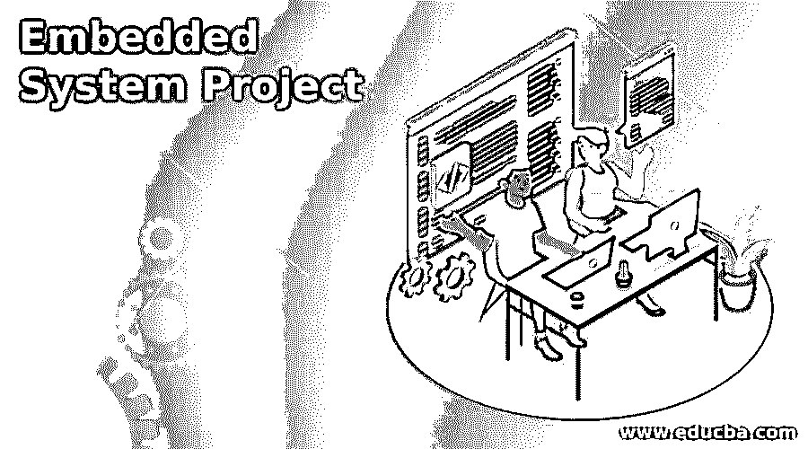

# 嵌入式系统项目

> 原文：<https://www.educba.com/embedded-system-project/>

## 嵌入式系统项目介绍

嵌入式系统是具有现实世界应用的挑战性系统，旨在完成单一功能。最显著的特征是它们在时间限制内产生结果，或者简单地说，这些是时间受限的系统。嵌入式项目可能需要各种领域的广泛专业知识。这包括从 CPU 计算板、传感器和接口设备到软件开发。在这个主题中，我们将学习嵌入式系统项目。

### 嵌入式系统项目列表

这些嵌入式系统项目创意包括各种应用和财务需求，具有不同程度的难度和硬件开发工具。由于应用范围广泛，基于微控制器的项目非常受欢迎。如果项目需要使用神经网络或人工智能(AI)技术，那么确实应该考虑嵌入式 Linux 处理器主板(Amazon.com 上的 Raspberry Pi)。我们已经收集了一些最好的嵌入式系统项目想法，供您考虑。

<small>网页开发、编程语言、软件测试&其他</small>

**嵌入式系统项目**

*   **实时嵌入式系统应用:**构建和部署实时嵌入式系统是为了在预定的时间限制内执行某些活动。这些甚至被进一步分为两种类型:
*   **软实时嵌入式系统:**在这样的系统中，工作的完成是最重要的因素，而不是时间线。
*   硬实时嵌入式系统:这些系统对截止日期有很高的优先级，绝对不能错过。

### 高效发电的太阳能跟踪系统

这个太阳能跟踪项目的主要目标是设计一个太阳能模块，它可以有效地利用太阳辐射量，同时产生额外的电力。这个太阳能项目的主要目的是为太阳能系统提供一个解决方案，通过全天捕捉最多的太阳光线，从太阳能电池板产生最多的电力。在目前的情况下，每个人都在处理长时间的停电，这个太阳能跟踪系统将只使用太阳光提供最佳的电力。然而，在这个项目中，利用了最便宜的能源形式——太阳能。

### 基于 RTOS 的病人监护系统的设计与分析

基于 RTOS 的病人监护系统的设计和分析:RTOS 是一个在硬件和应用之间需要时间的事件。该项目是关于在多个单元之间同时传输信息而不发生冲突。协议标准提高了数据传输速率。一部分使用 RTOS 和 LPC2148 作为主节点，而另一部分用作标准数据采集节点，传感器设备连接到该节点。传感器节点用于监测和控制病人。该策略的目标是减少冲突的可能性，同时满足客户端监控应用的重要数据传输时间标准。

### 自动植物灌溉系统

创建这个项目是为了让用户管理应用于植物的水量。如果有足够的水，每当达到最低水位时，这个小工具就会关闭动力泵并打开马达。ULN2003 集成电路和 PIC16F73 微控制器是电路的核心。在工厂内部，三个指标相互关联。该设备连接有两个传感器。植物中水分的百分比显示在 LCD 上。为了关闭电机，微控制器控制致动器单元和适当的继电器，这里的操作相当灵敏。

传感器还向驱动 IC 发送信号，当水位达到最低点时，驱动 IC 向微控制器发送警报。为了打开电机，微控制器控制驱动器单元和匹配的继电器。

### 基于传感器节点的物联网智能家居自动化系统

基于物联网的服务有助于改善家庭生活，并以各种方式得到应用。基于物联网的家庭自动化是多功能的，因为所有的家庭设备都连接在一起，可以在没有人为干扰的情况下运行。它使用 LM35、IR 传感器、LDR 模块、节点 MCU ESP8266 和 Arduino UNO 等多个传感器来管理一些家用电器，如灯、风扇、门和气瓶液位。这个项目的摘要使用了一个传感器来检测家庭中物理对象的出现。它会检查气瓶中的气体水平，如果低于某个阈值，它会立即储存气体，并将一个标识符作为消息发送给房主。

**迷宫赛跑者:**为了解决迷宫和逃脱，这个项目需要使用人工智能算法。机器人框架很容易创建或构建，然后添加传感器。机器人应该首先立即向前移动而不滑动，并进行 90 度和 U 形转弯。可以使用传感器或强力试错法来完成这一任务。第二步是扫描迷宫，并为它创建一个地图。这里可以使用一个基本规则，例如右手或左手规则。A*或 Dijkstra 算法通常用于路径规划。

**基于物联网的智慧路灯系统:**路灯是一个城市最昂贵的方面之一。因为成本高，所有的钠蒸汽灯用的电都比较多。本项目中使用的组件是一个 Arduino UNO wifi 和一个 170 针试验板。光传感器用于使设备自动化，这不仅节约能源，而且确保安全。

### 嵌入式系统项目中的墙上立式数控机床

这是一个机器人，你可以用它来构建和编程设计一个图像，而不是仅仅在墙上水平绘制，它会向上绘制和绘画。它看起来像一个数控机床，它是一个，除了它在墙上画画。它可以创造出令人难以置信的艺术品和形状，美化人类画家无法美化的领域。

这基本上是该项目的概念。.任何图纸都可以转换成 g 代码并保存到 SD 卡中。你要建造的机器人必须有一个 SD 阅读器接口，而不是串行端口。这是一种更有效、更可靠的方法。

因此，本文旨在提供一个基于知名技术的高级嵌入式软件项目列表。这些嵌入式系统的想法是实时项目，适用于家庭和商业设置。

### 推荐文章

这是一个嵌入式系统项目指南。这里我们讨论基于众所周知的技术的高级嵌入式软件项目列表。您也可以看看以下文章，了解更多信息–

1.  [嵌入式控制系统](https://www.educba.com/embedded-control-systems/)
2.  [什么是嵌入式 C？](https://www.educba.com/what-is-embedded-c/)
3.  [嵌入式系统的类型](https://www.educba.com/types-of-embedded-systems/)
4.  [在 HTML 中嵌入标签](https://www.educba.com/embed-tag-in-html/)

