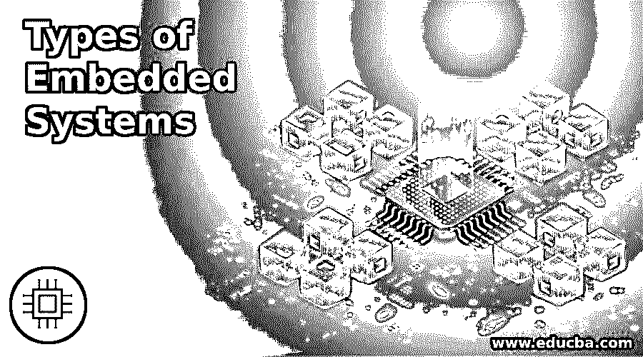

# 嵌入式系统的类型

> 原文：<https://www.educba.com/types-of-embedded-systems/>

## 嵌入式系统简介

计算机硬件和软件的组合，其中软件被嵌入到硬件中，称为嵌入式系统。这是一个电子系统，可以根据我们的需要进行编程。有一套协议，我们可以在其中组织工作和控制系统的方式。嵌入软件的硬件是在微控制器的帮助下构建的。硬件由用户接口组成，用户接口包括系统的显示器、输入和/或输出接口以及存储器。当我们考虑嵌入式系统的类型时，系统正常工作需要电源、处理器和通信端口。

### 嵌入式系统的类型

我们可以根据性能和功能需求以及微控制器的性能对嵌入式系统进行分类。微控制器对于嵌入式系统非常重要，因为硬件工作完全依赖于微控制器。它负责系统所需的通信和处理器。用户的需求取决于嵌入式系统的功能。让我们来看看这些类型。

<small>网页开发、编程语言、软件测试&其他</small>

基于性能和功能要求:

#### 1.独立嵌入式系统

顾名思义，这种类型的嵌入式系统不需要像计算机或处理器这样的主机系统，因为它自己工作，并在连接的设备上显示数据或在设备上进行必要的更改。输入数据作为模拟或数字信号从端口获取，处理在端口本身完成。适当计算和转换后的结果通过连接的设备显示。该结果可以根据数据控制或驱动或显示设备。这些系统提供了灵活性和效率，即使他们单独工作。各种各样的例子是洗衣机，移动电话，或任何没有计算机帮助的独立工作的系统。

#### 2.实时嵌入式系统

当在特定时间需要输出时，可以使用实时嵌入式系统。当一项任务必须按时完成或在项目的最后期限内完成时，这个系统就成了救星。外部环境在计算机系统的帮助下被控制，并通过传感器或任何其他输出/输入接口连接。我们可以通过静态或动态方式安排输出。这个类别下有两种类型。它们是软硬实时嵌入式系统。

*   **软嵌入式系统:**这些系统将进程视为主任务，完全管理任务。截止日期不被认为是优先事项，即使错过了截止日期，错过流程也不应该在这个系统中发生。在计算机系统中，声音系统是软系统的一个例子。但是应该注意的是，不应该总是错过最后期限，因为这会导致系统的退化。
*   **硬嵌入式系统:**这些系统把时间线当做截止日期，无论如何都不能错过。此外，即使有任何延迟，它们也应该在系统中有时间限制。没有永久的记忆，因此过程应该在第一次就正确地完成。硬嵌入式系统最好的例子是飞机控制系统。时间表和流程都不应该错过。

#### 3.网络嵌入式系统

当一个程序在另一个设备中运行时，就形成了一个网络。这被称为网络嵌入式系统，其中微处理器或控制器控制运行的程序。一个网络与这个系统相关，它们可以是局域网或广域网。连接不必是有线的或无线的。由于灵活性和连接性，这一类别被认为是嵌入式系统中发展最快的。此外，还有一个 web 服务器，其中的连接基于 web 浏览器。所有的网络都是在网络浏览器的帮助下控制和访问的。任何办公室或科技园区的安全系统都是网络嵌入式系统的例子，其中所有连接都通过一个公共网络进行，并在一个保护伞下进行控制。

#### 4.移动嵌入式系统

所有便携的、使用嵌入式系统的设备都是移动嵌入式系统。虽然内存和功能有限，但它的便携性和方便的系统对所有人都有用。我们可以轻松连接的最好例子是手机、笔记本电脑和计算器。

基于微控制器的性能:

*   **小型嵌入式系统:** 8 位或 16 位微控制器用于设计这些系统，并在系统中电池的帮助下工作。一些编程工具被用来开发小型嵌入式系统。硬件很小，处理器很慢。内存也少了。开发这些嵌入式系统的代码可以在任何 IDE 的帮助下编写。
*   **中型嵌入式系统:** 16 位或 32 位微控制器用于开发中型系统。此外，这些可以用 DSP 或 RISCs 开发。硬件和软件功能很复杂，有几种编码语言可以用作编程工具。作为小型系统，中型系统也需要 IDE。我们可以在具有大内存和处理数据的高端应用中使用中等规模的系统。
*   复杂的嵌入式系统:最复杂的嵌入式系统被称为复杂的嵌入式系统，它具有复杂的硬件和软件，使系统对所有人都有用。这些系统需要大内存的寄存器、可扩展的处理器和 IP 才能在任何环境下正常工作。它们用于具有图形屏幕、触摸板和尖端选项的系统，在这些系统中，软件和硬件对于性能同样重要。

### 结论

据了解，嵌入式系统以其系统的灵活性和可靠性而著称。没有嵌入式系统，我们无法想象现在的真实世界。了解这些类型将有助于我们更深入地了解世界上的嵌入式系统和实时应用。

### 推荐文章

这是一个嵌入式系统类型的指南。这里我们详细讨论基于性能的 4 种嵌入式系统的介绍。您也可以浏览我们的其他相关文章，了解更多信息——

1.  [Java 版本](https://www.educba.com/versions-of-java/)
2.  [CSS 列表](https://www.educba.com/css-lists/)
3.  [什么是嵌入式系统？](https://www.educba.com/what-is-embedded-systems/)
4.  [安卓操作系统](https://www.educba.com/android-operating-system/)

