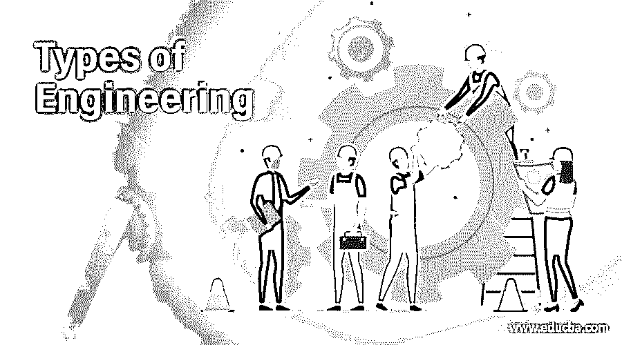

# 工程类型

> 原文：<https://www.educba.com/types-of-engineering/>

## 工程类型介绍

说到分析，工程是最广泛的领域之一。许多大学和学院提供不同的工程课程。很容易获得公立学院或私立大学的入学许可。根据兴趣和技能选择合适的工程部门是必要的，以确保快乐和繁荣的工程职业生涯。成长聚焦工程师，成长之路正在铺。然而，根据他们选择的工程部门的类型，他们的技能和职责是可变的。在本主题中，我们将详细了解工程的类型。

### 工程类型

不同类型的工程如下所述:

<small>网页开发、编程语言、软件测试&其他</small>

#### 1.土木工程

土木工程的另一个最常见的分支是物理基础设施或自然环境的建设和发展，包括机场、水坝、桥梁、高速公路和其他主要的基础设施项目。此外，这些基础设施元素的维护需要这种工程。土木工程被认为是工程领域中最古老的分支之一，自从它在住区及其布置中出现以来就一直存在。土木工程师的主要职责是生产和维护公共建筑的主要部件。此外，一个民间工程师协调几个小组，以保持项目时间，并防止过剩或低质量的建设。

#### 2.电机工程

电子学是一门工程，涉及电气、电子和基于电磁的设备或系统。然而，电气工程是在 19 世纪后期作为工程领域的一个较晚的分支出现的。这种形式的工程通常包括多个领域，包括激光、机器人、电磁光学、声学、语音、信号处理、超声波、地球科学、遥感、汽车和频率控制。在电路和设备的生产和安装中，电气工程师也参与其中。许多设备和系统，如微芯片或大型发电厂发电机，可能对这项工作至关重要。在大多数情况下，电气工程师使用 CAD 等软件来创建计划和软件。工程师还可以使用各种软件和方法来检测电气系统中的错误，并解决意外问题。

#### 3.质量工程

质量工程是学习货物和服务质量保证和控制领域技能的部门。这种工程主要集中于创造或设计商品和服务，以满足顾客的需求和愿望。质量保证和监控是任何进口或出口日常大宗商品的公司不可或缺的特征。质量工程师设计并跟踪整个产品和过程的质量。不同行业的产品缺陷都被注意到并得到关键的纠正。质量工程师专注于产品质量，但也确保所有工人满足组织的要求，并交付符合期望的产品。此外，质量工程师在企业的制造部门工作，以确保将浪费量降至最低。

#### 4.电机工程

电子学是一门工程，涉及电气、电子和基于电磁的设备或系统。然而，电气工程是在 19 世纪后期作为工程领域的一个较晚的分支出现的。这种形式的工程通常包括多个领域，包括机器人、激光、电磁光学、语音、声学、信号处理、地球科学、遥感、超声波、汽车和频率控制。

#### 5.软件工程

使用各种定义明确的科学概念、方法和技术对软件设计和维护进行的系统分析构成了软件工程。软件工程的过程包括对用户需求的研究以及按计划和预算开发软件产品。随着计算机使用的不断增加，信息技术市场也随之兴起。

#### 6.计算机工程

最常见的工程形式涉及计算机科学和电子学的各个领域。计算机工程主要用于构建硬件和计算机应用程序。计算机工程师通常管理和操作公司网络，通常在设计和创建软件和硬件方面发挥作用。一般来说，小型企业利用一名 IT 技术人员来执行各种各样的 IT 活动。此外，大公司的许多计算机工程师可能会根据他们的需要接受特定领域的培训。

#### 7.机械工程

机械工程是涉及机械系统(如机械)、设计、建造和维护的最广泛的工程行业之一。这种工程风格被认为是将工程和物理与材料科学结合在一起。为了计划、创造、安装和测试机械仪器，机械工程师使用各种方法。所有这些可以包括小电池，医疗和个人设备，空调，发电机，发电站。

### 推荐文章

这是一份工程类型指南。这里我们讨论工程的类型及其服务。我希望这篇文章对你有所帮助。您也可以看看以下文章，了解更多信息–

1.  [什么是数据工程？](https://www.educba.com/what-is-data-engineering/)
2.  [需求工程](https://www.educba.com/requirement-engineering/)
3.  [逆向工程工具](https://www.educba.com/reverse-engineering-tools/)
4.  [逆向工程过程](https://www.educba.com/process-of-reverse-engineering/)

