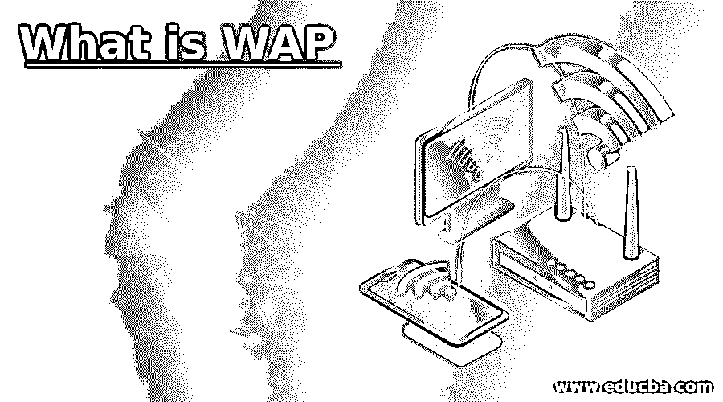

# 什么是 WAP

> 原文：<https://www.educba.com/what-is-wap/>

## WAP 简介

无线应用协议或 WAP 有助于通过所有通信网络访问无线数据。它是一种通信协议，有助于保持移动设备在网络和互联网中的连接。可以很容易地访问信息，并且为使用 WAP 网络的设备提供了 web 浏览器。只有当设备与 Wi-Fi 连接时，WAP 才会提供有关设备的信息。设备中的连接速度更快，并且它们遵循 WAP 协议。在 WAP 的帮助下，在设备中提供互联网服务。WAP 也有助于覆盖更远距离的网络。

### 我们为什么要用 WAP？

给出了一组通信协议，使得设备内部或设备之间的所有通信都遵循标准化的程序。这种通信方法包括任何无线设备、无线电设备、电子邮件、消息和任何种类的通信。协议有助于管理所有杂乱的消息，并让用户按照所有人的方式去做。制造商们使用不同的技术，这些技术通过一个叫 WAP 的协议连接在一起。WAP 可以在任何操作系统中创建，并且所有设备都很容易理解其工作原理。为了能在移动设备上工作，WAP 提供了 CSS，这样屏幕尺寸就能适应移动设备的尺寸。页面布局和屏幕大小由 CSS 控制，因此开发人员不必担心调整屏幕大小。

<small>网页开发、编程语言、软件测试&其他</small>

一种称为数据报的协议是 WAP 的中心，有助于系统的互联网模型。由于数据报协议，移动网络和系统的操作是独立的。无线网关在这一层很容易访问，因此网络问题和全球网络都在网关中管理。WAP 以跨平台技术而闻名，因此 HTML 和 HTTP 与网络中的带宽设备和寻呼机一起被结合在协议中。无线电话和数字设备被集成到系统中，以便它们可以在通信中没有任何障碍地进行良好的通信。此外，有些设备只查看协议中允许的页面，可能是系统中的普通页面或黑白页面。

### WAP 里什么重要？

*   这其中有四层，使得设备之间的通信更加容易。下文对它们进行了描述。
*   无线应用环境是 WAP 中的最高层，在它的环境中有不同的应用。这一层在设备与其他设备或同一设备的 web 服务器的通信中起着重要作用。架构简单，基于 WWW 架构。
*   无线会话层有助于保持通信设备内会话之间的健康关系。会话的高性能在这一层实现，会话细节存储在这一层。客户端和服务器通过这一层进行通信，因为它在这里提供了会话协议。通信系统之间的交互在这一层得到适当的维护，并且它们被很好地同步。
*   无线传输层安全性有助于整个 WAP 协议的安全性。为设备之间的通信提供了隐私，并且在各层中保证了数据完整性。此外，认证只提供给授权的人，这有助于防止对 WAP 层的恶意攻击。数据的传输受到保护，并且在一些通信中使带宽变低，以提供设备中数据的认证。
*   无线传输层是 WAP 中的最后一层，它连续地向最高层提供数据，并与 WAP 中的所有层有适当的接口。所有的特性都来自其他层，但是它们在自己内部工作。这一层的所有应用程序也可以用于其他层。
*   在开放移动联盟的帮助下，在 WAP 中提供工具测试，开放移动联盟是为所有移动设备的开发和支持而指定的。由于测试是专门针对 WAP 的，因此有许多内部应用程序使系统发挥了最大的能力。

### WAP 的优势

*   正如它的名字所暗示的那样，作为一个无线应用程序，它是便携的。任何移动设备或远程网络都可以使用它。由于通信协议，它易于使用，并且使用该系统的任何人都知道这些协议。所有的层都是相互连接的，通信变得很容易。
*   所有的服务都很容易访问，并且由于 WAP 在所有层的可用性，访问速度更快。方便了系统中各层的使用和数据传输路径的了解。
*   WAP 提供各种服务，WAP 的用户可以访问所有这些服务。这使得通信可靠并且数据传输在系统中得到认证。在市场上，这使得 WAP 在所有服务中脱颖而出，并使它们得到更充分的利用。
*   任何应用程序都可以在系统中成为个性化服务，因为它提供了对所有服务的访问。此外，它还以各种形式出现，如寻呼机、数字设备、电话、任何手持设备，这使得该系统易于从一个地方携带到另一个地方。
*   通过在系统中使用 WAP 环境的所有特征，用户体验被带到不同的水平。不间断地提供带宽连接。设备配备了 CSS、内存和处理能力，用户可以在有限的范围内使用，电池可以在不充电的情况下使用。

### 结论

基于网络系统中所需的应用，WAP 的使用成本较低。可以用 WAP 开发软件包。一些公司有旧的设备，使使用 WAP 成为现实，具有更大范围的优势。

### 推荐文章

这是一个什么是 WAP 的指南。在这里，我们详细讨论 Wap 的介绍及其用途、重要性、优点和缺点。您也可以浏览我们的其他相关文章，了解更多信息——

1.  [互联网的使用](https://www.educba.com/uses-of-internet/)
2.  [商业互联网的使用](https://www.educba.com/uses-of-internet-for-business/)
3.  [什么是互联网应用](https://www.educba.com/what-is-internet-application/)
4.  [互联网控制消息协议](https://www.educba.com/internet-control-message-protocol/)

