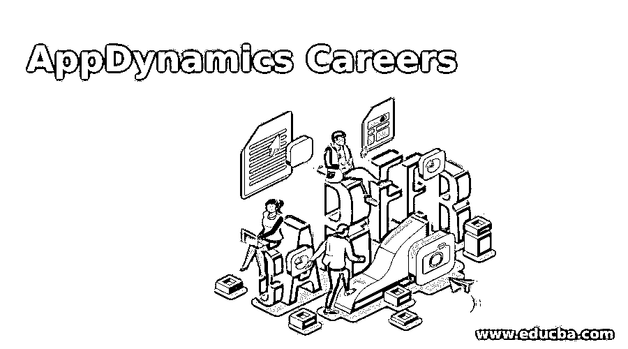

# AppDynamics 职业

> 原文：<https://www.educba.com/appdynamics-careers/>

## AppDynamics 职业概述

AppDynamics 被定义为测量 IT 行业中使用的不同应用程序的性能的工具，它通过分析单个通道中不同应用程序的性能来工作。云环境中的应用程序也可以借助 AppDynamics 进行管理。AppDynamics 监控应用程序的性能，并在工具中报告它们，以便通过在用户界面中比较不同的应用程序来进行简单的分析。通过该应用程序进行的所有交易也受到监控，但该工具安装在系统中是安全的。

### AppDynamics 职业所需的教育

*   了解所有应用程序的工作原理是开始 AppDynamics 职业生涯的基本要求。这需要了解在系统中工作的应用程序、它们在性能级别和可用性级别的分析以及用户界面的出色表现。AppDynamics 职业生涯可获得不同期限和不同费用的认证。
*   思科提供 AppDynamics Associate 或 AppDynamics Professional 证书，证书中包含不同的技能。他们监控和管理终端用户使用的应用、应用分析和监控技术，以了解应用的可用性。持续时间为 2 小时，并授予应用性能分析师证书。
*   擅长编码的开发人员可以在核心 AppDynamics 中进行为期 14 小时的认证课程，包括浏览器监控、数据库监控和 AppDynamics 中的基本知识。
*   擅长使用 Linux 基础知识管理 windows 的工程师可以承担管理和升级 AppDynamics 平台的角色，以便他们可以管理、安装和升级该工具，从而更好地使用该应用程序。AppDynamics 中还提供了开发人员角色，适合需要该工具生成的数据的开发人员、工程师和开发人员。数据科学家可以检索数据，并将其用于机器学习目的，因为该工具的分析数据非常庞大。
*   另一个称为实现者的角色适合架构师、管理员、顾问和工程师升级 AppDynamics 平台，以便在系统中安装 AppDynamics。必须为工具创建仪表板，而商业智能在这里是必需的。IOT 通过适当的监控帮助管理系统，IOT 的工程师可以很容易地在 AppDynamics 找到工作。

### 责任

appdynamics 职业的职责是:

<small>网页开发、编程语言、软件测试&其他</small>

#### 1.帐户所有者和管理员

帐户权限只能授予系统中的管理员和帐户所有者。帐户所有者可以在系统中添加或编辑用户，而管理员则管理系统中使用的应用程序，并接受系统中 AppDynamics 工具的监控。工具中的组件只能由管理员修改。此外，另一个称为分析管理员的角色处理分析以了解应用程序的性能，并为用户提供访问权限以处理工具分析生成的数据。

#### 2.数据库管理器

需要数据库监控来收集分析数据并在系统中管理这些数据。因此，数据库监控用户界面必须由能够管理用户界面和数据库收集器的人来管理。数据库监控用户只能使用数据库，对系统中的帐户没有权限，而数据库管理员可以添加、编辑或删除存储数据的数据库收集器。他们应该知道存储过程，并且为存储过程创建日志。如果可能的话，日志分析可以由系统中的管理员管理和考虑。

### AppDynamics 中的职业道路

开发人员可以从 AppDynamics 中的初级开发角色开始，开发和支持用于分析和可用性监控的工具。该角色还帮助他们在用户层面上更多地了解该工具，了解云知识并掌握性能仪表盘。两年后，他们可以进入高级开发角色，承担更艰巨的工作，在所有级别开发和监控工具，并掌握管理工具的知识。如果感兴趣，项目负责人可以通过处理系统性能和可用性中的所有应用程序，成为 AppDynamics 中的最佳人选。

通过处理系统中用户的管理方式，管理员拥有不同的路径。他们可以添加、编辑或删除系统中的用户，并管理可用应用程序的工具。他们应该详细了解工具要处理的应用程序，并管理负载最高的工具。高级管理员也可以作为一个实现者，他用适当的配置在系统中安装工具，并且用测试脚本的适当执行来维护系统中的工具。

### AppDynamics 的应用领域

AppDynamics 主要用于监控应用程序，因此如果必须监控任何应用程序的性能，那么 AppDynamics 是最好的工具。它也可以用在云应用程序中，这是该工具的优势，因为大多数性能监控工具并不监控云环境中的应用程序。

另一个应用程序是管理应用程序，并通过系统用户界面中的仪表板让用户知道它们的可用性。使用该工具可以监控业务交易，并管理警报。

### 薪水

印度 AppDynamics 工程师的平均年薪为 250 万英镑。起薪为 150 万英镑，AppDynamics 级别的专家最高年薪为 350 万英镑。有软件工程师、文档经理、项目负责人等不同岗位，平均年薪 200 万，最高年薪 400 万。

在 AppDynamics 中的职业生涯集成了不同的软件工程师角色，这使得开发人员在核心系统中学习更多。这促进了各个层次的职业发展，工具的增强帮助开发人员在不同的技能组合中成长。

### 推荐文章

这是 AppDynamics 职业指南。在这里，我们还讨论了 appdynamics 职业生涯所需的概述和教育以及优点和缺点。您也可以看看以下文章，了解更多信息–

1.  [JMeter vs LoadRunner](https://www.educba.com/jmeter-vs-loadrunner/)
2.  [安卓应用商店替代品](https://www.educba.com/android-app-store-alternatives/)
3.  [颤振应用](https://www.educba.com/flutter-applications/)
4.  [小程序生命周期](https://www.educba.com/applet-life-cycle/)

