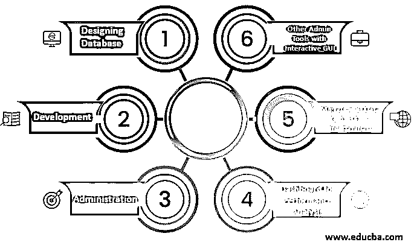

# 带宽监控工具

> 原文：<https://www.educba.com/bandwidth-monitoring-tools/>

## 什么是带宽监控工具？

带宽监控工具是一种用于测量网络带宽、帮助增强网络安全性、提升网络性能以及分析网络需求的工具。带宽监控工具还用于排除网络性能故障、规划网络容量和监控网络带宽。该工具监控带宽使用情况；这种类型的工具还可以监控平均使用量和峰值使用量。

### 监控工具是如何工作的？

带宽监控工具连接到网络，之后，它开始分析带宽消耗，并找到服务器和应用程序的性能瓶颈。该工具将图形可视化，以显示网络流量。这些图表有助于分析带宽消耗，并据此绘制历史报告。该工具生成的报告可用于显示网络流量波动。据此，可以做出某些决定，比如哪个应用程序消耗了更多的带宽。据此，具有更多带宽消耗的设备可以从网络中移除。

<small>网页开发、编程语言、软件测试&其他</small>

### 6 款最佳带宽监控工具

下面给出了带宽监控工具:

#### 1.网络带宽分析器包

这种类型的工具可以检测、解决和诊断与网络性能相关的问题，并帮助用户提高网络性能。该工具支持 IPv4 和 IPv6，并识别使用最多带宽的不同类型的协议和应用程序。该工具提供了一个交互式仪表盘，用于显示交通模式和图表。当流量出现波动时，该工具会立即向用户发送警报。当网络流量突然减少、增加和变化时，该工具会立即发出警报。当产生的上升很高时，它表明存在可疑活动的风险。当流量非常低时，表明网络存在性能问题。

#### 2.网络流量分析器

NTA(网络流量分析器)是网络安全管理软件产品提供的工具。该工具在本质上是强大的，但与网络带宽分析器包相比性能较差。该工具提供不同的功能，如监控网络带宽、分析网络，以及在出现任何与网络相关的性能问题时向用户发送警报。该工具提供的仪表板是用户友好的，并向用户提供标记任何特定网络元素和分析某一持续时间(如几天、几个月)的流量模式的功能。带宽监控支持不同的协议、应用、IP 地址，因此如果出现问题，可以解决。该工具还支持生成报告，该报告可以定制并显示过去的数据，还包括带宽使用详细信息，以便相应地调整策略。

#### 3.PRTG 网络监视器

PRTG 是另一种用于监控 IT 基础设施的带宽监控工具。该工具可以监控互联网的使用情况，并通过监控路由器上的数据来监控网络上的流量。PRTG 工具还用于监控应用程序和网络消耗的带宽，并确定是否有任何严重过载，以便消除网络上存在的所有瓶颈。该工具支持不同的工具，如 SNMP、数据包嗅探和流。在识别瓶颈之后，可以相应地修改带宽策略。PRTG 工具还用作网络监视器类型的工具，并支持基于云的应用程序监视，使该工具成为一个完整的包，供组织使用。工具是功能有限的开源工具，也是包含高级功能的商业版本。

#### 4.网络流量分析器

NetFlow Analyzer 是一个完整的流量分析型工具。它使用不同类型的流技术，包括 NetFlow、IPFIX、sFlow、J-Flow、NetStream 和 AppFlow。所有这些都有助于实时监控网络带宽和网络性能。在监控应用程序后，可以分离出存在性能瓶颈的应用程序，并据此为消耗更多带宽的应用程序更改策略。使用 NetFlow Analyzer 工具可以进行容量规划。可以绘制流量模式，并且可以使用历史数据来生成流量报告，该报告将包括关于网络元件的详细信息。当设备消耗的带宽超过分配的带宽值时，设备需要关闭，因为可能存在与该特定问题相关的多个问题。

#### 5.实时带宽监控

网络安全管理软件产品电力这个工具，这是一个开源工具，用于监测网络和应用程序的带宽使用。这种工具用于实时监控服务器的带宽使用情况。服务器的带宽使用情况以图表的形式显示，以便以适当的方式进行分析。可以定制带宽阈值，当带宽达到阈值时，该工具会向用户发送警报。

#### 6.Ntopng

这是另一种带宽使用监控工具，用于捕获流量并报告网络使用情况和流量。top 工具提供了使用某些标准(如 L7 协议、IP 地址端口、自治系统和其他因素)来区分网络流量的功能。该工具提供实时网络流量，因此可以实时进行监控。工具中会显示所有活动的主机，并据此生成历史报告。与其他带宽使用监控工具相比，tool 9 不够强大。该工具提供了具有高级功能的商业版本，但该工具的免费版本也可用于监控应用程序和网络元素的带宽消耗。

### 结论

不同类型的带宽监控工具因预算和规模而异。该组织使用这些工具来帮助提升网络性能，并监控应用程序和网络元素的带宽消耗。这些工具为网络提供了额外的安全保障。

### 推荐文章

这是带宽监控工具指南。这里我们也讨论一下入门，以及监控工具是如何工作的？以及 6 个最好的工具。您也可以看看以下文章，了解更多信息–

1.  [神经网络机器学习](https://www.educba.com/neural-network-machine-learning/)
2.  [网络安全的类型](https://www.educba.com/types-of-cyber-security/)
3.  [QlikView Tools](https://www.educba.com/qlikview-tools/)
4.  [云监控工具](https://www.educba.com/cloud-monitoring-tools/)

