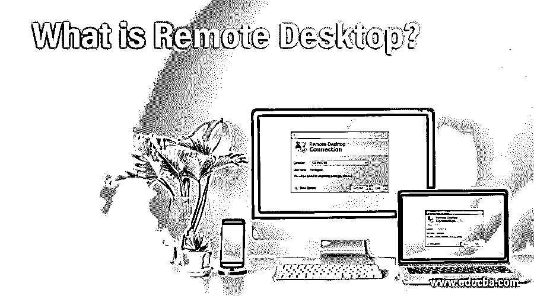

# 什么是远程桌面？

> 原文：<https://www.educba.com/what-is-remote-desktop/>

## 什么是远程桌面？

帮助用户连接到另一个位置的系统的软件或操作系统称为远程桌面。这有助于解决桌面中的问题或在桌面中进行任何更改。用户可以与离他很近的桌面交互。此功能还有助于用户在客户端管理系统。该功能通过互联网启用，并使用户通过屏幕共享和提供对系统的控制来享受两个系统的特权。用户可以从任何位置管理远程桌面。

### 远程桌面的重要性

*   当用户使用远程桌面功能时，他节省了时间和从另一个位置解决桌面的任何问题的物理干预。这项技术帮助软件开发者和其他程序员管理系统并进行必要的修改。这也有助于启动远程桌面的安全功能。
*   开发人员的工作体验可以在远程桌面的帮助下改变。它有助于更改设置和使用需要启用安全功能和物理干预的应用程序。这些应用程序可用于监控桌面上的活动并检查更新。这有助于提高用户体验，使用户可以管理两个系统，而不是一个。因此，可以控制两个系统的应用，并且可以容易地管理工作。
*   当购买新系统时，如果没有技术指南，许多人可能不知道如何使用它。通过接触技术人员，他们可以学习如何管理系统。可以暂时将管理任务交给技术人员，以便他们可以管理系统活动。
*   由于社会需求，现代企业最需要远程桌面。它可以管理学习应用程序，处理系统中的管理任务，并帮助人们设置应用程序或软件，而无需访问系统。

### 我们为什么需要远程桌面？

*   从我们所在的地方操作任何桌面都是一个很大的优势，这种设施使远程桌面成为用户的优势。它有助于在任何地方使用其他系统，无论是购物中心、道路，甚至是我们正在旅行。唯一需要的是远程桌面和连接系统应该在同一个网络下。
*   由于现代世界技术的进步，远程桌面提供了在任何连接中工作的灵活性。如果总是提供网络连接，如果任何人可以在家里工作，就不一定要每天去办公室工作。这有助于改善员工的工作生活平衡，从而提供工作灵活性。现在到处都有连接，这对任何人来说都不是问题。
*   远程桌面在处理客户支持方面非常有用。技术人员和软件开发人员不能按时到达客户处。通过允许技术人员远程操作系统，用户可以避免物理干预并管理时间。这也有助于技术人员避免出差，并比预期更快地完成工作。资源和系统的处理从未像现在这样简单，远程桌面提高了客户满意度。
*   借助远程桌面，IT 专业人员的工作变得更加轻松。他们可以更高效地工作，因为他们可以在旅行和在家时处理系统。工作可以轻松完成，他们获得更多的个人时间与家人和朋友相处。此外，他们可以不受任何人干扰地工作，这在某种程度上提高了生产率。如果有技术问题，可以在网络内远程处理和管理。
*   远程桌面连接对那些处理多台设备的人来说是一个福音。他们可以同时在两个系统上工作，并且比预期更快地完成工作。他们还可以处理其他人的设备的技术问题和其他问题，以管理应用程序和设置系统。可以很好地管理时间，提高效率，从而提高生产力。

### 远程桌面的优势

*   当我们身在异地，无法准时参加会议时，远程桌面设施使我们能够向他人演示应用程序或软件。这管理许多人的时间，工作被认为是完成了。现代企业就是以这种方式处理的，而且效果很好。
*   我们可以从工作场所访问我们的家用电脑，或者从家里操作工作场所系统。只要我们在同一个网络中，这不会产生任何问题。像这样处理设备可以避免问题和技术问题。
*   喜欢在办公室以外的任何舒适区域工作的员工可以使用他们的远程桌面连接。基于提供的网络，他们可以在酒店房间或咖啡馆工作。如今，许多咖啡馆通过让员工在咖啡馆工作来提供处理工作场所的选择。这改善了业务和员工的士气。可访问性是远程桌面连接不可避免的优势。
*   当员工选择远程桌面连接时，他可以在自己的环境中自由工作，这可以提高他的生产力，同时高效地完成大部分工作。工作方式和舒适度取决于员工，这从整体上改善了系统。业务需求可以在家里得到满足，许多人可能真的喜欢这个机会。

### 结论

由于远程桌面连接提供了许多机会，使用此连接时有许多协议要遵循。连接软件适用于大多数操作系统，任何人都可以熟悉它。

<small>网页开发、编程语言、软件测试&其他</small>

### 推荐文章

这是什么是远程桌面的指南？.在这里，我们还将讨论远程桌面的介绍和重要性，以及需求和优势。您也可以看看以下文章，了解更多信息–

1.  [远程桌面替代方案](https://www.educba.com/remote-desktop-alternatives/)
2.  [比特巴克 vs 去](https://www.educba.com/bitbucket-vs-git/)
3.  [JMeter vs Selenium](https://www.educba.com/jmeter-vs-selenium/)
4.  [什么是 CMD？](https://www.educba.com/what-is-cmd/)

