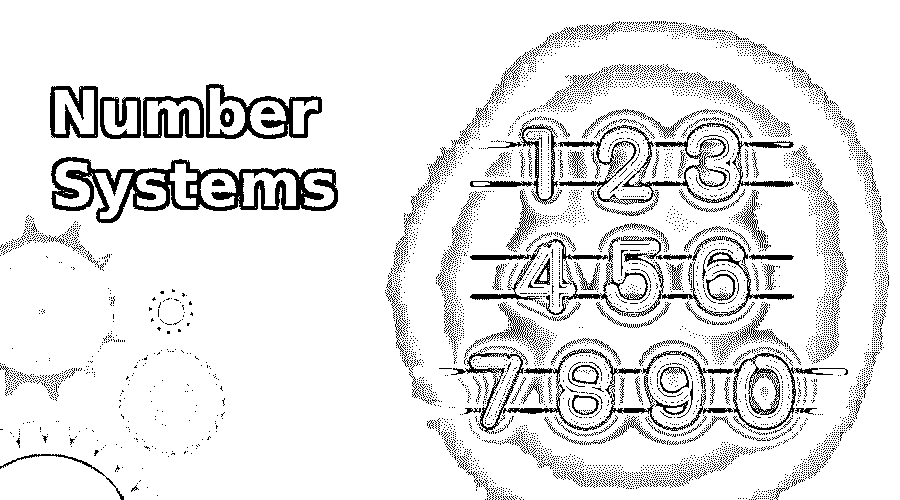
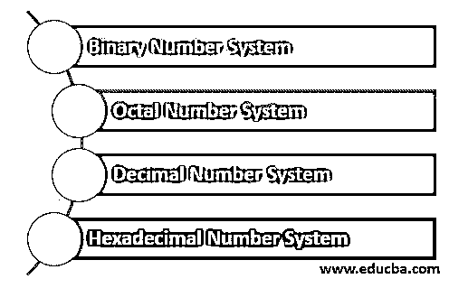

# 数字系统

> 原文：<https://www.educba.com/number-systems/>

## 数系介绍

我们人类使用文字、数字和字符相互交流。然而，计算机不能理解这种语言。因此，当我们到达数据时，数据被转换成电子信号。每个脉冲被称为代码，ASCII 将代码翻译成数字格式。它为系统理解的每个数字、符号和字符创建一个数字值。一个数中一位的数值可以用该数、该位在该数中的位置、系统的基数来指定。因此，要理解计算机语言或与系统交流，需要了解数字系统。

### 数字系统的类型

计算机中的数字系统如下所示:

<small>网页开发、编程语言、软件测试&其他</small>

#### 1.二进制数系

二进制系统只使用两个数字' 0 '和' 1 ',因此基数是 2。所以它也被称为基数为 2 的数字系统。在这个系统中，有两种类型的电子脉冲。如果没有电子脉冲，则该数字表示为“0”，如果有电子脉冲，则表示为“1”。单个二进制数字是一位。四位序列(1001)是一个半字节，八位序列*(11001010)称为一个字节。二进制表示数字系统的基数(2)的特定幂。例，2 0 。二进制数的最后一位代表底数(2)的 x 次方。例，2 x 其中 x 代表最后一个位置-1。*

 ***例子**

这里我们将看到一个如何计算二进制数的十进制等效值的例子
二进制数:11001 2

11001 2 可以写成 11001
**第一步:**((1 x 24)+(1 x 23)+(0 x 22)+(0 x 21)+(1 x 20))10
**第二步:**(16+8+0+0+2)10
**第三步:** 2610

#### 2.八进位数制

八进制使用八个数字 0，1，2，3，4，5，6，7，因此基数是 8。八进制数中的每个位置都表示以 0 为底(8)的幂。所以它也被称为八进制。例 8 0 。八进制数的最后一位代表底数的 x 次方(8)。例如 8x，其中 x 表示最后一个位置-1。

**例子**

这里我们将看到如何计算八进制数的十进制等效值的例子

12071 8 可以写成 12071

**第一步:**((1 x 84)+(2 x 83)+(0 x 82)+(7 x 81)+(1 x 80))10

**第二步:** (4096 + 1024 + 0 + 56 + 1) 10

第三步: 5177

#### 3.十进数制

十进制使用八位数 0，1，2，3，4，5，6，7，8，9，因此基数是 10。在这个数字系统中，9 是最高数字值，而 0 是最低数字值。十进制数中每个数字的位置表示该系统的基数(10)的特定幂。我们在日常生活中使用十进制。十进制数字系统能够表示任何数值。

**例子**

这里我们将看到一个如何计算十进制数的十进制等效值的例子
十进制数:1237 10

1237 10 可以写成 1237

**第一步:**(1×103)+(2×102)+(3×101)+(7×l00)10

**第二步:**(1×1000)+(2×100)+(3×10)+(7×1)10

**第三步:** (1000 + 200 + 30 + 7) 10

第四步: 1237

#### 4.十六进制数系统

十六进制数字系统使用 10 个数字和 6 个字母，0，1，2，3，4，5，6，7，8，9，A，B，C，D，E，f，因此它的基数是 16。八进制数中的每个位置都表示以 0 为底(8)的幂。所以它也被称为 16 进制数字系统和字母数字系统，因为它既使用数字也使用字母。字母代表从 10 开始的数字。A = 10。B = 11，C = 12，D = 13，E = 14，F = 15。十六进制数中的每个位置都表示以 0 为底的幂(16)。十六进制数的最后一位代表底数的 x 次方(16)。示例 16x，其中 x 表示最后一个位置-1。

**例子**

这里我们将看到如何计算十六进制数的十进制等效值的例子

19FDE 16 可以写成 19FDA

**第一步:**((1 x 164)+(9 x 163)+(F x 162)+(D x 161)+(A x 160))10

**第二步:**((1 x 164)+(9 x 163)+(15 x 162)+(13 x 161)+(10 x 160))10

**第三步:**(65536+36864+3840+208+10)10

第四步: 106458

### 结论

在这篇文章中，我们已经看到了一个数字系统，该系统用于与计算机进行通信以及十进制转换。我希望这篇文章对你有所帮助。

### 推荐文章

这是数制指南。在这里，我们讨论一个数字系统及其不同类型的简要概述，以及他们的例子。您也可以浏览我们推荐的其他文章，了解更多信息——

1.  [jQuery toggle()简介](https://www.educba.com/jquery-toggle/)
2.  [jQuery empty()(示例)](https://www.educba.com/jquery-empty/)
3.  [如何使用 jQuery insertAfter()方法？](https://www.educba.com/jquery-insertafter/)
4.  [jQuery appendTo()](https://www.educba.com/jquery-appendto/)

*