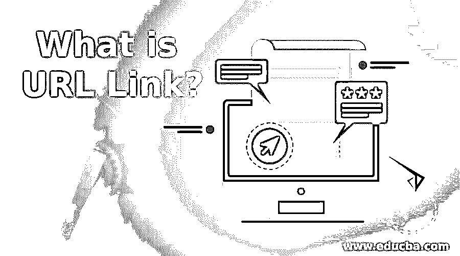

# 什么是 URL 链接？

> 原文：<https://www.educba.com/what-is-url-link/>

## 什么是 URL 链接？

URL 是 www 资源及其协议的一种标准资源 ID 和地址。将指示用于访问网页的网站的位置。举个例子如果你要访问 educba 网站，那么网址是什么是[www.educba.com](https://www.educba.com)；URL 将用户传送到特定的资源，例如视频、网站或其他在线服务。当你在 Google 上搜索任何查询时，会显示几个资源 URL，它们都与你的搜索查询相关。网页的超链接是显示的网址。所以这是 URL(统一资源定位符)的完整形式。计算机上可选的端口号。它包括访问资源的协议。它包含应用程序目录结构中的资源位置。下面通过一个示例定义了其他 URL 详细信息:

1.  **http / https:**

http 是一种超文本通信传输协议。它告诉浏览器域中指定的信息将用于哪个协议的输入。

<small>网页开发、编程语言、软件测试&其他</small>

2.  **www**

在这个页面上，环球网的材料是有区别的。URL 可能会被省略很多次，因为它不重要。如果你输入“http:/educba.com”，你总能找到 educba 网站。这个站点被称为子域，也可以被替换为基本的子页面。

**字符不能在 URL 中使用:**很多人都知道 URL 中不允许有空格。您只能在 URL 字符串上使用符号！RFC 1738 $- +* "()，包括字母数字字符。如果需要，所有其他字符都应该在 URL 中编码。

### IP 地址等同于站点或 URL 吗？

IP 地址不等同于网址或 URL，因为它是分配给每个网络单元的一个单独的数字。一个域名在 WWW 上被分配了一个特定的 IP 地址，当输入一个 URL 如 educba.com 时，该地址被路由器转换成一个 IP 地址以找到 web 服务器。之所以使用域名，是因为它便于人们回忆，而不是使用 IP 地址。例如，要记住像 216.58.216.165 这样的 IP 地址很难，但要记住“educba.com”却容易得多。

### 为什么是 URL？

URL 是有用的，因为用户只需在 URL 的书面信息中点击鼠标，就可以从一个网页切换到另一个网页。所有的 URL 都是特殊的，告诉用户如何访问特定的资源。

当用户在 web 浏览器上键入 URL 并打开来自搜索结果的一些超链接时，浏览器向 web 服务器发送请求以收集与查询相关联的文件。

### 重定向 URL

web 服务器的一个功能是 URL 重定向，它将您的 URL 指向另一个 URL。您拥有旧的“wallstreetmojo.com”网址，并希望为您的客人直接访问新的“educba.com”网址。重定向是唯一的选择，因为如果您有“wallstreetmojo.com”，浏览器中的某人将被发送到新的“educba . com”URL。Web 开发人员可以找到不同种类的重定向，如 HTTP 3xx 序列的状态代码、JavaScript、手动重定向、元级刷新器、服务器文件、重定向帧等。此外，重定向 URL 也可以称为 URL 重定向、域重定向、3xx HTTP 客户端重定向和域重定向。URL 重定向通常用于通过未经授权的活动(如网络钓鱼)触发用户及其计算机问题。此外，它可以用来删除网站搜索结果，但大多数搜索引擎现在可以检测到这种欺诈企图。重定向网站最流行的方式是通过 HTTP 3xx 系列协议的不同代码。这个系列的成员具有不同的特征，例如:

*   号码 300 有不同的重定向选项。例如，替代语言选择选项。
*   对于未定义的路径，使用数字 302。
*   307 用于重新设计网站。

### 在哪里使用重定向？

让我们讨论一下在哪里使用重定向:

*   **您有重复的内容:**在页面上出现不止一次的重复材料。谷歌有几个页面包含重复的内容。在这种情况下，谷歌很难理解哪个页面是正确的。301 重定向到原始页面可在复制材料。这将有助于提高您的搜索引擎排名，并为您的用户提供更好的体验。
*   **你有多个域名:**有些人为了保护网络品牌，买了好几个域名。因此，每个旧域必须被引导到新的域。为了从常见的印刷错误中获得更多的细节，一些企业会这样做。他们也可能阻止竞争对手获得类似的域名，并将其转发到自己的网站。

### 推荐文章

这是一个什么是 URL 链接的指南？.在这里，我们还讨论了简介和额外的 URL 细节，并给出了一个例子，以及在哪里使用重定向。您也可以看看以下文章，了解更多信息–

1.  PHP URL
2.  [Django 网址](https://www.educba.com/django-url/)
3.  [Java URLEncoder](https://www.educba.com/java-urlencoder/)
4.  [Laravel 重定向到 URL](https://www.educba.com/laravel-redirect-to-url/)

