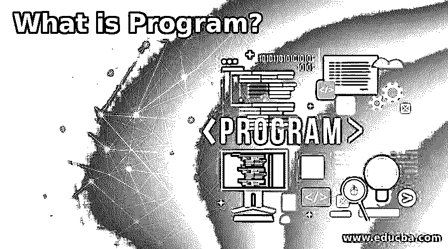

# 什么是程序？

> 原文：<https://www.educba.com/what-is-program/>

## 什么是程序？

桌面程序是一系列指令，既可以用作动词，也可以用作实体短语。就动词而言，它用于使用编程语言构建软件程序。名词用于机器上的特定任务，带有应用程序、程序或应用软件。计算机程序是一系列命令，既可以用作名词，也可以用作实体短语。就动词而言，它用于用编程语言构建软件程序。名词用于使用应用程序、系统或应用软件在设备上完成特定工作。

### 程序的目的是什么？

该软件在计算机上进行特定的活动。虽然机器可以在没有应用软件(编程)的情况下使用操作系统进行操作，但它不能执行特定的功能。例如，如果你想创建一个 Word 文档，你必须在你的机器上安装 Microsoft Word。它是一个帮助你在你的计算机上创建、编辑和保存文档或文件的程序或软件。

<small>网页开发、编程语言、软件测试&其他</small>

### 应用程序和程序之间的差异

每个设备都可以称为程序，但不能成为程序。请求是帮助最终用户实现目标的一系列服务。这种程序通过通信来执行任务或事件。没有软件和功能就不可能执行最终用户的命令。相比之下，程序是定义计算机任务的一组指令。

### 程序的基本功能

程序的用途取决于软件类型。互联网浏览器的作用是在计算机上查找信息并显示万维网，编辑和查看与测量、分析等相关的资料。一般来说，程序被编程来执行特定的功能或任务。例如，Excel 程序可以生成文本，但它们不能像万维网上的浏览器那样定位信息。

### 程序示例

今天，不同类型的手机、电脑和其他设备都是可用的。下表包含了一些例子和他们组中项目的简要概述。

*   谷歌浏览器:谷歌于 2008 年 12 月 11 日发布。这是一个互联网浏览器。它用于在计算机屏幕上收集和查看万维网上的可用信息。这提供了各种功能来支持用户，包括标签冲浪、谷歌服务和账户同步、基于网络的拼写检查和自动翻译。此外，还有一个 Omnibox 搜索栏，允许用户搜索任何查询。
*   **C 编程语言:**是一种用于软件开发的通用编程语言。这是继丹尼斯·里奇在贝尔实验室的作品之后于 1972 年出版的。它被广泛用于编写复杂的程序，如 Python、Git、Oracle 等。它还包括额外的功能，包括简单和安全，便携，丰富的图书馆，可扩展，高速，等等。
*   Adobe Photoshop: 支持所有类型的文件格式，甚至 JPG、Targa、GIF、BMP、HEIF 等。它允许用户制作、编辑、更改、执行(包括实时图像)、从图像或短视频文件制作动画 GIF。它还提供在 macOS 或 Windows 上运行的图像编辑应用程序。
*   微软 Word: 是文字处理器的模板。它是由微软的查尔斯·西蒙尼和理查德·布罗迪开发并出版的。Word 软件可以在 Windows、Android、Apple iOS 和 Apple macOS 上使用，也可以在带有 WINE 的 Linux OS 上使用。该应用程序仍在运行，可以使用。
*   Mozilla Thunderbird: 开源电子邮件客户端提供了在 MS Windows、Linux、macOS 和其他支持系统上发送、接收和处理电子邮件的能力。电子邮件由 IMAP 或 POP3 提供，可以通过简单邮件传输协议(SMTP)发送给用户。它提供了从他们的电子邮件提供商接收邮件的替代方法。
*   Adobe Dreamweaver: 它是 Macromedia 于 1997 年发布的一款用于构建网页的软件程序。这是一个完整的 HTML 和程序编辑器，允许用户创建和编辑网页(所见即所得)。它支持 HTML、CSS、JavaScript、XML，以及中文、日文、俄文、西班牙文、英文、法文等语言。
*   Audacity:这是一个开源程序，允许用户捕捉和编辑录音。它可以在 macOS、Linux 和 Windows 等操作系统上运行。GPL(通用公共许可证)是免费提供的。
*   FileZilla: FileZilla 是一个开源程序，允许用户从本地计算机向远程计算机传递数据。它既可以用作客户端版本，也可以用作服务器版本。它包括附加功能，如快速移动，文件&文件夹视图，目录比较，网站管理器，和其他主要功能。

### 推荐文章

这是一个什么是程序的指南？.这里我们也讨论一下入门，一个节目的目的是什么？并附有示例。您也可以看看以下文章，了解更多信息–

1.  [C 语言中的编程错误](https://www.educba.com/programming-errors-in-c/)
2.  [Java 中的字谜程序](https://www.educba.com/anagram-program-in-java/)
3.  [Python 中的字谜程序](https://www.educba.com/anagram-program-in-python/)
4.  [C 语言中的字谜程序](https://www.educba.com/anagram-program-in-c/)

