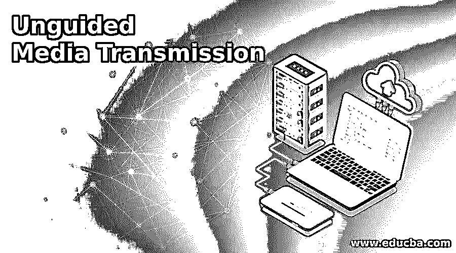

# 无制导媒体传输

> 原文：<https://www.educba.com/unguided-media-transmission/>

## 介绍非导向媒体传输

非导向介质传输是一种传输介质，用作从一端向另一端发送信息和数据的路径。非导向媒体传输的另一个名称是无线媒体。在这种介质中传输数据是通过电磁波进行的，因此传输不需要任何物理导线或电缆。无制导媒体传输受地理区域的限制。这种类型的通信被定义为无线通信。无制导信号有三种传播方式，即空中传播、地面传播和视距传播。

### 非导向媒体传输的类型

无导向媒体传输是不使用任何物理导体在两个节点之间传输信息的传输类型。非导向媒体传输的另一个名称是无线通信。信号和信息可以从一个地方广播，并且可以同时传送给多个用户。无制导信号有三种传输方式。它们描述如下:

<small>网页开发、编程语言、软件测试&其他</small>

#### 1.地面传播

通过这种方式，信号在大气的最底层传输，并且可以使用天线作为传输设备向各个方向发送。当该信号的频率较低时，信号被传输。

#### 2.天空传播

在这种方式下，传输的信号通常具有高频率，并且可以使用天空作为媒介进行传输。通过这种方式，无线电波向上传播，然后信号因电离层而被反射并再次到达地球表面。这样，信号可以传输更长的距离，消耗更少的能量。

#### 3.视线传播

以这种方式，具有非常高频率的信号使用天线到天线通信来传输。非制导传输介质可以分为三大类。下面提到了它们:

**a .无线电波:**无线电波可以定义为电磁波，可以用来不受任何限制地向任何方向传递信息。无线电波被定义为全向的，这意味着电波可以向任何方向传播。无线电波的基本频率范围在 3 千赫到 1 千赫之间。在无线电波传输中，发送天线和接收天线不必对齐，信号可以传输到任何接收天线。无线电波信号的一个最好的例子是调频收音机。

无线电波应用:

1.  无线电波用于需要从单一来源向多个用户发送相同信息的地方。
2.  无线电波的应用是电视、调频收音机和无绳电话。

**b .微波:**微波是另一种电磁波，其频率范围为 1 GHz 至 300 GHz。微波是单向的。在这种传输中，每当信号通过天线传输时，信号可以变窄以聚焦到特定点。并且在这种传输中，需要发送天线和接收天线的正确对准。

微波应用:

1.  使用微波传输，单播传输变得更容易。
2.  微波用于卫星网络通信和无线局域网。

**c .红外线波:**红外线是另一类频率范围在 300 GHz 到 400 THz 之间的波。当需要短距离通信时，使用这些类型的波。由于红外波的频率很高，信号无法穿透墙壁。也可以根据需要进行远程红外通信。如果太阳光照射在它上面，红外线波会介入，因为太阳光也有红外线波。

红外应用:

1.  红外线的数据传输质量相对高于其他类型的电磁波。
2.  用于计算机系统组件之间进行通信。

### 我们需要做什么无制导媒体传输？

对于两个节点之间的非导向传输介质，不需要直接连接。发送端和接收端可以通过无线电波、微波和其他无线介质相互通信。唯一的要求是连接目的节点和发送节点，然后信息传输可以在两个节点内开始。在质量开始下降并且信号质量变得更差之后，传输存在一定的限制。为了传输，可以使用发射塔，卫星可以用来传输信息。

### 非导向媒体传输的优势

无向导媒体传输有几个优点。其中一些提到如下:

1.与导向传输介质相比，非导向介质传输的带宽更高。信息可以共享而不受任何媒体的干扰。

2.由于发送方节点和目的节点之间没有直接通信，因此无导向传输介质不会受到腐蚀性物质的影响。

3.与导向传输介质相比，非导向介质传输的价格较低，因为不使用物理电缆或电线，这有助于降低非导向传输介质的安装成本。

4.同一时间，相同的信息可以没有任何延迟地广播给多个用户。例如，广播电台或电视频道，其中多个用户可以使用该设备来获取信息。

5.非导向传输介质中的信号可以长距离传输，不会受到介质的任何干扰，也不会影响质量。

6.在无导向传输介质中，信号衰减较低。由于没有使用物理电线或电缆，信息传输中的衰减较低。

### 结论

无导向传输介质是典型的无线通信，这意味着源节点和目的节点之间的信息传输不需要物理导体。三种通信方式包括地面、天空和视线传播。还有包括无线电波、微波和红外波在内的非制导传输类型。

### 推荐文章

这是一个非制导媒体传输指南。在这里，我们讨论非导向媒体传输的介绍，类型和各自的优势。您也可以浏览我们的其他相关文章，了解更多信息——

1.  [社交媒体优化](https://www.educba.com/social-media-optimization/)
2.  [媒体查询 CSS](https://www.educba.com/media-query-css/)
3.  [萨斯@媒体](https://www.educba.com/sass-media/)
4.  [GIS 软件](https://www.educba.com/gis-software/)

