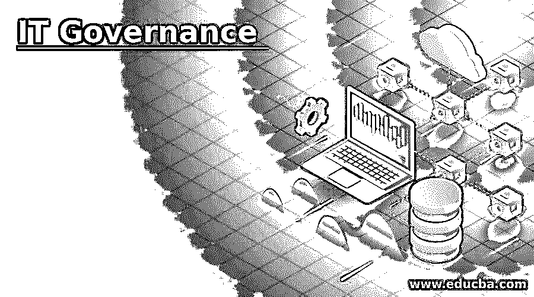
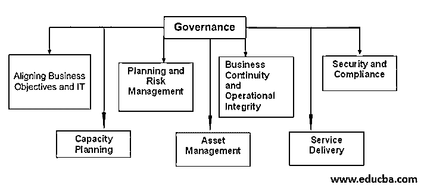
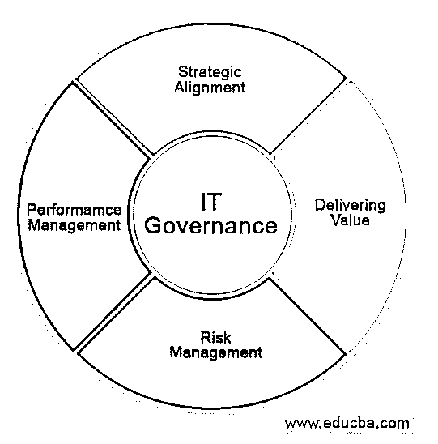

# IT 治理

> 原文：<https://www.educba.com/it-governance/>

## IT 治理简介

一个过程或框架，其中所有与信息技术相关的重要决策都受到密切监控，以便在向最终客户提供产品或服务时，确保所有的价值都是正确的，并且在 IT 领域做出的决策被承诺为该领域的利益相关者正在开展的业务提供正确的价值，如果涉及任何风险，减轻风险的保证被称为 IT 治理。

### IT 治理组件

下面给出了 IT 治理组件:

<small>网页开发、编程语言、软件测试&其他</small>

#### 1.结构

框架对于 IT 治理非常重要，这样可以标准化流程并简化错误。框架是任何项目的基础，这有助于确定过程中要包括的不同步骤。所有的职责和任务都应该包含在框架中，这样任何查看框架的人都可以一眼就识别出流程。

#### 2.商业利益

组织中有许多好处，不管是金钱上的还是成长上的，但是理解它们在组织成长中的作用是非常重要的。因为这有助于组织遵循标准，并通过帮助员工制定规则来提高自身水平。

#### 3.管理

管理组织的战略或道德行为在 IT 治理中很重要，因为这有助于组织在不牺牲任何道德的情况下实现业务目标。项目组合管理帮助组织在其外壳内成长，并接触不同的客户。战略是一个硬币的两面。

#### 4.优化风险和资源

了解和分配组织中的资源很重要，这样可以避免一些风险。

### IT 治理流程

在进行 IT 治理时，必须遵循一个框架。

在这个过程中有三个主要的活动。

*   估价
*   方向
*   监视

#### 1.估价

对该组织的道德规范、遵循的策略、与客户打交道的协议(如果有的话)以及与其他组织的一致性进行评估。这有助于了解组织的规则，以便能够以结合组织价值观的方式使用 IT 治理。在使用 IT 治理时，任何情况都应该由组织来管理。

#### 2.方向

在这里，根据组织中遵循的策略，员工被分配了多项职责。这有助于管理组织活动和政府对项目的投资。此外，在此阶段设置了几个规则，以便组织将遵守 IT 治理，并确定哪些规则可以由员工或利益相关者管理。

#### 3.班长

一旦制定了规则，检查组织中是否遵循了规则是很重要的。有必要进行适当的监控，以检查员工的 IT 合规性，以便在一定程度上降低风险，除非有人故意违规。组织的绩效受到监控，以确保公司遵守政府制定的所有指令。

### IT 治理挑战

以下是 IT 治理面临的挑战:

#### 1.管理资源

当项目中涉及到 IT 治理时，必须进行预先计划和后期计划，以使规则有效。IT 治理的资源至关重要，他们应该知道在做项目时要遵循的法律和法规。通常，这成为一个挑战，因为每个项目的 IT 治理规则各不相同。团队管理应确保在整个项目完成过程中和项目结束后始终提供 IT 支持。

#### 2.责任和问责

每当挑战发生时，团队中必须有人负责，因为 IT 治理不是每个人都喜欢的。政府对项目进行投资，因此项目中的每个人都应该遵守政府制定的规则，如果技术给政府带来任何风险，这些 IT 治理规则会让每个人承担责任。

#### 3.风险管理

由于数据的安全性非常重要，因此确保项目过程中不发生风险非常重要。应该遵循所有的框架，因为忽略一个法律可能会导致违反协议和停止工作。所有的技术都应该标准化，这样如果出了什么问题，就很容易找出错误。这也有助于通过让高层管理人员参与框架并对规则进行优先排序来降低风险。

### IT 治理的优势

下面是提到的优点:

*   大多数情况下，业务战略和 IT 战略是不同的，此时需要使它们协调一致以达到预期的结果。IT 治理通过在每个业务或项目中设置一些要遵循的规则来带来这种和谐。
*   每当一个项目或工作正在进行或正在进行时，为每项任务设定责任是很重要的，这样某人就可以完全投入到任务中。IT 治理使任务对每个人负责，以便可以设定期望，并且可以在更短的时间内实现结果。
*   决策以更好的方式完成，因为通过 IT 治理，所有人都知道关于 IT 的大多数规则和风险。这使得员工考虑所有可行的选择并研究任务。
*   很容易创建关于所有任务的报告，因为每个任务都与它相关，每件事都被适当地记录以避免进一步的混淆。这有助于事先创建文档和报告。
*   该公司在战略上与任何关于 IT 治理的新改革保持一致，这有助于行业中新项目的开发。IT 法规非常重视项目的实施前和实施后。

### 结论

当一个公司项目被 it 治理所治理，并且学习它需要一些时间时，IT 治理会对公司项目造成滞后。了解管理该技术的所有规则并适当小心地处理它是很重要的。此外，项目的任何一方都不应该违反道德规范。

### 推荐文章

这是一个 IT 治理指南。在这里，我们分别讨论 IT 治理的介绍，以及组件、过程、挑战和优势。您也可以看看以下文章，了解更多信息–

1.  [Java 流过滤器](https://www.educba.com/java-stream-filter/)
2.  [Java IO](https://www.educba.com/java-io/)
3.  [JavaScript 枚举](https://www.educba.com/javascript-enum/)
4.  [JavaScript getelement byid()](https://www.educba.com/javascript-getelementbyid/)

