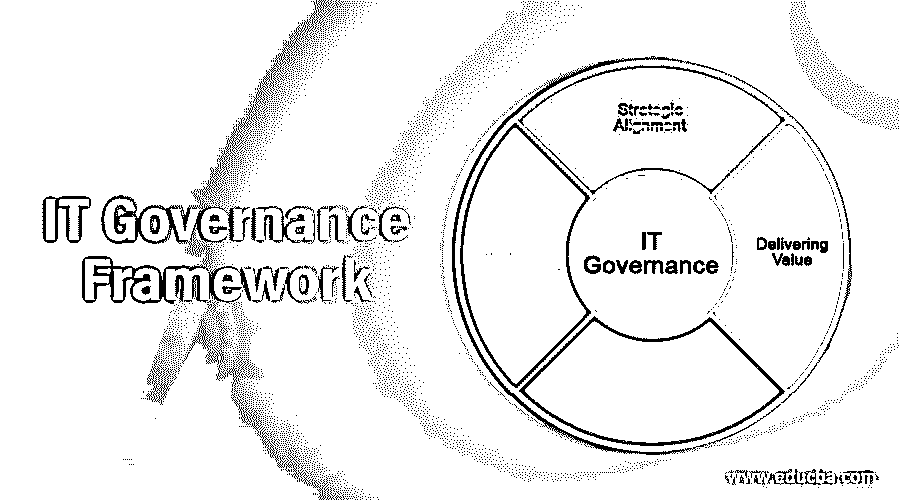

# IT 治理框架

> 原文：<https://www.educba.com/it-governance-framework/>

## IT 治理框架简介

IT 治理框架是一个完整的结构，它解释了企业可以实现、执行、监控和管理公司内部定制的所有 IT 治理的方法和某些技术。它给出了指导方针，并计算了使用公司内所有 It 流程和资源的有效方法。它还衡量了定义报告值和绩效衡量标准的要求，这些标准用于标准化模型中运行的可变方的管理数据，并允许员工完美地评估他和公司每一步的成功。下面的文章对 IT 治理框架进行了简单的讨论。

### 什么是 IT 治理框架？

IT 治理框架在区分如何以及谁应该预定义功能模型的组件方面的一瞥。构建的规则、原则和流程应允许员工在适当的时间做出适当的决策。它还提供了一个完美的框架来处理情况和想法，这些情况和想法被总部采纳来做出决策，并解释沟通方式以推进讨论。IT 治理框架应该适应和灵活，以适应客户不断变化的业务需求。它应该分为三个或更多的层次，如运营、商业和管理。它不仅检查决策的有效方法，而且给出解决问题的有限升级路径。

<small>网页开发、编程语言、软件测试&其他</small>

### IT 治理框架的组件

IT 治理框架的组件:IT 治理框架的三个主要元素是结构、过程和沟通。

*   该结构定义了决策流程，并解释了要创建的结构性策略，谁需要遵循该策略，什么是上报规则，他们各自的责任是什么，如果他们承担工作而不是遵循规则会发生什么。这种类型的每一个步骤都被描绘在员工栏里，以使他们坚持下去。
*   该流程是简单的 IT 投资，他们应定期制定遵循和提议股票投资规则、审查股票和投资、批准投资以及确定投资政策优先级的决策流程。
*   沟通将导致决策过程被测量、监控和互动。IT 投资中使用的交互机制应由董事会、执行管理层、IT 员工管理层、堆栈持有人和业务部门管理层制定。
*   除了这三个重要的框架之外，其他广泛使用的是公认的第三方框架和厂商中立框架。他们不依赖并完全遵守任务，但拥有卓越的 IT 治理能力。
*   ITIL 很重要，拥有 IT 服务管理业务流程的最佳库，并作为信息技术基础架构库进行了扩展。它由联合王国内阁办公室实施。它在全球范围内被广泛采用，并由通过独立认证的 IEC/infra 进行维护。ITIL 的网页可以在一篇关于 ISO 2000 和 IT 服务管理的免费简介文章上找到。
*   信息技术上的控制目标是一个重要的 IT 框架，它支持企业应对风险管理、IT 战略一致性、法规遵从性和一些策略领域的业务挑战，以实现组织目标的有效运作。它是一个国际标准框架，管理指导原则元素包括一个控制框架，用于测量 It 工具的标准化，然后测量和访问 COBIT 三十七个创建流程的 IT 能力。
*   Val IT 是一个治理框架，用于开发从 IT 投资中获得的业务价值。
*   它旨在确保信息和技术创造的商业价值。它持续监控 It 经理的绩效。它研究与 It 领域相关的可能风险，并尽可能缩短风险。

### IT 治理框架中的术语

IT 治理中遵循的其他可能的术语解释如下，

*   IT 管理层应该细化和更新 IT 治理策略，在这些策略中，IT 资源被用于规划、指导和组织公司的各个方面。它清楚地解释了 It 治理策略的规则，以实现和利用资源，并相应地获得最大的生产力。
*   IT 法规遵从性用于开发适当的防御流程，该流程处理法规遵从性并针对法规遵从性系统中的每个完整性，以确保所有人都遵守公司政策，不会滥用公司资产。IT 法规遵从性在控制员工方面的变革扩展到保护私有和个人数据，包括如何存储、保存、管理和共享数据。
*   IT 控制被部署为 IT 员工应该遵循的特定任务，以确保业务目标始终处于首要位置。
*   GRC 政策被扩展为治理、风险和合规，这是由道德团体和开放合规政策发明的，开放合规政策是指一些组合能力，它们合并了风险管理并具有高性能，以实现可靠的业务目标来解决不确定的问题。
*   最佳治理政策是衡量公共组织的效率如何从政治审查中获得最大回应的方法，它是风险管理方面最佳治理的观点，并确保 it 方面的合规条款。
*   CGEIT 是为大型企业中负责 IT 治理的 IT 员工实施的供应商中立的重要课程。
*   ISACA 是非盈利性的独立组织，致力于开发、部署和采用全球公认的行业政策、知识和信息系统实践。
*   COSCO 是 Treadway 试运行框架委员会，该委员会专注于标准 IT 流程，强调企业中的欺诈威慑和风险管理。CMMI 是将项目从一到五进行分级的标准流程，以便更好地了解公司。

### 结论

因此，这些是企业以敏捷的方式获得高生产率所要遵循的一些主要的 IT 策略。

### 推荐文章

这是一个 IT 治理框架指南。在这里，我们讨论 IT 治理中遵循的介绍、组件、框架和术语。您也可以浏览我们的其他相关文章，了解更多信息——

1.  [华硕文件管理器](https://www.educba.com/asus-file-manager/)
2.  [软件系统架构](https://www.educba.com/software-system-architecture/)
3.  [统计中变量的类型](https://www.educba.com/types-of-variables-in-statistics/)
4.  [网络服务的类型](https://www.educba.com/types-of-web-services/)

