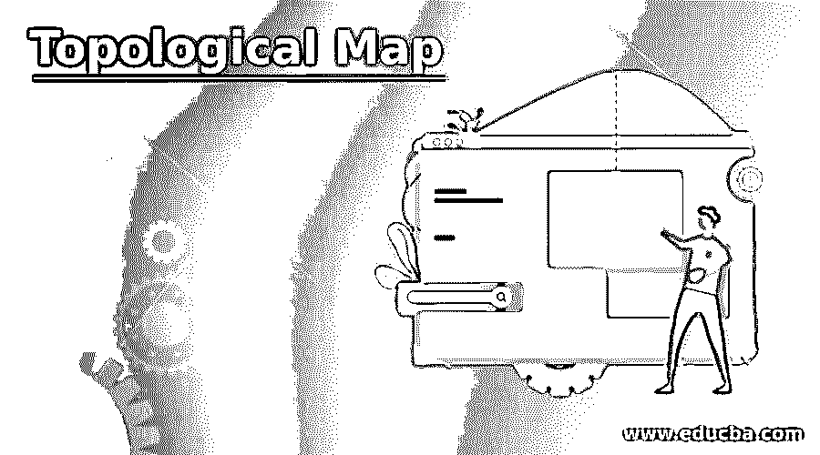

# 拓扑地图

> 原文：<https://www.educba.com/topological-map/>

## 拓扑图介绍

简而言之，拓扑图是一种图表或结构形式，它只给出基本信息，而排除了所有不需要的细节。但是这些结构并没有一个完美的尺度、方向和距离，它们会有一些变化。应该保持相关点之间的关系。术语拓扑图是从在科学、数学和地理结构中实现的拓扑学中提取的。所有对象的属性保持不变，并且不能变形以保持对象或位置的准确信息。本文简要讨论了拓扑图的重要性及其应用。

### 什么是拓扑图？

拓扑表示对象和空间特征之间的关系。就功能而言，拓扑非常重要，它包括空间功能，如通过线性网络进行网络路由。有不同类型的拓扑地图连接不同的概念步骤来解释主要的一个。主要概念是整个结构的主干。一个组件可以与另一个组件相关联，它们形成不同类型的拓扑图，以使其适合并适合该区域或系统。拓扑图的重要优势在于，如果整个系统中出现任何故障，都可以很容易地检测和分类，以保持系统的生产率和可靠性。

<small>网页开发、编程语言、软件测试&其他</small>

人们可以通过几何拓扑和相互关系的概念，如欧拉特征、亏格和网络的连通性，强调理解多维材料的完整范围的基本要求。在实现基本概念之后，所有案例研究中提到的所有概念的说明都是强制性的。然后，它考虑了一个新兴拓扑组件的不断增长的标准，该组件在空间组件中包围 k 空间和实空间，如绝缘体或狄拉克材料，聚合物和软物质上的 Weyl 半金属，可以是双光子组件，超大分子元件上的组件。它用于评估指标并强调拓扑，以分类和研究材料和属性的行为，从而在未来的技术中实现它，并以更好的方式利用其效率。

人们经常说生物进化类似于数学进化，因为它将对象从小到大排列，但是所有的单个组件都与表示系统的工作和意义有关。

首先，拓扑的实现是为了缩短工作，并给人们一个巨大或多维系统的结构化视图。就电气而言，如果从节点 A 连接到节点 B 的单根电线中间有许多分支来连接不同的部件。并且通过电线连接的所有部件具有各种功能以产生单一生产力。

第二，所有领域中的拓扑用于开发具有最大完整性的增强质量控制的数据。这组规则是为验证数据集而设计的，并确保其中没有错误。因此，通过拓扑图的不同应用，人们可以提取出它背后的各种思想，提取出的概念可以应用于各个领域。

第三，通过建立拓扑组件之间的关系图，可以帮助人们分析特征、类和跨类共享的特性。换句话说，如果人们打开数据集，可以通过将它放置在不同的位置来移动它的特征，并且可以在它与系统冲突或支持系统时更新它的特征。这也有助于数据同步。拓扑图之间的空间在定义区域时也起着重要的作用。例如，如果河流在州内或州之间流动，应该有完善的行政边界以避免混乱，应该有一套规则供人们平等地使用。就数学而言，拓扑空间使它成为一个统一的概念，并将数学带到了一个更高的层次。

### 拓扑图的重要性

网络中的组件与逻辑视图相关联。组件之间的互连的模式或布局也可以被映射来表示拓扑区域。人们可以想象任何结构和形状的拓扑结构，并可以形成最好的利用它。即使是简单的拓扑图也可以将系统带到高级拓扑结构。

连接的组件或对象或位置应使用插图正确定义。就电气而言，存在许多不同的拓扑结构，如总线、星形、环形、网状、混合式、点对点、树形等等。但是这些概念可以在其他分支中继承，以获得不同的视角。每种拓扑都有一些独特的属性，可以为用户和他的系统提供不间断的服务。

因为在这个技术驱动的世界里，大型企业可以用简单的软件设计，在实施之前可以用软件组件进行测试，以避免巨大的损失或崩溃。所以这种拓扑图对不同行业的人来说是非常有益的，可以在逻辑上或物理上建立。它是在链接的对象之间建立连接和关系的高级表示。拓扑图有助于人们最大限度地降低部署、维护和运营成本，并在管理整个网络的性能方面发挥着关键作用。每个对象的功能可以很容易地被监控，如果有任何故障或失灵，它可以被迅速隔离。因此，它提供了资源和组件的适当利用。

总结一下拓扑图的优点。

*   开发、部署和维护系统的成本是有效的。
*   它只需要最少的组件来形成逻辑拓扑地图。
*   它给人们一个更好的视角和理解。
*   降低结构的复杂性是灵活的。
*   对于规模较小的企业或地区来说，它太闲置了。
*   很容易排除对象的故障或错误配置，并提供有序的排列。

### 推荐文章

这是一个拓扑图指南。这里我们也讨论一下引论和什么是拓扑图？以及重要性和优势。您也可以看看以下文章，了解更多信息–

1.  [扎里斯基拓扑](https://www.educba.com/zariski-topology/)
2.  [什么是圈复杂度？](https://www.educba.com/what-is-cyclomatic-complexity/)
3.  [Maya 奖励工具](https://www.educba.com/maya-bonus-tools/)
4.  [DFS 算法](https://www.educba.com/dfs-algorithm/)

