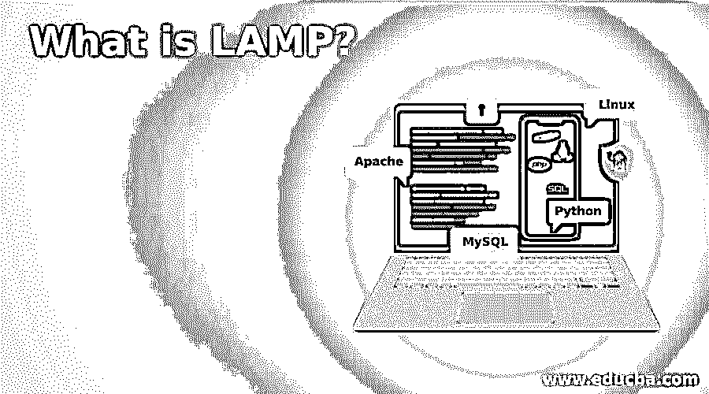

# 什么是灯？

> 原文：<https://www.educba.com/what-is-lamp/>

## 什么是灯？

LAMP (Linux、Apache、MySQL、PHP/Perl/Python)是一个开源的软件开发框架，使用了操作系统 Linux、软件服务器 Apache、合作伙伴数据库管理系统 MySQL 和面向对象的脚本语言 Perl / PHP /Python。LAMP 也称为 LAMP stack，因为它的平台有四层。可以安装各种操作系统上的堆栈。LAMP 是 web 服务器堆栈的首字母缩写的一个例子。灯组件在很大程度上是可互换的，而不是局限于初始范围。LAMP 旨在创建交互式网站和网络应用。LAMP 模型，虽然传统上是由开源自由软件组成的，但自从开发以来，已经适应了另一部分。使用 Windows 而不是 Linux 来使用这些资源的开发人员可以使用 WAMP、Macintosh 系统 MAMP 和 Solaris 系统 SAMP。灯组在模块化方面可以不同。然而，这种独特的应用混合已经变得流行，因为大量的 web 框架是合适的，Drupal，包括 Joomla 和 WordPress。

### 灯的建筑

Linux 在最底层，LAMP 有一个经典的分层架构。Apache 和 MySQL，然后是 PHP，是下一个阶段。灯堆叠顺序证明了组件的互操作性。这个过程从用户浏览器向 Apache 服务器提交网页请求开始。如果请求是针对 PHP 文件的，Apache 将请求传输到 PHP 以加载文件并运行存储在其中的代码。PHP 还与 MySQL 交互来捕获代码中的一些数据。为了构建浏览器用来查看网页的 HTML，PHP 使用文件中的代码和数据库细节。LAMP stack 可以强大地管理静态网页和动态页面，其中的内容会根据日期、周期、用户身份和每个加载周期的其他因素而变化。

<small>网页开发、编程语言、软件测试&其他</small>

### 灯组组件

四个程序元素由基于 Linux 的 web 服务器组成。这些部分被组织在相互支持的层中，形成了软件栈。在这个底层堆栈之上，运行着网站和移动应用。该应用程序的常规组件包括:

#### 1.Linux 操作系统

Linux 为模型栈提供了基础。在这一层之上，运行所有其他层。该操作系统是开源和免费的。这在一定程度上得益于它的简单性，而且定制大多数操作系统更加困难。

#### 2.Apache HTTP 服务器

第二层包括来自数据库服务器的应用程序，通常是 Apache Web 服务器。该层位于 Linux 层之上。Apache HTTP Server 是一个开源的许可免费服务器软件包。它最初开发于 1995 年，以前被称为 Apache Web Server。

#### 3.关系型数据库

MySQL 是一个用于服务器数据存储的伙伴关系数据库管理系统。这是一种开源格式，以易于使用的鳞状格式保存所有数据。SQL 非常适合有组织的业务领域，是一个令人印象深刻的工作室，可以轻松容纳所有最大和最复杂的网站。

#### 4.服务器端编程语言（Professional Hypertext Preprocessor 的缩写）

脚本层使用 PHP 和其他相关的在线编程语言。PHP 开源脚本语言用于呈现与 Apache 交互的网站。在复杂的程序中，包括从数据库中删除数据，我们不能使用 HTML。我们把 PHP 代码放在你想要交互的页面部分，以提供这种形式的功能。这一层包括网站和在线应用程序。

### 灯的特性

下面给出了一些特征:

#### 1.效率

LAMP 将最大限度地减少生产时间，因为它是一个可使用十年的开源堆栈。我们愿意借鉴过去的经验，让过去的事情变得更容易。Apache 模块中的函数，可以配置最后的 20%到 80 %,节省大量时间。

#### 2.灵活性

虽然 LAMP 使用 Linux 作为操作系统，但是也可以使用替代操作系统的其他模块来满足这些规范。例如，有一个微软视窗 WAMP 堆栈。

LAMP 是开源的，非自有的，所以可以防止锁定。我们可能会为特定任务或公司需求挑选最佳组件。在其他方面，这种灯也有多种用途。Apache 本质上是模块化的，通过各种不同的插件，我们会发现现有的可定制模块。这些模块不同于其他语言的支持和安全功能。

*   它有网络嗅探功能，这对于安全测试很有用
*   它提供入侵检测(IDS)和入侵防御(IPS)以及 snort 系统以提高安全性
*   它有用于图表的 RRDtool
*   它提供了用于监控的网络绘图工具，如 Cacti、Nagios 和 Collectd。

### 推荐文章

这是一个什么是灯的指南？.在这里，我们还将讨论 LAMP 的介绍和体系结构，以及组件和特性。您也可以看看以下文章，了解更多信息–

1.  [LED 的种类](https://www.educba.com/types-of-led/)
2.  [插座类型](https://www.educba.com/types-of-socket/)
3.  [拉弗尔展开](https://www.educba.com/laravel-deploy/)
4.  [PostgreSQL 特性](https://www.educba.com/postgresql-features/)

