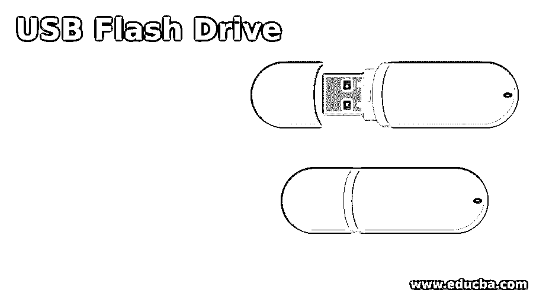

# USB 闪存驱动器

> 原文：<https://www.educba.com/usb-flash-drive/>

## USB 闪存驱动器简介

USB 闪存驱动器是一种数据存储设备，包括带有集成 USB 接口的闪存。它是一种可移动、可重写的便携式设备。它比圆盘小。u 盘主要用于存储，将文件从一台电脑传输到另一台电脑，数据备份。与磁盘或光盘相比，USB 闪存驱动器体积更小、速度更快、更可靠。它使用 USB 大容量存储设备类标准。像 Windows、Linux、UNIX、macOS 和许多 BIOS 引导 rom 这样的操作系统都支持这个标准。

### u 盘是怎么工作的？

有两种类型的存储器可用于存储数据易失性和非易失性。USB 闪存驱动器属于非易失性类别。它必须借助电力来保存、传输和存储数据。然而，它也可以在没有电源的情况下存储数据。它将以电子信号的形式向内部电路发送存储命令。即使没有电源供应，它也可以存储数据，而不会造成任何损害或数据丢失。它维护数据的完整性。它没有任何活动部件。通过 USB 它可以兼容所有设备。当我们将笔驱动器插入计算机 USB 端口时，设备开始读取、写入、传输、存储和保存数据。里面的数据不会消失，直到我们手动删除它或者内存出了问题。

<small>网页开发、编程语言、软件测试&其他</small>

### USB 闪存驱动器的使用

出于各种原因，USB 闪存驱动器被用于各种领域。其中一些列举如下:

*   用于数据、软件和应用程序文件的安全存储。
*   个人数据传输。
*   更新主板固件。
*   用于引导操作系统
*   计算机取证和执法。
*   操作系统安装介质。
*   来备份数据。
*   Windows ReadyBoost。
*   应用载体。
*   媒体存储和营销。
*   音频播放器。
*   产品或品牌推广。
*   拱廊。

### USB 闪存驱动器的功能

下面给出了一些特征:

*   它耗电更少，没有任何易碎的活动部件。
*   这个设备上的数据存储不受机械冲击、磁场和灰尘的影响。USB 闪存驱动器的这些特性使它们适合从一个地方移动到另一个地方。
*   与其他设备相比，它可以存储更多的数据
*   一些 USB 闪存驱动器是使用粗糙的橡胶和金属专门制造的，以提供防水功能并使其坚硬。这种类型的驱动器在浸没在水中后不会失去记忆。

### USB 闪存驱动器的类型

根据用途、大小、外观等属性，USB 闪存驱动器可以分为多种类型。我们将在这一部分讨论其中的一些。

*   **安全闪存盘:**安全闪存盘是一种 USB 设备，为了保护数据，它有一个重要的变化。它是以安全的方式设计的，以确保数据的隐私不会受到损害。例如来自 cryptex 的闪存驱动器。它有一个密码锁，限制未经授权的用户访问数据。其他安全设备也可以像密码保护，加密保护。该设备的目的是增加访问数据的安全性。
*   **信用卡硬盘:**顾名思义，这种 u 盘的设计看起来像信用卡。这种闪存盘可以定制成显示持有人的名字和假的信用卡号码。你也可以把这个硬盘放进钱包里。
*   **钥匙链 USB 闪存盘:**这款闪存盘设计为像典型的钥匙链一样可以随身携带。这种类型就派上用场了。这是非常有用的，尤其是对于那些容易被遗忘和经常失去动力的人。
*   **腕带优盘:**顾名思义，这种类型的优盘设计成腕带的样子。我们可以把它像手表或其他带子一样戴在手腕上。此 USB 驱动器可能不防水。
*   **音乐闪存盘:**这些类型的闪存盘用于保存音乐并将其从一个设备传输到另一个设备。它有各种奇特的设计和不同的闪存驱动器类型。
*   **不同大小:**这种类型的闪存驱动器是根据其大小进行分类的。大小可能有所不同，例如 128 MB、256 MB、512 MB、1GB、2 GB、4 GB、8 GB、16 GB、32 GB、64 GB、128 GB、256 GB、512 GB、1 TB、2 TB。

根据大小、功能和安全性，有各种类型。一些人开始使用云进行存储。用户还可以获得一个个性化的闪存驱动器供离线使用。

### 推荐文章

这是一个 u 盘指南。在这里，我们还将讨论简介以及 USB 闪存驱动器的工作原理、功能和类型。您也可以看看以下文章，了解更多信息–

1.  [Flash 工具驱动](https://www.educba.com/flash-tools-driver/)
2.  [什么是 WPS](https://www.educba.com/what-is-wps/)
3.  [二级存储器](https://www.educba.com/secondary-memory/)
4.  [网络安全事件](https://www.educba.com/cyber-security-incidents/)

