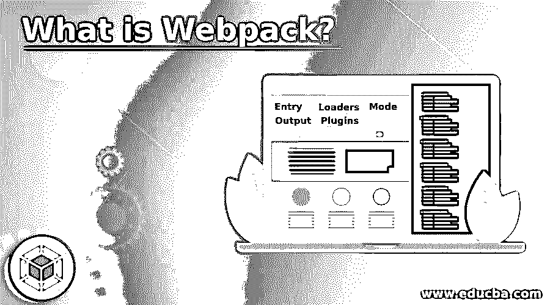

# 什么是 Webpack？

> 原文：<https://www.educba.com/what-is-webpack/>

## Webpack 简介

Webpack 被定义为一个模块错误，也有助于捆绑模块和不同的任务运行器。所有的资产和文件都被认为是模块，其中有一个依赖图。依赖图用于借助文件间的引用将模块相互关联。它用于遍历模块，以便可以创建依赖图，从而可以构建一个单独的包。用于此目的的编程语言是 JavaScript。

### 什么是 Webpack？

它被定义为使用 JavaScript 应用程序的静态模块捆绑器。创建了依赖图，该依赖图可用于将所有 JavaScript 模块捆绑在单个模块中，因为所有 JavaScript 模块相互依赖。

<small>网页开发、编程语言、软件测试&其他</small>

在使用该工具之前，需要理解一些相关的重要概念。其中一些提到如下:

#### 1.进入

对于 webpack 模块，入口点是一个模块，以便 webpack 可以开始构建内部类型依赖图。所有的入口点和模块都包含在依赖图中，这样依赖图中就不会留下任何未包含的模块。默认的入口点是。也可以在 webpack 配置文件中指定单独的模块。

#### 2.输出

它是另一种类型的属性，指导包的存储位置以及需要给文件起什么名字。默认情况下，值集为。/dist/main.js，对于生成的文件。/dist 是给定的默认值。其他文件可以是图像文件或任何其他文件。该值可以根据用户要求在配置文件中指定。

#### 3 .装载机

支持两种类型的文件，包括 JSON 文件和 JavaScript 文件。为了支持另一种类型的文件格式，webpack 使用加载器将文件转换成有效的格式模块。加载器用于将不受支持的模块的源代码转换成受支持的模块，以便可以将其添加到依赖图中。例如，CoffeeScript 语言被转换成 JavaScript 文件。

#### 4.插件

插件是加载程序的替代品，因为它们比加载程序更强大，并且可以执行加载程序无法执行的一些功能。插件可以用来管理资产，最小化捆绑包，并优化捆绑包，以便以更好的方式使用它。

#### 5.方式

有两类源代码——一类用于生产目的，一类用于开发目的。该模块用于将模式更改为生产、开发或其他模式。内置选项在 webpack 中。默认情况下，模式值设置为生产。

### 如何使用 Webpack？

因为 webpack 用于编译 JavaScript 模块。安装后，用户可以通过 API 或 CLI 进行交互。开始使用 webpack 需要几个步骤:

*   用户需要创建一个目录，初始化 npm，然后在本地系统中安装 webpack。然后需要安装 webpack-cli。
*   安装之后，下一步是创建包。在这一步中，源代码和发布代码需要分离。
*   之后，可以使用 web 浏览器创建模块。使用 webpack 旧的浏览器也可以使用。
*   接下来的事情是配置 webpack。有一个给定的配置文件，用户需要配置。
*   创建 npm 脚本是为了使用 webpack CLI 测试 webpack 副本。
*   创建脚本后，运行脚本以获得输出。输出可以显示在 webpack-CLI 中，这有助于节省工作和成本。

### 网络包的重要性

有几个相关重要因素。其中一些提到如下:

#### 1.自动化

所有的自动化工作都由 webpack 直接完成。不需要在 HTML 头中添加 JavaScript 库，webpack 可以用来做所有这些事情，帮助开发人员节省精力。它用于将所有必需的库添加到 bundle 中，以便在模块中使用。

#### 2.装载速度

当任何一个脚本被加载到网页中时，都要花费大量的精力和昂贵的方法。这有助于降低成本，因为所有模块都可以捆绑到一个模块中。与逐个获取所有模块相比，网络服务器可以容易地获取单个模块。

#### 3.仅加载重要的脚本

当使用任何普通应用程序时，所有的 JavaScript 模块都由普通应用程序加载，这产生了不必要的负担，但是在 webpack 中，只加载必要的模块，从而只加载必要的模块，并且减少了 web 服务器的负担。这也很重要，因为它有助于代码分割。因为脚本可以通过使用该应用程序按需加载。

#### 4.依赖性问题

使用该应用程序时，依赖性问题被消除。库和脚本之间的依赖关系可以减少。

#### 5.开发可以很快完成

Webpack 提供热模块替换，因此可以减少开发时间。通过这一点，生产率可以得到提高。JavaScript 模块的开发不能加速，但是 CSS 模块可以使用 webpack 加速。因为当开发者调试代码或脚本中的任何问题时，不需要加载完整的网页。构建系统也可以用这个来控制。

### 结论

webpack 是一种用于编译 JavaScript 模块的应用程序。使用此功能，用户可以将不同的模块捆绑在一个模块中。可以从所有模块中创建依赖图。通过使用 webpack，可以很容易地消除对模块的依赖。该软件在加载 JavaScript 时减少了工作量和成本，为使用该工具创造了更多的重要性。

### 推荐文章

这是一个什么是 Webpack 的指南？.这里我们也讨论一下入门和如何使用 webpack？以及重要性和解释。您也可以看看以下文章，了解更多信息–

1.  [Browserify vs Webpack](https://www.educba.com/browserify-vs-webpack/)
2.  [Rollup vs Webpack](https://www.educba.com/rollup-vs-webpack/)
3.  [NPM 的替代方案](https://www.educba.com/npm-alternatives/)
4.  [安装角度](https://www.educba.com/installing-angular/)

