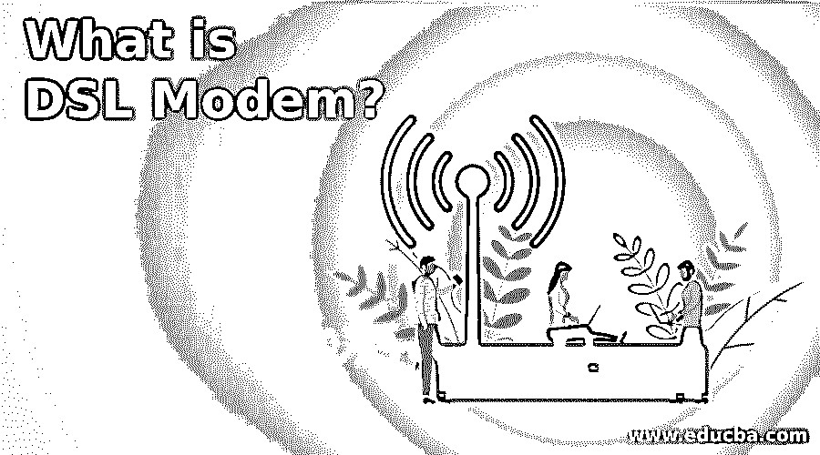

# 什么是 DSL 调制解调器？

> 原文：<https://www.educba.com/what-is-dsl-modem/>

## DSL 调制解调器简介

什么是 DSL 调制解调器，DSL 代表数字用户线路，通过电话线可以将数据从一个地方传输到另一个地方？调制解调器将数据转换成接收器可理解的格式，以便接收器可以根据需要翻译和接收数据。可以看出，如果有人用我们不熟悉的外语或母语和我们说话，我们将无法获取信息。所以，数据应该被翻译成我们能够理解的格式。这是调制解调器的工作原理。

通过电缆将计算机系统或路由器连接到电话线以向系统提供数字用户线服务的设备称为 DSL 调制解调器连接。电话连接不会中断，即使使用电话连接，设备也能有效工作。很容易说，我们通过电话连接获得互联网连接。这是电信公司的一种经营方式。电话和 DSL 连接的频率是不同的，这就是为什么即使使用互联网电话也能工作的原因。

<small>网页开发、编程语言、软件测试&其他</small>

### DSL 调制解调器是如何工作的？

了解电话线和连接的工作原理对了解 DSL 很重要。电话连接是通过电线进行的，这些电线可能在地下，也可能不在地下。这些电线的容量超过了普通电话频率的容量。因此，DSL 被用于具有不同频率的电话线路中，以便在相同的线路中也能够实现互联网连接。因此，如果我们考虑 DSL 使用和电话引入的时期，我们可以说，由于使用频率降低，电话电缆被浪费了近一个世纪。

DSL 连接需要一个特定的调制解调器，它只能用于相同的目的。使用一个分路器，以便将语音和数据连接与电话线分开。数据通过专门使用的 ADSL 线路发送，因此下载数据连接比上传数据连接更快。需要注意的是，与其他调制解调器类似，调制解调器和 ISP 集线器应该保持靠近，以便连接总是更快。如果我们远离调制解调器，数据连接的速度会更差。

如上所述，DSL 连接需要两台设备。调制解调器和分离器使 DSL 连接更好。调制解调器由公司或为 DSL 连接工作的路由器提供。它的设计方式是，如果我们从一个 ISP 更换，如果我们改变连接，它可能不会工作得很好。分离器的用途从名称就可以理解，因为它将数据连接和语音调制分开。从分离器到 DSL 有两个连接，一个连接到电话。数据连接的速度也依赖于拆分器。分离器应该能够很好地管理两者的频率。DSL 连接是通过电话连接进行的，因此如果电话服务不可用，则提供电话服务。这项电话服务将没有拨号音。

### DSL 连接的重要性

首先，通过阅读这篇文章，我们知道 DSL 连接在效率和速度上是相当不错的。这就是为什么我们必须在家里和工作场所使用 DSL 连接。由于我们现在在任何地方都使用电话连接，所以可以很容易地通过电信运营商建立 DSL 连接。我们不能比较普通调制解调器和 DSL 连接的速度，这是一个使用 DSL 连接的例子。

房屋中的几条电线和设备可能会令人烦恼，就好像一个设备不工作，很难找出哪条电线连接到特定的设备。DSL 在这方面具有优势，因为 DSL 连接不需要特定的有线连接，因为已经建立了电话连接。此外，这种调制解调器不会中断电话服务，因此我们可以在家人通过电话通话时使用互联网。

此外，另一点要注意的是，调制解调器在安装期间总是免费提供的。也许电信公司正在创造业务和建立客户的信任，但是是的，他们大部分是免费提供的。在比较价格时，这使得 DSL 成为许多人更好的选择。由于许多其他调制解调器服务收取调制解调器额外的价格，这成为一个昂贵的事情，而安装互联网连接。此外，如果我们不使用电话连接，他们提供一些优惠的电话连接到家庭或办公室。

DSL 互联网连接仍然是一件私事，即使邻居使用互联网，它也能快速工作。如果使用电缆连接，互联网连接必须是共享的，如果在高峰工作时间(如交通高峰时间)，连接会显得很慢。DSL 连接既便宜又快速，这使得它成为所有想要使用宽带服务的人喜欢的连接方式。

### 结论

可用性和低价格使得 DSL 在客户中很有吸引力。此外，有了安装工具包和说明书，我们可以自己动手，让它工作。它更多地出现在城市地区，这对许多人来说可能是一个不利条件。

### 推荐文章

这是什么是 DSL 调制解调器的指南。这里我们讨论 DSL 调制解调器的介绍，它是如何详细工作的，以及它的重要性。您也可以浏览我们的其他相关文章，了解更多信息——

1.  [调制解调器 vs 路由器](https://www.educba.com/modem-vs-router/)
2.  [什么是路由器？](https://www.educba.com/what-is-router/)
3.  [网络设备的类型](https://www.educba.com/types-of-network-devices/)
4.  [软件质量控制](https://www.educba.com/software-quality-control/)

