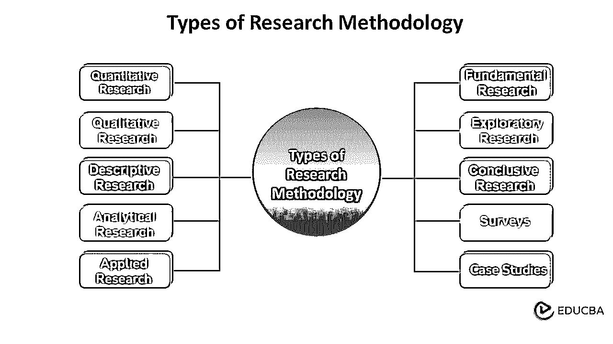
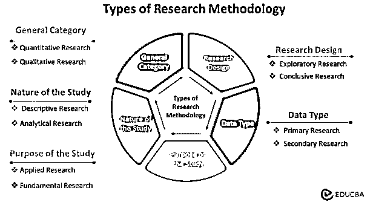
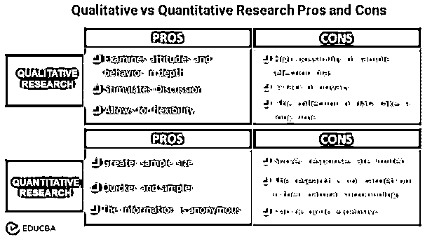
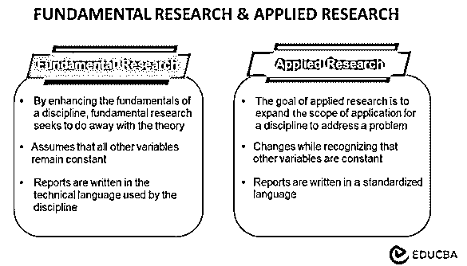
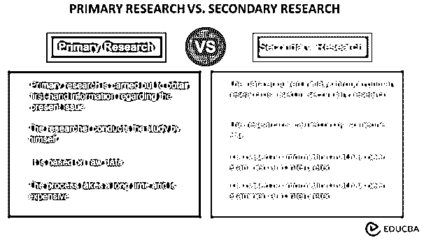

# 研究方法的类型

> 原文：<https://www.educba.com/types-of-research-methodology/>

## 研究方法类型介绍

研究方法是指用来有效描述研究的方法和技术。它涉及一项研究的系统设计，以保证结果符合研究的目的和目标。研究人员主要负责提出想法，并解释所使用的不同类型的研究方法。

### 目录

*   **研究方法类型介绍**
*   **研究方法类型列表**
*   **选择研究方法时需要考虑的技巧**
*   **使用不同类型研究方法的优势**
*   **结论**
*   **常见问题解答**
*   **推荐文章**

### 关键要点

*   为了确保收集的数据有价值和可靠，研究人员采用了各种研究方法。
*   研究者根据不同的标准对研究方法进行分类。它们是一般类别、研究的性质、研究的目的、研究设计和数据类型。
*   调查和案例研究是研究中最常用的两种数据收集工具。
*   使用研究方法有许多优点，包括帮助研究者拓展研究领域和更有效地进行研究。两者都有助于研究者对主题的了解。

### 研究方法类型列表

<small>网页开发、编程语言、软件测试&其他</small>

研究方法根据不同的类别进行分类。它们包括一般类别、研究性质、目的、研究设计和数据类型。也有基于研究方法的访谈和案例研究。在一些研究中，研究者结合了两种以上的方法，而在一些研究中结合了很少的方法。

基于**一般** **类别**:

1.  #### Quantitative research

顾名思义，[量化数据](https://www.ncbi.nlm.nih.gov/pmc/articles/PMC7719473/)依赖于量化某一特定现象的一定量或数量。它侧重于收集和分析数字数据，可用于寻找平均值和模式或预测结果。

它属于两个主要的研究范畴，并且依赖于数字。它使用表格、事实和图表得出结论。许多科学和实地研究主要使用这种形式的研究。

定量研究的一些利弊如下:

**优点**

它允许更大的样本量，能够对调查结果进行彻底的分析，并有助于对您的目标受众得出更广泛的结论。

因为定量研究使用调查、实验和实时数据收集，所以在收集研究数据时有最小的延迟。因此，与其他研究方法相比，研究人员分析研究信息的速度相当快。

由于匿名，研究人员在检查敏感话题时经常使用定量数据。因此，此设置降低了产生不准确数据的可能性。

**缺点**

因为研究人员可能无法在受试者的自然环境中进行研究，所以它可能看起来是人为的和受管制的。参与者的回答是声称的，可能并不反映他们实际的真实行为。

因为调查的回答是有限的，你不能像定性研究那样深入探究行为、态度和动机。

定量研究需要考虑一个财务因素，因为它可能很昂贵。

2.  #### Qualitative research

定性是指研究中的非数值因素。当研究人员不能从数字上掌握信息或数据时，定性研究就能派上用场。虽然不如定量研究可靠，但定性研究有助于在数据中形成更好的理论总结。

此外，这种类型的研究对发现人类行为背后的激励因素感兴趣，即，为什么人们以特定的方式行动或思考。通过这项研究，人们可以了解驱动人们以某种方式行为或控制他们对某一特定事物的倾向的变量。

其利弊如下:

**优点**

由于定性研究比其他研究方法使用更小的样本量，研究可以更快地进行。社会科学家可以使用这个框架有效地从参与者那里收集数据，从而得出对公众有益的结论。

它能够更深入地探索态度和行为，因为它更亲密，可以深入细节，更好地理解他们的想法和行动，以制定或检查假设。

它允许灵活性，因为面试官可以进入主题，探索任何他们认为相关的问题，他们甚至可以改变设置。

**缺点**

你选择参与定性研究的人可能对主题都有特定的观点，而不是一群有不同观点的人，这意味着在样本选择中可能存在偏见。

收集数据需要很长时间，因为需要时间来筛选元素以确定哪些是有用的，哪些是无用的。

一些参与者可能担心缺乏隐私，尤其是在讨论敏感问题时。

根据研究的**性质**:

3.  #### Descriptive research

描述性研究是一种概述被研究人群或问题特征的分析。这种描述性的方法更关注研究问题的“是什么”而不是“为什么”由于研究者不能影响研究设计中的变量，他们只能准确地报道已经发生或正在发生的事实。

描述性研究中使用的主要方法包括观察、调查和案例研究。人们可以在描述性研究中使用许多变量来解释事实。

它的优点包括:a)有效地分析不能依赖数字的主题和问题，b)在未改变的自然环境中可观察，以及 c)比定量实验花费更少的时间。

4.  #### Analysis and research

分析性研究使用已证实的事实作为研究的基础。研究人员经常通过研究来寻找支持数据，以加强和验证他们早期的发现。此外，它有助于开发与研究主题相关的新概念。因此，分析研究结合微小的细节来产生更站得住脚的假设。因此，分析研究解释了为什么主张是有效的。

有各种方法来进行这项研究，包括元分析，文学或科学试验，以及了解公众意见。

此外，研究人员用这种方法对材料进行了严格的评估。分析方法也经常使用定量方法。

基于研究的**目的**:

5.  #### Applied research

只研究一个领域并且通常将研究结果一般化的行动研究被称为应用研究。研究人员将变量视为常数，研究人员进行预测，这使得这些方法在应用研究中很容易找到。

应用研究旨在解决社会或商业/工业组织当前面临的问题。应用研究被认为是非系统的探究；企业、政府机构或个人通常会进行这种研究来解决特定的问题。

一个例子是对吸引中国千禧一代目标的营销策略的研究。

6.  #### Basic research

理论的形成和概括是基础研究的主要关注点。它寻求发现具有广泛应用的事实，补充特定领域或行业中已知的想法。

几个领域相互关联，目的是发现如何改变传统事物或开发新事物。人们可以在日常语言中找到总结，并在研究中应用逻辑发现。

基础研究的一些例子是对人类行为一般化的研究或对纯数学的研究。

基于**研究**设计:

7.  #### Exploratory research

理论及其解释是探索性研究的基础。它的目标只是调查研究问题，而不是为当前的问题提供明确和结论性的解决方案。

探索性研究旨在增加我们对问题的理解，而不是提供确凿的证据。结构不当，方法提供了一个灵活的调查方法。所以一个不检验假设，结果对外界没有帮助。调查结果通常是一个相关的主题，这有助于改善研究。

探索性研究通常是定性的，但大样本探索性研究也可以是定量的。由于其灵活性和开放性，它通常被称为解释性研究或扎根理论方法。

8.  #### A conclusive study

结论性研究在方法论上有明确的设计，意在回答研究问题。一个经过深思熟虑的结构有助于制定和解决假设，并给出结果。这里的结果是通用的。

此外，建立本研究的研究目标和数据要求也是至关重要的，因为结论性的研究结果通常都有特定的目的。探索性研究的结果可以使用结论性研究设计进行验证和量化。

结论性研究设计通常采用数据收集和分析的定量方法。此外，结论性研究通常采用演绎研究方法。

基于**类型的数据:**

9.  #### Primary research and secondary research

研究人员为**初级**T2 研究收集新数据。当研究者第一次收集某个主题的信息时，该研究被归类为初级。调查、采访和观察是收集数据的几种常见方式。

另一方面，**二级** **研究**使用以前通过一级研究收集的数据。书籍、杂志、行业杂志和其他媒体主要作为二手资料来源。此外，在这种情况下，研究人员不进行原始数据收集。

由于所有的一手研究都需要在研究过程的文献综述阶段收集和分析二手资料，所以记住一手研究也包括二手研究是至关重要的。然而，一手研究和二手研究的主要区别在于是否有任何研究人员以前从事过这项研究。

一手和二手研究各有利弊。原始数据更加耗时和昂贵，尽管它是特定需求的高质量数据。相反，二手研究费用低廉，数据收集简单，但信息有可能过时或不适合个人需要。因此，必须首先评估这两种方案的要求、来源、费用等。，然后选择一个。

一些常见的数据收集方法:

10.  #### Investigation

**客服反馈表**

You can download this Customer Service Feedback Form here – [Customer Service Feedback Form](#popmake-167767)Surveys play a prominent role in the research method. It helps to collect a vast amount of real-time data and helps in the research process. It is done at a low cost and is usually faster than any other method. A researcher can conduct surveys in both quantitative and qualitative methods. The researcher usually prefers quantitative surveys over qualitative ones as they provide numerical outputs and accurate data.

调查主要用于了解市场对某种产品的需求。这也有助于根据研究结果预测产量。

问卷调查和访谈是两种最常见的调查方式。虽然面谈是面对面进行的，以反映感受和经历，并更强调探索问题，但研究人员使用问卷调查来快速获取大量信息。

11.  #### Case study

[定性分析](https://www.educba.com/what-is-qualitative-data-analysis/)的一种常用技术是案例研究法，这种方法需要对一个社会单位进行彻底的观察，并侧重于深入的研究。案例研究强调对一小组环境及其相互作用的详细考察。案例研究方法的目标是找到集体解释所提供单元的行为模式的元素。

在这种[研究方法](https://www.educba.com/types-of-research-methodology/)的方法中，研究人员考虑不同的情况，并选择适合研究的情况。案例研究有助于发展研究的思路，有助于研究的基础。

人们考虑来自案例研究的各种事实和理论，这些事实和理论有助于形成关于研究主题的适当评论。研究者可以根据研究中的文献综述，对主题进行概括或具体化。研究者可以从案例研究中对研究做出恰当的理解。

此外，我们有焦点小组和研究访谈，以明确的方式了解研究方法。各种方法可以遵循结构化和非结构化方法。

### 选择研究方法时需要考虑的技巧

*   在开始任何研究之前，应该牢记一个明确的目标，因为一个好的研究问题应该是精确的、适用的和有价值的。这表明你能够完全解决问题并据此做出判断。
*   为了使研究可靠，研究者必须确保**相关人群**的适当代表性。您必须创建包容性的调查和问卷，以确保适当的代表性。
*   你的面试问题应该**收集必要的数据**并巧妙地解决你的研究问题。要做到这一点，与受试者建立融洽的关系至关重要。
*   另一个需要考虑的是你有多少时间可以利用。如果有时间限制，可以考虑方便或随机抽样等方法，以及能够在几天内收集数据的工具。如果有更多的时间，面对面的访谈和观察是数据收集的选择。

在研究过程中，研究者采用了多种方法来解释这些观点；我们将在本文中研究各种类型。方法的选择完全由研究者决定，对类型没有限制。

### 使用不同类型研究方法的优势

优势如下:

*   这些不同的方法有助于达到研究的目的，即有效地分析主题数据。他们提供验证和事实检查，这在关键评估中至关重要。它也提供了看待事物的不同视角。
*   调查是定量方法，有助于获得有关研究的数字统计。在数字调查的帮助下，研究人员可以跳过复杂的论文，毫不费力地获得必要的结果。
*   定性方法，包括案例研究，有助于深入研究。研究者可以更深入地研究主题，直接研究行为模式。
*   不同的方法有助于验证研究并提高其可靠性。这也有助于为大多数观众概括分析。

### 结论

研究人员在所有领域都取得了进展，他们的研究对整个社会都有帮助。了解研究方法对于验证和确认不同领域的研究至关重要。此外，它提供了一个全面的计划，有助于保持研究人员在课程上，促进一个简单，有效和可管理的过程。

### 常见问题

#### 1.什么是混合研究方法？

**答案:**

混合方法研究是指研究人员在同一研究中收集和分析定量和定性数据。

#### 2.什么是抽样？

**答案:**

样本是从大量人口中抽取的一小部分人。抽样就是选择你将从中抽取数据进行研究的群体。

#### 3.什么是研究设计？

**答案:**

研究设计是解决你的研究问题的策略。它确定了策略的范围，并指定了数据收集和分析的方法。

#### 4.研究方法和研究方法论有什么区别？

**答案:**

方法的目的是为研究问题找到一个解决方案，而方法论的目标是检验用来找到解决方案的方法的适当性。毕竟，方法仅仅是用来选择研究方法的行为或工具。该方法评估所有的调查方法和程序。

### 推荐文章

这是一个研究方法类型的指南。这里我们讨论 11 种研究方法及其各自的优势。您也可以看看以下文章，了解更多信息–

1.  [Arduino 的类型](https://www.educba.com/types-of-arduino/)
2.  [主板类型](https://www.educba.com/types-of-motherboard/)
3.  [什么是方法论？](https://www.educba.com/what-is-methodology/)
4.  [项目管理方法](https://www.educba.com/project-management-methodology/)

