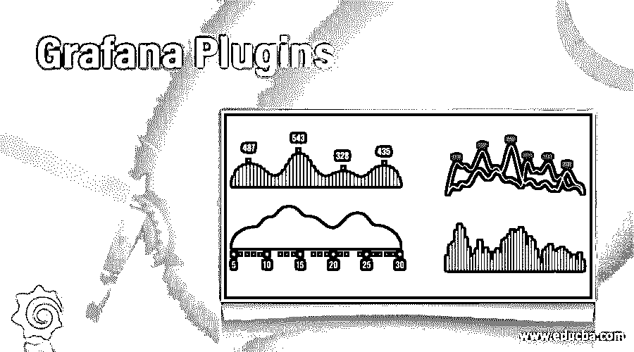

# Grafana 插件

> 原文：<https://www.educba.com/grafana-plugins/>

## Grafana 插件简介

Grafana 插件是外部软件组件，通过各种新功能增强用户体验，如改进数据点的可视化、包含来自另一个数据源的数据以获得更好的洞察力，以及增加新功能以提高所呈现数据的可读性。

这些插件软件组件可以由 Grafana 构建，也可以由第三方开发人员开发，或者由内部团队构建，这些插件与 Grafana 主软件接口。最终用户将能够使用查询构建器和插件交互式地生成复杂的仪表板。这些插件减少了主应用程序的大小和负载，并简化了许可证管理。

<small>网页开发、编程语言、软件测试&其他</small>

下面我们来过一遍 Grafana 的各大插件的功能和特点。

### 格拉夫纳简介

Grafana 是 TorkelOdegaard 于 2014 年在 Orbitz 开发的一个分支项目。它更侧重于时间序列数据和数据可视化特性。它支持 InfluxDb、OpenTSDB 数据库以及传统的 RDB，如 MySQL、SQL Server 和 PostgreSQL。它是一个开源数据分析平台，专门通过 web 应用程序提供图形、图表和警报。该工具的功能可以借助本地插件或定制的第三方插件进行扩展。

### 不同类型的 Grafana 插件

三种主要类型:

*   该小组
*   数据源
*   应用

#### 1 个面板插件

这些插件在主 Grafana 工具提供的时间序列和非时间序列数据的基础上增加了额外的数据可视化特性。

##### 桌子面板插件(Grafana 游乐场)

它处理表实现，其功能包括小计、分页、数据过滤和行突出显示，这使得数据可视化体验变得简单而有吸引力。这个表格插件是 Grafana 产品的一部分，它使用户能够清楚地查看图表中的高点和低点，并观察数据趋势。它还使用户能够寻找高点和低点之外的特定值，并理解图表的行为和推断见解。

##### 图形面板插件

它使用灵活的可视化设置来设计有吸引力的仪表板，处理关于管理不同时间序列数据的多种类型的图表的附加功能。这个插件是 Grafana 工具不可分割的一部分。点、线和条等绘图选项可用于绘制不同的时间序列图，以获得清晰的数据可读性和最佳的可视化效果。

X 轴和 Y 轴可以以不同的方式配置，以便绘制数据并轻松解释它们，例如直方图和时间序列可以绘制在 X 轴上，单位、最大/最小值和刻度可以绘制在 Y 轴上。数据可以链接到另一个仪表板或外部链接(URL ),以便更深入地研究和更好地理解数据行为。

此插件可用作创建其他仪表板和生成丰富数据可视化体验的定制插件的基础。

##### 世界地图面板

由 Grafana Labs 开发的这个插件有助于将数据映射为平铺世界地图上的圆圈。此插件的输入是带有 geohash 数据的时间序列度量或包含要链接到位置的数据的表，以及经度和纬度中的位置细节。

##### 时钟面板

这个插件显示一个事件的时间或倒计时，并经常更新。

#### 2.数据源插件

这些插件方便 Grafana 与外部数据库和在线数据源进行接口，从数据源中提取相关数据，并提供给它们供消费的应用程序。它支持 PostgreSQL、influxDB、MySQL、Google BigQuery、Oracle 和 Azure Data Explorer 等数据源。

##### 应用动力学

通过从连接的数据库和应用服务器收集的数据，可以有效地监控应用性能。应用程序响应时间、API 调用数量、JVM 内存使用情况、数据库性能细节都映射到这个工具，应用程序使用情况通过这个插件提供的令人眼花缭乱的仪表板进行监控。这个插件非常适合 Java 应用程序，性能瓶颈可以跟踪到应用程序的那个部分，问题可以得到解决。

##### 数量

Scalyr 为 Grafana 发布的插件，从开发环境中的各种数据源收集数据，并提供各种指标的仪表板，生成警报并从连接的数据库中提取数据。这个插件是一个日志管理工具，它从各种数据源收集日志数据，包括非结构化数据和其他不包括在 Grafana 列表中的数据源，并以令人印象深刻的仪表板格式显示处理后的数据。

##### 云观察

Plugin by CloudWatch for Grafana 是一个应用程序监控工具，它从各种来源提取关于应用程序性能的数据，并创建一个关于资源利用、数据库活动和其他健康监控参数的仪表板。该插件将 Grafana 与 AWS 服务和非 AWS 服务的几个数据源集成在一起，并为管理跨应用程序环境提供了一个单一的监控工具。

#### 3.应用插件

它是一个面板、数据源、新 UI 页面和仪表板的捆绑包。它是上述两种类型的插件以及新的吸引人的特性的结合。

##### 库伯内特斯

Kubernetes 提供的开源插件帮助系统管理员通过 Grafana 可视化分析工具监控容器化的应用程序。这个插件在节点级别提供容器性能参数的数据，比如网络流量、CPU/内存使用和输入/输出操作。可以在 Kubernetes 的基本执行单元(即 Pod)跟踪性能，并且可以轻松监控整个集群的健康状况。

##### 扇子

该插件有助于自动监控 IT 环境中的基础设施资产。Grafana 仪表板使用该插件提供的输入提供了所有基础设施资产性能的综合视图。Sensu 在 Grafana 中提供了大量关于基础设施资源性能的数据，如客户数据、事件指标和结果，以便进行分析并向用户提供见解。

##### 扎比克斯

非常适合 Zabbix 指标的时序分析和可视化。多个指标可以映射到一个交互式动态控制面板中。其他功能包括带注释的事件显示、触发器面板中的问题显示和早期警告警报。

### 结论

内部开发团队应该利用可用的 Grafana 社区支持、丰富的文档和庞大的插件库来开发他们的插件，以丰富 UI 并使用户体验更上一层楼。

### 推荐文章

这是 Grafana 插件的指南。这里我们讨论 3 种不同类型的 Grafana 插件以及它们各自的特性和功能。您也可以看看以下文章，了解更多信息–

1.  [搅拌机插件](https://www.educba.com/blender-plugins/)
2.  [胃插件](https://www.educba.com/maven-plugins/)
3.  [jQuery 插件](https://www.educba.com/jquery-plugins/)
4.  [詹金斯插件](https://www.educba.com/jenkins-plugins/)

