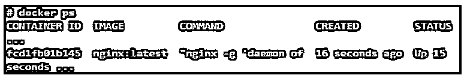
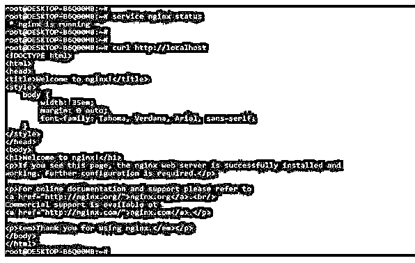
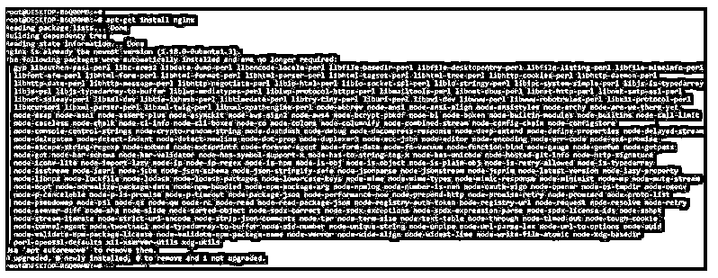
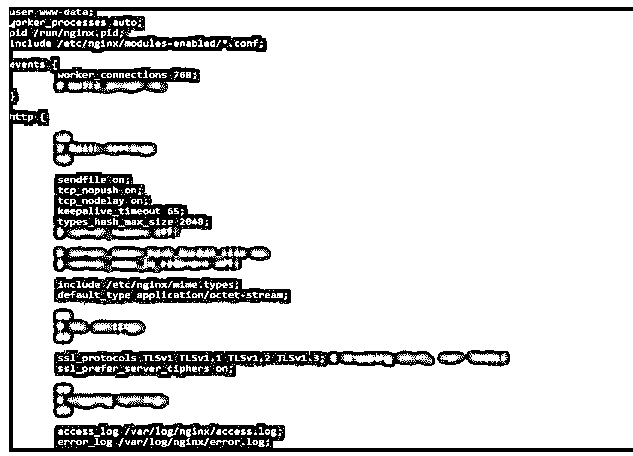
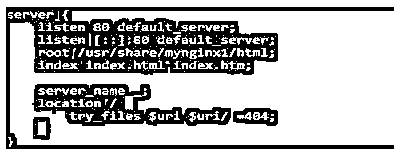
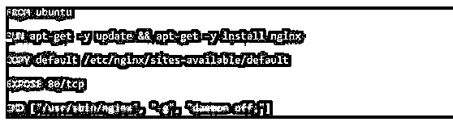
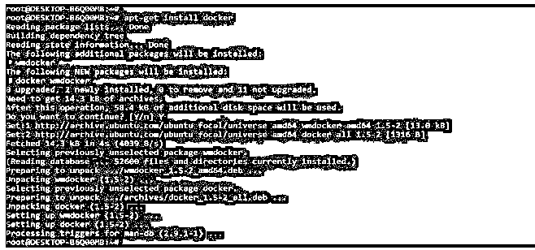

# Nginx 容器

> 原文：<https://www.educba.com/nginx-container/>


## Nginx 容器简介

Nginx 容器是一个开放平台，用于运行、运输和构建分布式应用程序作为容器。它是一个独立的、轻量级的、可执行的软件包，包括运行应用程序。反过来，它将被部署到 Kubernetes 的编排平台的容器平台上。Nginx 正在 nginx 开源版本中提供 F5 的入口控制器。

### Nginx 容器是什么？

通过使用它，我们可以减少系统管理的开销。Nginx 将自己描述为反向代理、http、通用 TCP 代理和邮件代理服务器。基本上，许多系统管理员使用 nginx 来提供 web 内容。Nginx 是一个高性能的交付平台和 web 服务器，负载平衡器在 docker 容器中提供。docker 的平台包括引擎 docker，运行时将构建并运行容器。docker hub 的托管服务，整个开发社区在其中对应用程序进行 docker 化和协作。

<small>网页开发、编程语言、软件测试&其他</small>

### 使用 Nginx 容器

通过将应用程序从约束的基础结构中分离出来，它将使开发人员能够将精力集中在应用程序内容上。

使用 Docker hub 的映像，我们可以在 Docker 容器中创建 nginx 实例。要使用它，首先，我们需要在我们的系统中安装 docker。我们需要运行下面的命令来启动容器中的一个实例，并且需要使用默认的 nginx 配置。

**代码:**

```
docker run –name (container_name) -p (map post) -d nginx
```

**输出:**


上面的命令将基于 nginx 的映像创建一个名为 mynginx1 的容器。我们可以看到，这个命令返回长形式的容器 ID，它被用在日志文件的名称中。p 选项用于告诉 docker 映射从容器中暴露的 post。第一个参数将指定容器将以分离模式运行。要检查容器是否已创建并且正在运行，我们可以使用以下命令进行检查。

**代码:**

```
docker ps
```

**输出:**




我们还可以使用下面的命令检查 nginx 是否在我们的服务器上运行。运行 curl 命令后会出现 nginx 页面的默认代码，运行 status 命令后会显示 nginx 服务器的运行状态。

**代码:**

```
service nginx status
curl http://localhost
```

**输出:**




管理 nginx 实例的 SSH 访问是非常常见的，但是 nginx 的映像没有安装 OpenSSH，因为 docker 容器通常只用于一个目的。

### 如何设置 Nginx Docker 容器？

正如我们所知，nginx 是一个强大的高级服务器，我们可以使用它来提供各种内容，如网页和 API。要设置一个 nginx docker 容器，首先，我们需要在我们的系统中安装 nginx。

以下步骤显示了我们如何设置 nginx docker 容器，如下所示:

1.在设置 nginx docker 容器时，首先，我们在系统上安装 nginx，如下所示。

**代码:**

```
apt-get install nginx
```

**输出:**




2.nginx 服务器默认不启动。要开始同样的操作，我们需要执行下面的命令。我们可以如下检查 nginx 服务器和支持模块的版本。

**代码:**

```
service nginx start
service nginx status
nginx –V
```

**输出:**


3.在这一步中，我们使用 docker 文件创建 nginx 映像的初始设置，如下所示。

**代码:**

```
mkdir mynginx1
touch Dockerfile
```

**输出:**


4.现在创建了目录和 dockerfile 之后，我们打开配置文件来添加条目，如下所示。




5.打开配置文件后，我们将在下面添加服务器和位置指令。

**代码:**

```
server {
  listen 80 default_server;
  listen [::]:80 default_server;
  root /usr/share/mynginx1/html;
  index index.html index.htm;
  server_name _;
  location / {
  try_files $uri $uri/ =404;
 }
}
```

**输出:**




6.添加服务器和位置指令后，我们将如下命令添加到 docker 文件中，如下所示。

**代码:**

```
FROM ubuntu
…..
EXPOSE 80/tcp
```

**输出:**




7.将内容添加到 docker 文件后，我们将构建一个 docker 映像，如下所示。

**代码:**

```
docker build . -t nginx/mynginx1
```

**输出:**


8.构建完映像后，我们通过发出如下命令来运行映像。

**代码:**

```
docker run --name (container_name) -p (map post) -d nginx
```

**输出:**


### Nginx 容器服务器

我们可以在服务器上使用 docker 容器。为了首先使用 nginx 和 docker 容器，我们需要在我们的系统中安装相同的容器。下面的例子显示了使用服务器安装 docker 容器，如下所示。

**代码:**

```
apt-get install docker
```

**输出:**




为了托管一些示例内容，我们使用 nginx 中的服务器。我们没有使用 SSH 来访问 nginx 服务器的容器。假设我们想要编辑配置文件，那么我们需要创建包含对 shell 的访问的助手容器。对于用于访问文件的帮助器容器，我们需要创建一个包含适当数据卷的新映像，这是我们在映像中定义的。在服务器中，Debian 参数意味着 helper 容器，它使用来自 docker hub 的 Debian 映像。

### 结论

Nginx 将自己描述为反向代理、http、通用 TCP 代理和邮件代理服务器。基本上，许多系统管理员使用 nginx 来提供 web 内容。它是一个开放的平台，用于运行、运输和构建分布式应用程序作为容器。

### 推荐文章

这是一个 Nginx 容器的指南。这里我们讨论一下 Nginx docker 容器的介绍和如何设置？和服务器。您也可以看看以下文章，了解更多信息–

1.  [Nginx 添加 _header](https://www.educba.com/nginx-add_header/)
2.  [Nginx 位置指令](https://www.educba.com/nginx-location-directive/)
3.  [Nginx 晶圆](https://www.educba.com/nginx-waf/)
4.  [Nginx FastCGI](https://www.educba.com/nginx-fastcgi/)


