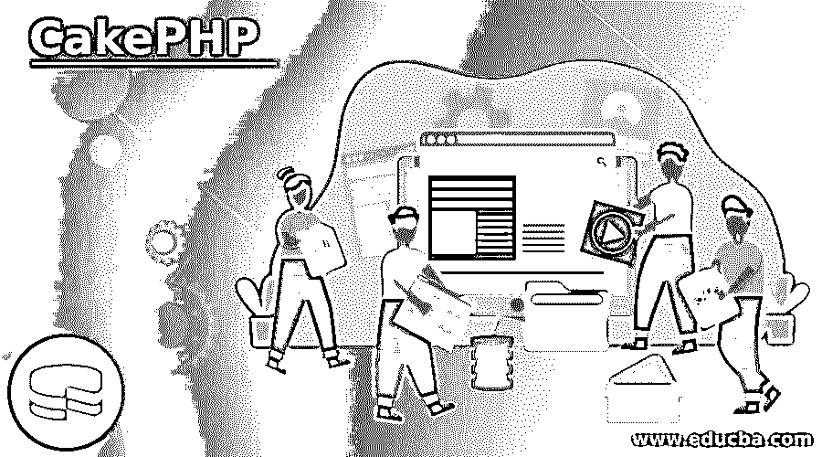

# CakePHP

> 原文：<https://www.educba.com/cakephp/>

## CakePHP 简介

CakePHP 是一个非常快速的开源平台，用于 PHP 框架的开发。它是一个基于 MVC 的模型，其目标是简单、分布式地创建 Web 应用程序。它通常也用于处理一个 web 应用程序，Cake PHP 中巨大的库支持使这一愿景变得清晰，易于开发人员采用。运行时基础设施框架也使得 CakePHP 可以实现这些事情。使用 Cake PHP 时，代码行通常会减少。它是最快的 web 开发平台之一。

CakePHP 由 Michal Tatarynowicz 于 2005 年开发，并按时发布了几个补丁和更新。最新的稳定版本是 2019 年的 3.7.9。CakePHP 中使用的 MVC 架构保证了业务逻辑与各层的分离，使得代码冗余且清晰。

<small>网页开发、编程语言、软件测试&其他</small>

### 为什么选择 CakePHP？

让我们试着去理解为什么要用 CAKE PHP。

*   用户友好的工具:使用 MVC 架构的 CakePHP 是用户友好的，在 Cake PHP 中编码是快速和容易的。
*   **安全性:**高度安全，能够安全处理请求。
*   MVC 框架:它使用遵循分层模型方法的 MVC 框架，保持业务逻辑的清晰和分层。
*   **与数据库轻松交互:**开发人员可以轻松全面地控制数据库。CakePHP 可以轻松处理插入、删除、更新操作。
*   **测试框架支持:**它支持单元测试框架，使开发者测试应用变得容易。
*   **高度兼容:**与 PHP 稳定版本高度兼容。
*   **内置验证:**CakePHP 内置的验证使代码得到验证。
*   搜索引擎的网址是友好的。
*   它对 PostgreSQL、SQL Lite、MYSQL 等数据库有大量的支持。

### CakePHP 的功能

让我们看看 Cake PHP 的工作原理:

*   CakePHP 有一个包含几个部分的请求周期，每个请求都有以下步骤
*   该规则被重定向到 index.php。
*   自动加载程序和引导文件被进一步执行。
*   调度过滤器处理请求，并在需要时生成响应。
*   此后调用控制器动作，并与模型和组件进行交互。
*   正文和标题的响应由 View 使用 Helper 和 Cells 生成。
*   响应被进一步发送回客户端。
*   控制器与模型和视图交互，将生成的响应返回给用户。
*   应用程序中的用户请求以用户请求的页面开始。分阶段进行，用户请求一个接一个地传递。
*   当客户端发出请求时，调度程序执行该请求，调度程序过滤客户端配置的请求，然后执行受控动作，并与模型交互，获取动态数据。它接受组件并与数据库模型交互，然后将反馈发送给视图。最后，请求显示在 web 浏览器中。

### 优势

让我们来看看 CakePHP 的一些优点:

*   它是一个用于 web 开发的开源框架。
*   它支持 MVC 模式。
*   它有简单的凝乳操作，与数据库的交互也很容易。
*   它遵循内置的验证模型。
*   电子邮件、cookies、会话在 Cake PHP 中都能轻松处理。
*   它有一个内置的模板引擎。
*   它有简单的缓存操作。
*   它提供了一个单一的配置文件，这使得配置部分变得简单。
*   业务层和表示层的独立业务模型。
*   成本模型相对较低。
*   很好理解。
*   CakePHP 可免费用于网站和应用程序开发。
*   它使用 ORM(对象关系映射)并与面向对象模型集成。
*   它要求用户从零配置开始。

### 不足之处

Cake PHP 也有一些缺点，让我们来看看使用 Cake PHP 的一些缺点

*   对 Cake PHP 的文档支持并不是那么支持。
*   实现和学习 PHP 总是有点繁重的任务。
*   它提供了一个单向路由框架，落后于许多框架。
*   我们需要更新 CakePHP 中的默认路由，这在 PHP 中是一项艰巨的任务。

### CakePHP 的用法

让我们检查一下 CakePHP 的用法。

*   用于 Web 开发。
*   嗯，与数据库模型的交互。
*   产生复杂的商业解决方案。
*   ORM 相关业务模型的构建。
*   用于基于 MVC 的 web 应用程序。

从这几点，我们看到了 CakePHP 的用法。

### 结论

从上面的文章中，我们看到了 CakePHP 在现实世界中的重要性。从各种例子和分类中，我们试图理解 CAKE PHP 是如何工作的，以及它在 PHP 编程中的用法。我们还看到了 CakePHP 所需的技能和工作标准。这些优点和缺点给了我们一个清晰的使用 Cake PHP 的模型。架构图帮助我们清楚地理解 Cake PHP 的工作原理。从上面这篇文章中，我们对 CakePHP 及其用法有了相当的了解。

### 推荐文章

这是 CakePHP 的指南。在这里，我们也讨论了 cake PHP 的介绍和工作以及优缺点。您也可以看看以下文章，了解更多信息–

1.  [PHP $_POST](https://www.educba.com/php-_post/)
2.  [PHP $_SERVER](https://www.educba.com/php-_server/)
3.  [PHP require_once](https://www.educba.com/php-require_once/)
4.  [PHP XML 阅读器](https://www.educba.com/php-xml-reader/)

