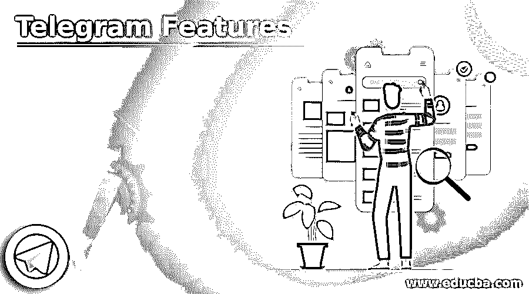

# 电报特征

> 原文：<https://www.educba.com/telegram-features/>

## 电报特征的定义

Telegram 是众所周知的流行消息应用程序之一。这是一个功能丰富的应用程序，提供了丰富的功能，使通信更好，更安全。就功能而言，Telegram 是一款为用户提供全面责任的应用程序，用户可以根据需要操作和使用该应用程序。电报还提供了一些它的对手想都想不到的微妙特征。除了最受欢迎的功能，如编辑已发送的消息，发送现场和当前位置，编辑图像和视频等，它允许用户定制相应的界面和体验。

### 电报的特点

除了简单的在人与人之间发送信息，Telegram 还有一些令人惊叹的鲜为人知的功能。让我们逐一了解其中的一些:

<small>网页开发、编程语言、软件测试&其他</small>

*   **自定义主题:** Telegram 提供了一个非常有趣的功能，可以添加主题，并根据用户在应用程序的界面上应用不同的颜色。人们可以根据喜好定制电报应用程序来查看。用户可以插入新主题，也可以通过下载和应用来使用电报频道中的主题。为了添加新主题，需要遵循以下步骤:设置- >聊天设置- >主题然后点击‘创建新主题’。然后，用户需要添加自定义名称，并单击 OK 按钮完成。颜色和背景选项也可以应用于聊天和消息窗口。
*   **定位附近的用户:** Telegram 购买了定位选择被发现的附近用户的特殊功能。当用户想要将某人添加到他们的电报中，而没有共享号码和在电话上手动保存的麻烦时，该功能是有用的。它还允许您查看已经创建的附近群组，并创建您自己的附近用户。为此打开汉堡菜单->->联系附近的人。要添加新群组中的人:打开汉堡菜单- >联系人- >添加附近的人。
*   聊天的特殊文件夹:你应该知道的电报的一个有用的窍门是“聊天文件夹”。用户有不同的群组，有些是与办公室同事一起开会和讨论，有些是个人社交群组。Telegram 允许用户为每个聊天组创建特殊的文件夹，以便在不同级别区分它们。为此，打开汉堡菜单- >点击设置- >文件夹- >创建新文件夹。给文件夹命名，然后将聊天内容移到其中。
*   **边发边编辑图片:**很多时候我们发错图片或者图片没有编辑。Telegram 有解决这个问题的方法。我们可以编辑图片，即使它是由:长按图片- >点击编辑按钮- >从内置的照片编辑器中选择所需的过滤器/裁剪/编辑图像。编辑 Telegram 中的图像类似于编辑已发送给对方的文本。
*   **生活位置:**和 Whatsapp 一样，Telegram 也提供了分享用户生活位置的功能。这是电报最常用的功能之一。为了与特定的人共享实时位置，必须打开聊天窗口并遵循以下步骤:点击附件按钮(出现在底部)- >位置- >实时位置- >选择 tim 持续时间(直到你想要共享它的时候)。Telegram 用户可以分享 15 分钟、1 小时、8 小时的实时位置。
*   **预定邮件:**由于我们大多数人在日常生活中经常使用预定邮件。电报还提供发送预定消息的功能。为了发送预定消息，需要执行以下步骤:键入消息- >长按发送按钮- >点击预定消息- >选择各自的日期和时间。消息将在预定的日期和时间发送给相应的人。
*   **无声信息:**电报允许用户发送没有任何声音的无声信息。当我们不打扰接收者时(或者他们正在学习、参加会议、睡觉等)，这些信息是非常有用的。要发送无声信息:输入信息- >长按发送键- >选择发送无声。
*   **开启秘密聊天:**与其他信息应用不同，Telegram 允许用户保持聊天私密。为了保持私人内容不被任何人(即使是黑客或当局)截获，Telegram 允许用户对用户加密(尽管其他聊天是用户对服务器加密的)，将聊天存储在匿名服务器上(而不是 Telegram 服务器上)。要开始与此人的秘密聊天，请点击个人资料/用户信息- >向下滚动- >开始秘密聊天。在秘密聊天中有一些限制，如双方用户不能转发消息，截图功能被禁用等。
*   **设置提醒:** Telegram 允许我们像谷歌日历和其他任务管理应用一样设置提醒。要设置提醒只需键入所需的任务- >长按发送按钮- >选择设置提醒- >选择所需的日期和时间。电报将在所需的日期和时间发送提醒通知。Telegram 的提醒功能的一个问题是，用户只能在保存的消息中发送提醒。
*   **编辑发送的信息:**发送错误信息或在错误窗口发送信息的人经常会遇到这种情况。Telegram 赋予用户编辑文本的权力，即使文本已经发出。要做到这一点，长按文本- >点击顶部的编辑图标。编辑消息没有时间限制。用户可以在发送后的 48 小时内编辑信息。

### 结论

上面的描述清楚地解释了电报应用程序是什么，以及它最有趣和鲜为人知的特性。与 Whatsapp、Messenger 等只关注更好沟通的其他消息应用不同，Telegram 在向用户提供大量隐藏和鲜为人知的功能方面要好得多。此外，它可以免费使用，并通过其端到端加密功能更加安全。

### 推荐文章

这是电报功能指南。在这里，我们还将讨论 telegram 的介绍和特性，以及详细的解释。您也可以看看以下文章，了解更多信息–

1.  什么是电子邮件？
2.  [PHP $_SERVER](https://www.educba.com/php-_server/)
3.  [Ubuntu 的使用](https://www.educba.com/uses-of-ubuntu/)
4.  [PHP require_once](https://www.educba.com/php-require_once/)

