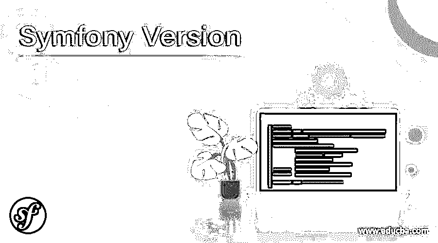

# Symfony 版本

> 原文：<https://www.educba.com/symfony-version/>

## Symfony 版本的定义

Symfony 版本是专门为 PHP web 应用框架设计的软件，由于它拥有一些有用的可重用组件或库，因此具有维护软件的能力。Symfony 软件通过替换一组重复的代码来帮助加速 web 应用程序，并帮助构建健壮的应用程序，该应用程序为开发人员提供了控制和配置任何一组外来库的目录结构的灵活性，这些库可以以任何方式定制以匹配企业开发。这有助于用附加工具建立基准，在许多方面帮助开发人员。

### Symfony 版本列表

Symfony 版本有一个根据基于时间的模型维护的模式，其中次要版本每六个月发布一次，特别是在五月和十一月，而所有主要版本每两年发布一次。以下是作为 Symfony 软件的一部分发布的版本:

<small>网页开发、编程语言、软件测试&其他</small>

**1.0** :该版本软件是 2007 年 1 月发布的初始版本，支持期为三年，维护期于 2010 年 1 月结束。本软件支持 PHP 版本> = 5.0。

**1.1:** 该版本软件于 2008 年 6 月发布，支持期将近一年，维护期于 2009 年 6 月结束。在 2010 版本中，所有与安全相关的补丁都应用于此。本软件支持 PHP 版本> =5.1

**1.2** :该版本软件于 2008 年 12 月发布，支持期近一年，维护期于 2009 年 11 月结束。本软件支持 PHP 版本> = 5.2

**1.3** :该版本软件于 2009 年 11 月发布，并在 2010 年 11 月维护结束后再次获得近一年的支持。该软件支持 PHP 版本> =5.2.4

**1.4** :该软件版本于 2009 年 11 月发布，并在 2012 年 11 月维护结束后再次获得近三年的支持。该软件支持 PHP 版本> =5.2.4。这是主要版本，也是第一个与 1.3 版相同的 LTS 版本，但它不支持 1.3 的废弃版本。

2.0: 该版本软件于 2011 年 7 月发布，错误修复于 2013 年 3 月结束，而安全修复于 2013 年 9 月结束，这意味着发布耗时近三年，并支持 PHP 版本> =5.3.2

**2.1:** 该版本软件于 2012 年 9 月发布，其中更多的组件是稳定 API 的一部分，到 2013 年 6 月发布时花了将近 8 个月的时间。该软件支持 PHP 版本> =5.3.3

**2.2** :该版本软件于 2013 年 3 月发布，2013 年 3 月完成了错误修复，提供了各种新功能和 PHP 版本支持> = 5.3.3

**2.3** :该版本软件于 2013 年 6 月发布，第一个 LTS 版本就是在这里发布的，随后仅用了三个月的时间进行开发，通常需要六个月的额外工作。这支持 PHP 版本> = 5.3.3

**2.4** :该版本软件于 2013 年 11 月发布，是一个为期 8 个月的小版本，维护于 2014 年 7 月结束，其中所有第一个 2.x 分支版本完全向后兼容。支持 PHP 版本> =5.3.3。

**2.5** :该软件版本于 2014 年 5 月发布，是一个为期八个月的小版本，维护工作于 2015 年 1 月结束，支持 PHP 版本> =5.3.3

**2.6** :该版本软件于 2014 年 11 月发布，小版本持续时间为 8 个月，维护结束时间为 2015 年 7 月，支持 PHP 版本> =5.3.3

**2.7** :该版本软件于 2015 年 5 月发布，主版本为三年 LTS 版本，维护结束时间为 2018 年 5 月。支持 PHP 版本> = 5.3.9

**2.8** :该版本软件于 2015 年 11 月发布，主要版本为 LTS 版，维护于 2018 年 11 月结束。对 PHP 版本> = 5.3.9 的支持。

**3.0** :该版本软件于 2015 年 11 月发布，8 个月小版本，2016 年 7 月维护结束。支持 PHP 版本> =5.5.9

**3.1** :该版本软件于 2016 年 5 月发布，8 个月小版本，2017 年 1 月维护结束。支持 PHP 版本> =5.5.9

**3.2** :该版本软件于 2016 年 11 月发布，8 个月小版本，2017 年 7 月维护结束。支持 PHP 版本> =5.5.9

**3.3** :该版本软件于 2017 年 6 月发布，8 个月小版本，2018 年 1 月维护结束。支持 PHP 版本> =5.5.9

**3.4** :该版本软件于 2017 年 11 月发布，主要 LTS 版本为三年，维护于 2020 年 11 月结束。支持 PHP 版本> =5.5.9

**4.0** :该版本软件于 2017 年 11 月发布，8 个月小版本，2018 年 7 月维护结束。支持 PHP 版本> =7.1.3

**4.1** :该版本软件于 2018 年 5 月发布，8 个月小版本，2019 年 1 月维护结束。支持 PHP 版本> =7.1.3

**4.2** :该版本软件于 2018 年 11 月发布，8 个月小版本，2019 年 7 月维护结束。支持 PHP 版本> =7.1.3

**4.3** :该版本软件于 2019 年 5 月发布，8 个月小版本，2020 年 1 月维护结束。支持 PHP 版本> =7.1.3

**4.4** :该版本软件于 2019 年 11 月发布，主要 LTS 版本为三年，维护于 2022 年 11 月结束。支持 PHP 版本> =7.1.3

**5.0** :该版本软件于 2019 年 11 月发布，8 个月的小版本在 Symfony Amsterdam 现场发布，2020 年 7 月维护结束。对 PHP 版本> =7.2.5 的支持。

**5.1** :该版本软件于 2020 年 5 月发布，8 个月小版本，2021 年 1 月维护结束。支持 PHP 版本> =7.2.5

**5.2** :该版本软件于 2020 年 11 月发布，8 个月小版本，2021 年 7 月维护结束。支持 PHP 版本> =7.2.5 的下一个版本。

### 结论

Symfony 是一个软件，旨在为创建灵活的 web 应用程序提供帮助，并且是 PHP 相关的框架，它极大地受到了 Spring framework 的启发。通过提供更多的信息，它为开发人员创建一个版本和分支提供了很多优势。它还使得整个软件非常有用，因为其中有一些库。

### 推荐文章

这是一个 Symfony 版本的指南。这里我们讨论 Symfony 版本的定义和列表。您也可以看看以下文章，了解更多信息–

1.  [Groovy 版本](https://www.educba.com/groovy-version/)
2.  [Gradle 版本](https://www.educba.com/gradle-version/)
3.  [rabbitq 版本](https://www.educba.com/rabbitmq-version/)
4.  [MariaDB 版本](https://www.educba.com/mariadb-versions/)

