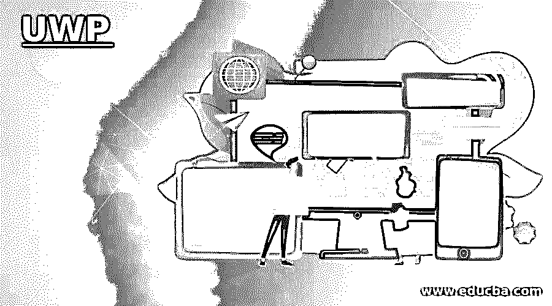

# UWP

> 原文：<https://www.educba.com/uwp/>

## UWP 简介

通用窗口应用程序基于 UWP，该应用程序在 Windows 8 中作为 Windows 运行时发布。通用 Windows (UWP)在 Windows 10 中实现，进一步完善了 Windows 运行时模型。在 Windows 8.1 中，WinRT 与 Windows 8.1 和 Windows 8.1 的第一批 foi 兼容，包括 Windows phone 和 Windows 应用程序，使用公共代码库来支持通用的 Windows 8 应用程序。Windows 10 统一核心，现在称为 Windows Core，是 UWP 在任何基于 Windows 10 的系统上提供通用应用平台的平台。

### UWP 应用程序的功能

*   它可以使用设备的各种功能，并将 UI 更改为设备的不同屏幕尺寸、分辨率和 dpi。
*   UWP 应用程序公布他们访问的计算机和数据。这必须得到消费者的允许。
*   可在所有运行 Windows 10 的电脑上从微软商店访问。在微软商店，你可以从你的应用程序中赚钱。
*   C++，C#，JavaScript，Visual Basic 都是可编程的。使用 WinUI，XAML，HTML 或 DirectX 的用户界面。对于 directX。

让我们看看缩放和有效像素:

<small>网页开发、编程语言、软件测试&其他</small>

*   UWP 应用程序可以在所有 Windows 10 电脑上从电视运行到平板电脑或 PC。但是，如何构建一个在各种设备和屏幕上都好看的用户界面呢？UWP 允许用户界面可读，并通过自动改变它们方便地连接到所有设备和屏幕尺寸。
*   当应用程序在您的电脑上运行时，系统会使用一种算法来规范用户界面元素在屏幕上的显示方式。这种缩放算法结合了观看距离和观看密度，这意味着 PPI(每英寸像素)(而不是物理尺寸)。缩放算法帮助用户在 10 英尺的 Surface Hub 上读取 24 px 字体，以及在 5 英寸的手机上读取 24 px 字体。
*   缩放方法的工作方式是，您构建的 UWP 应用程序没有实际的物理像素，而是有效像素。有效像素(epx)是一个虚拟的度量单位，用于传达布局和距离，与屏幕密度无关。
*   在多个 4 epx UWP 应用程序中，UI 元素的比例、边距和位置应该始终保持一致。
*   UWP 可在各种设备中扩展，具有 100%扩展平台、125%、175%、200%、225%、300%、350%和 400%的扩展能力。基本单位是 4，因为它是唯一不完全可伸缩的整数(例如 4 *1.5 = 6)。对于四倍，所有 UI 元素都与像素匹配，并且 UI 元素具有短而清晰的边框。

#### 1.布局

由于 UWP 应用程序自动扩展到所有设备，UWP 应用程序的设计对所有设备都是一样的。从 UWP 应用程序的用户界面开始。

#### 2.页面布局

这些页面应该是什么样子的？嗯，大多数页面都是根据标准布局组织的，以便于在应用程序页面之间和内部导航。通常，页面包含三种 UI 元素类型:内容元素显示应用程序的内容。命令元素触发行为，例如操作、存储或内容共享。浏览元素允许用户选择要显示的内容。命令元素触发行为，例如操作、存储或内容共享。

#### 3.风格

流行控件自动表示系统主题和颜色强调，适用于所有类型的输入，并可扩展到所有设备。这代表了流畅的设计框架——它们是适应性的、移情的和可爱的。流行的控件使用其默认的光线、运动和深度样式，因此您可以使用它们将我们的流畅设计框架集成到您的应用程序中。

#### 4.输入

智能体验是 UWP 应用的基础。在不理解或识别点击是来自鼠标、样式还是手指点击的情况下，您可能会与点击建立交互。但是，对于独特的输入模式，您也可以构建自己的应用程序。

#### 5.控制

UWP 的界面平台提供了一系列标准控件，确保所有 Windows 设备正常运行，并符合我们的流畅设计原则。像按钮或文本元素这样的简单控件，从数据集和原型创建列表的复杂控件，都涉及到这些控件。

### UWP 的好处

*   它更稳定。仅当计算机的用户/所有者允许访问设备资源时。
*   这并不意味着我们不能使用设备特定的属性，因此可以使用给定设备的所有独立特征。
*   UWP 支持很多语言，比如 JavaScript Visual Basic C++ C sharp 等等。

### 推荐文章

这是 UWP 旅游指南。在这里，我们讨论了介绍，UWP 应用程序的功能以及好处，以便更好地理解。您也可以看看以下文章，了解更多信息–

1.  [t 中间窗口大小](https://www.educba.com/tkinter-window-size/)
2.  [Windows 监控工具](https://www.educba.com/windows-monitoring-tool/)
3.  [什么是 Windows 10？](https://www.educba.com/what-is-windows-10/)
4.  [jQuery 窗口](https://www.educba.com/jquery-window/)

