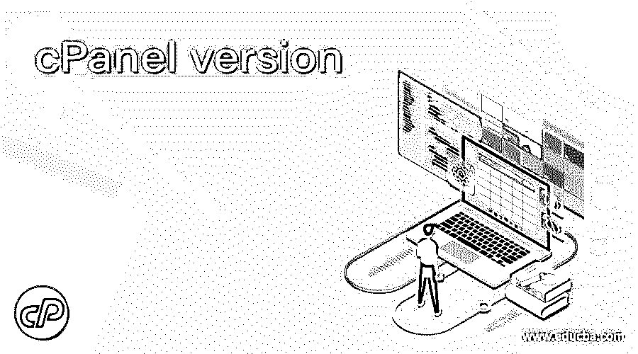

# cPanel 版本

> 原文：<https://www.educba.com/cpanel-version/>

## cPanel 版本介绍

cPanel 是由 cPanel，L.L.C .开发和设计的网络托管控制面板软件，cPanel，l . l . c .是一家美国公司，主要用于促进通过网络托管的任何服务器的管理。cPanel 软件为最终用户提供了一个图形用户界面，它简化了 web 服务器和 web 托管的过程，包括一些很好的自动化工具。cPanel 不允许单独处理任何管理步骤，它必须与 WHM 合作来管理整个服务器。cPanel 包含一些命令行和 API 访问，允许第三方软件安装和操作。在这个主题中，我们将学习 cPanel 版本。

### cPanel 的版本

有许多 cPanel 版本存在，但是遵循 cPanel 版本的官方文档(包括 changelog 和 Releases notes ),它从 cPanel 版本 54 开始到 cPanel 版本 88 是最新的。

<small>网页开发、编程语言、软件测试&其他</small>

以下是 cPanel 版本及其各自的错误修复和发布:

#### 1\. 54.0.0 – 54.0.36

这个 cPanel 版本的 54.0.0 于 2016 年 1 月 4 日发布，修复了面板中与域搜索相关的一些错误，这些错误在搜索时已被否决，如果 EA4 Apache 使用其 MPM，PHP DSO 处理程序包也可以被删除。与此同时，cPanel 版本 54.0.36 发布了对用于测试的 Munin MySQL 帐户的密码固定的修复。

#### 2\. 55.9999.61 – 56.0.52

这个 cPanel 版本于 2016 年 2 月 8 日发布，修复了面板中与 MYSQL 相关的远程服务器检测的一些错误。这个版本是以递增的方式为其他版本临时准备的，在其他版本中，发布模式与数据库存储相关，漏洞与密码更改和其他接口相关。此版本于 2017 年 9 月 18 日发布。

#### 3\. 59.9999.58 – 60.0.48

本系列中的 cPanel 版本于 2016 年 8 月 9 日发布了初始版本，随后于 2017 年 9 月 18 日发布了最后一个版本，其中包含许多修复和发布。最新系列中的主要内容是支持 SSL 主机名验证，并且不提供不必要的第三方下载。MySQL 数据库中存储的 XSS 漏洞。

#### 4\. 61.9999.55 – 62.0.48

该系列中的 cPanel 版本于 2016 年 11 月 10 日获得了其初始版本，随后于 2018 年 6 月 25 日获得了该系列中的最后一个版本，该版本的主要修复与 LTS 版本、首选项更新和 UI 配置设置相关的逻辑修复有关。

#### 5\. 63.9999.74 – 64.0.42

cPanel 版本在 2017 年 2 月 21 日首次发布，随后在 2017 年 11 月 20 日发布了该系列的最后一个版本，该版本中的主要修复主要是针对地址和目录的许多修复，需要用文件和值的恢复来填充。

#### 6\. 65.9999.38 – 66.0.35

cPanel 版本于 2017 年 4 月 17 日发布，随后于 2018 年 1 月 22 日发布，主要修复了一些 SRS 机密及其在数据库中的存储。

#### 7\. 67.9999.64 – 68.0.39

该系列中的 cPanel 版本于 2017 年 8 月 4 日发布了其初始版本，随后于 2018 年 5 月 21 日发布了该系列中的最后一个版本，该版本中的主要修复与 ACL 的 API 令牌相关，这些令牌将从 WHM cPAddons 接口的帐户中删除。

#### 8\. 69.9999.122 –  70.0.69

该系列中的 cPanel 版本于 2017 年 12 月 18 日发布了其初始版本，随后于 2019 年 6 月 6 日发布了该系列的最后一个版本，其中主要修复了 4.91-4.cp1170 的更新 Exim。

#### 9\. 71.9980.30 – 72.0.12

该系列中的 cPanel 版本于 2018 年 5 月 10 日发布了其初始版本，随后于 2018 年 8 月 28 日发布了该系列的最后一个版本，主要修复了 IPV6 寻址和传输协议以及 MySQL 系列的数据库更新或恢复。

#### 10\. 73.9980.0 – 74.0.12

该系列的 cPanel 版本于 2018 年 7 月 2 日首次发布，随后于 2018 年 11 月 29 日发布了该系列的最后一个版本，其中有许多修复和 CVE 参考，如 CVE-2018-18311，CVE-2018-12015，CVE-2018-18312。

#### 11\. 75.9999.218 – 76.0.22

该系列的 cPanel 版本于 2018 年 10 月 9 日发布了其初始版本，随后于 2019 年 6 月 6 日发布了该系列的最后一个版本，其中包含许多修复，并更新了 Exim 相关的 4.91-1.cp1170，其中包含 CVE 2019-10149 中的修复。

#### 12\. 77.9999.110 – 78.0.49

该系列中的 cPanel 版本于 2018 年 12 月 18 日发布了其初始版本，随后于 2020 年 5 月 18 日发布了该系列的最后一个版本，其中包含许多与机密或凭据存储以及虚拟机 API 增强相关的修复。

#### 13\. 79.9999.191 – 80.0.24

该系列中的 cPanel 版本于 2019 年 3 月 21 日发布了其初始版本，随后于 2019 年 8 月 14 日发布了该系列中的最后一个版本，其中包括 apache 配置、SSL 认证以及包重建和形成方面的更改和过渡。

#### 14\. 81.9999.242 – 82.0.19

该系列中的 cPanel 版本于 2019 年 6 月 20 日发布了其初始版本，随后于 2019 年 11 月 19 日发布了该系列的最后一个版本，其中包含与支持 windows 中行尾文件的密码和影子查找相关的重大更改和修复。

#### 15\. 83.9999.115 – 84.0.22

该系列的 cPanel 版本于 2019 年 8 月 27 日首次发布，随后于 2020 年 3 月 16 日发布了该系列的最后一个版本，对邮件日志的带宽暂停、备份泄露到当前工作目录进行了重大更改和修复。

#### 16\. 85.9999.120 – 86.0.37

该系列中的 cPanel 版本于 2020 年 1 月 6 日首次发布，随后于 2021 年 2 月 17 日发布了该系列中的最后一个版本，主要变化包括配置方面的配置服务可用性、MySQL 更新到 5.6.51-1.cp1186，以及更新 cPanel 和 WHM 定价并签订了期限协议。

####  17\. 87.9999.92 – 88.0.17

该系列中的 cPanel 版本于 2020 年 3 月 23 日首次发布，随后于 2020 年 9 月 17 日发布了该系列的最后一个版本，主要变化是 WHM 编辑区界面中的自我 XSS 漏洞、通过电子邮件配额缓存的文件覆盖，以及 cron 作业界面和编辑器界面。

#### 18\. 89.9999.76 – 90.0.19

该系列中的 cPanel 版本于 2020 年 7 月 21 日首次发布，随后于 2020 年 12 月 15 日发布，对 Power DMS 的正确报告和状态商数以及 RPM 数据库损坏的情况进行了重大更改，删除了身份验证请求并更新了 11 月 16 日至 2020 年的许可协议版本。

#### 19\. 91.9999.79 – 92.0.11

本系列的 cPanel 版本于 2020 年 10 月 12 日首次发布，随后于 2021 年 2 月 9 日发布，对应用程序配置进行了重大修改，可以访问 WHM 的 php-fpm，并添加到 find _ outdated _ service 的忽略列表中。

#### 20\. 93.9999.106 – 94.0.1

cPanel 版本在 2021 年 1 月 5 日发布，随后在 2021 年 2 月 10 日发布，修复了许多错误，比如暴露已经存在的密码哈希，改进了发送者验证等等。

### 结论

WHM 的 cPanel 将服务器上的许多复杂功能作为虚拟主机的一部分变得简单而具体。它为开发人员和管理员提供了很大的灵活性和多功能性，使应用程序和服务器能够正常工作。它为最终用户提供了一个视图，让他们可以对托管在 web 上的服务器进行分析和执行各种实验。

### 推荐文章

这是一个 cPanel 版本的指南。在这里，我们讨论 cPanel 的现有版本，但是遵循包含 changelog 的版本的官方文档。您也可以看看以下文章，了解更多信息–

1.  [网络端口](https://www.educba.com/networking-ports/)
2.  [Java GUI 框架](https://www.educba.com/java-gui-framework/)
3.  [SSL 协议](https://www.educba.com/ssl-protocols/)
4.  [CAN 协议](https://www.educba.com/can-protocol/)

