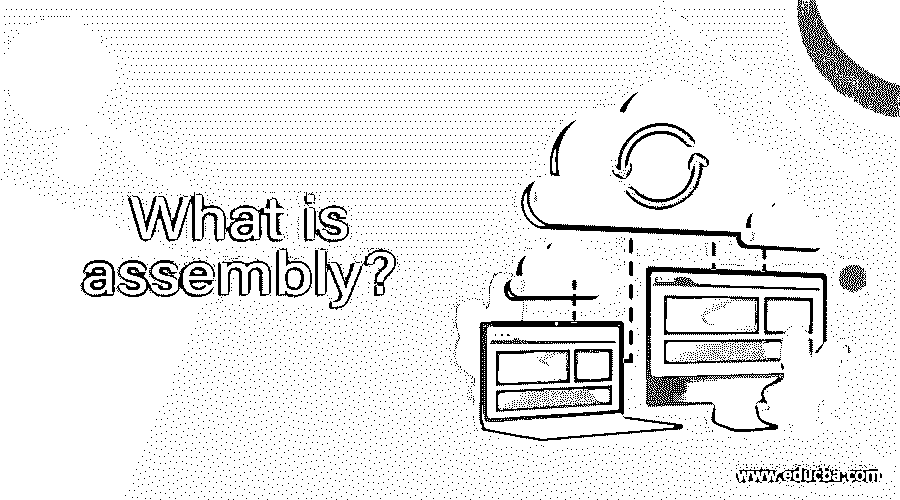

# 什么是组装？

> 原文：<https://www.educba.com/what-is-assembly/>

## 什么是组装？

程序集只不过是构成功能逻辑单元的类型和引用的集合。ASP.NET 框架中的所有类型都必须存在于程序集中；公共语言运行库不支持程序集之外的类型。当您创建 Microsoft Windows 应用程序、Windows 服务或任何类库时，将自动创建程序集。程序集存储为。exe 或。dll 文件。

### 为什么我们需要组装？

汇编的主要目标是消除 DLL 地狱。在当前的 COM 或 COM+模型下，dll 的目录集中在 windows 注册表中。当 DLl 的新版本发布时，注册表会重新引用您指向新 DLL 的目录。这种集中式注册范例使得多个应用程序依赖同一个 DLL 变得很困难。最常见的情况是，应用程序绑定到一个集中位置的 DLL，而不是通过并行执行来运行组件的多个版本。的。net framework 使运行多个版本的组件变得容易，因为默认情况下，它将程序集存储在本地应用程序目录中。这将程序集与任何其他应用程序隔离开来，并保护程序集免受系统更改的影响。

<small>网页开发、编程语言、软件测试&其他</small>

### 装配组件

组件的组成如下

1.  程序集清单:它是程序集的一部分，包含有关程序集的元数据。它被视为程序集的头部分，因为它包含版本号、发行者、加密信息等信息。程序集清单可以存储在 PF 文件(即. exe)或。或者在只包含程序集清单信息的标准 PE 文件中。
2.  MSIL 源代码:MSIL 包含关于初始化，加载，存储和调用对象的方法的信息。它还存储有关操作的指令，如算术和逻辑运算、内存访问、控制流、异常处理等。MSIL 是平台无关的，这意味着 MSIL 的源代码可以在任何平台上执行。net 框架支持和 JIT 编译器。JIT 编译器将代码转换成机器专用的目标代码。
3.  类型元数据:类型元数据描述程序集引用的包含类型和外部类型的格式。执行代码后，CLR 将元数据加载到内存中，并驱动关于类、属性及其成员等的信息。
4.  资源:。net framework 由包含各种资源(如声音剪辑、字符串、图像和图标等)的主程序集组成。

### 装配类型

根据程序集的部署过程，将程序集分为两类，一类是私有程序集，另一类是共享程序集。

**私有程序集:**也称为本地程序集。私有程序集是在您创建要与应用程序一起使用的类库时创建的，而不是设计为与每个。net 应用程序。任何依赖于私有程序集的应用程序都会获得 dll 的本地副本，该副本与项目的可执行文件一起保存在项目的 bin 文件夹中。

共享程序集:当你编写一个类库，它可以和任何。net 应用程序，最好在所有应用程序之间共享一个公共副本。这将更容易更新程序集。这种程序集被称为全局程序集。它们保存在机器上的一个标准位置，称为 GAC。全部。net framework 程序集是全局的，在安装时会安装在 GAC 中。net 框架。

### 组装是如何工作的？

*   程序集包含公共语言运行库执行的代码。PF 文件中的 MSIL 代码。也就是说，如果可移植的可执行文件没有关联的程序集清单，它将不会被执行。每个程序集只能有一个入口点。
*   程序集提供安全性，因为它是请求和授予权限的单元。
*   它形成部署单元。当应用程序启动时，只有应用程序最初调用的程序集必须存在。其他程序集(如本地化资源或包含实用工具类的程序集)可以按需检索。它允许应用程序在第一次下载时保持简单和精简。
*   它是支持并行执行的单元。
*   程序集提供了类型的边界:每种类型的标识都包含它所在的程序集的名称。一个类型被称为类型范例，在一个程序集的范围内加载的类型与在另一个程序集的范围内加载的称为类型范例的类型是不同的。
*   它形成了一个版本边界。程序集 ks 公共语言运行库中最小的可版本化单元。同一程序集中的所有类型和资源都被版本化为。单位。程序集清单描述您为任何依赖程序集指定的版本依赖项。
*   Assembly 提供了程序集清单范围的边界，包含用于解析类型和对资源请求进行分层的程序集元数据。

### 结论

在本文中，我们已经讨论了组装及其组件和类型的基本概念。我们还讨论了大会的工作。希望你喜欢这篇文章。

### 推荐文章

这是一个什么是组装的指南？.这里我们讨论为什么我们需要装配？程序集的类型，程序集是如何工作的？分别是。您也可以看看以下文章，了解更多信息–

1.  [什么是边缘计算？](https://www.educba.com/what-is-edge-computing/)
2.  什么是远程访问？
3.  什么是社交媒体？
4.  [什么是电报？](https://www.educba.com/what-is-telegram/)

