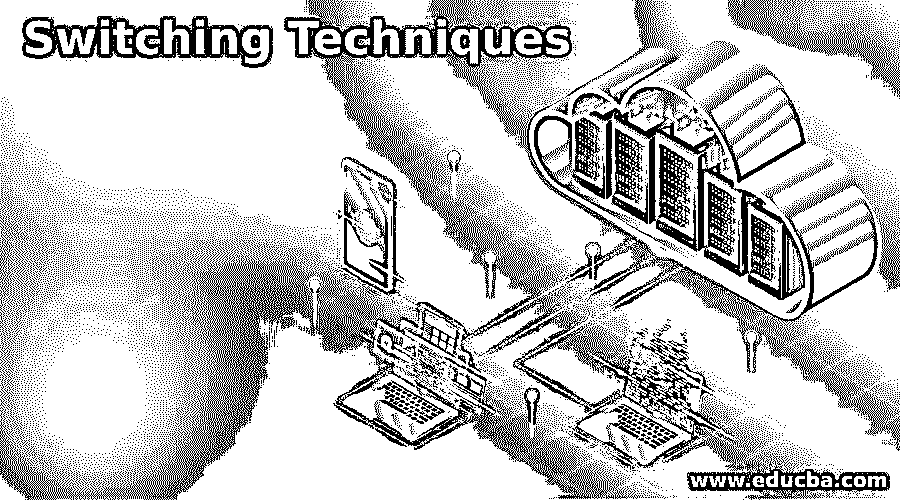

# 切换技术

> 原文：<https://www.educba.com/switching-techniques/>

## 开关技术的定义

交换技术是在大型网络中使用和应用的技术。当这些大型网络需要将数据包从源传输到目的地，即从发送方传输到接收方时，交换技术就出现了。准备从源传输到目的地的分组需要跟踪分组传输将发生的路由。为数据包从发送方到接收方的数据传输选择可用路由的过程称为交换。有两种流行的交换技术，如电路交换和分组交换，各有其重要性。

### 切换技术

交换技术有多种分类，这些技术用于大型网络之间的通信，以实现消息传输或从源设备向目的设备发送数据包。这种方式用于网络路由中数据的各种层次和排列。因此，以下是各种交换技术的层次结构:

<small>网页开发、编程语言、软件测试&其他</small>

*   电路交换技术
*   时分交换技术
*   空分开关
*   信息交换技术
*   包交换技术
*   数据报方法
*   虚电路方法

开关虚拟参数虚拟电路

*   电路(聚氯乙烯)
*   (SVC)

#### 1.电路交换技术

*   电路交换技术是一种交换技术，其中源到目的地之间的可用路径被用于任何分组传输。
*   一旦连接被成功发布，则根据可用性所采用的路径保持存在而没有任何干扰，即，就终止而言，它是持久的。
*   任何公共电话网络中的电路交换都用于语音传输。
*   如果应用电路交换技术，然后任何用户想要发送数据进行传输，并且数据可以是任何视频、请求或语音，则该视频被发送到目的地接收器，然后向发送数据的用户提供确认。
*   线路内交换技术只能传送固定的一组数据，并且从源到目的地应有适当的通路。
*   通信交换技术包括三个主要阶段:
    *   电路连接建立
    *   数据传输
    *   电路断开

*   此外，这种通信交换技术分为两种:
    *   时分交换技术
    *   空分交换技术
*   空分交换技术涉及电路交换技术，其中采用单个传输路径来单独隔离交叉点集合。
*   交叉点随着站的数量的增加而增加，并使大型或多级开关的切换成本增加，这被认为是一个缺点。

#### 2.信息交换技术

*   消息交换技术是一种用于将消息作为完整实体进行传输的技术，并通过中间节点进行路由，用于同步存储和转发消息。
*   在消息交换中，在源和目的地(即接收者)之间没有特定的连续路径。
*   基于信息的中间节点被附加到消息上，目的地地址在它的顶部。
*   信息开关提供最有效的路径，以最显著的方式编程。
*   这个网络倾向于存储和转发网络及其信息到下一个节点，下一个节点将每个消息作为一个独立的实体对待。
*   使用消息交换的优点是数据信道共享可用带宽，这随着时间的推移提高了效率。
*   消息的优先级可以用来使用和管理网络，大小也可以是无限制的类型。
*   由于消息交换技术中可用的消息特征的转发和存储，可能存在时间延迟。

#### 3.分组交换技术

*   这种形式的交换技术用于将消息分成更小的块，以便可以将它单独发送到目的地接收器，而不会出现任何问题。
*   打包在数据包中的消息被分割成小段，并被赋予一个唯一的编号，以便为接收端提供一个身份。
*   每个数据包都包含存储在其报头中的信息，如序列号、目的地址和源地址。
*   数据包试图覆盖整个旅行网络中可用的最短路径。
*   在接收端，数据包的顺序是有序的，一旦接收到，就会重新组合。
*   一旦在接收端接收到的订单是正确的并且处于正确的序列中，那么在这种情况下，确认消息将被发送给用户。
*   基本上，两种类型的方法被尝试并用于分组交换，如下所述:
*   在任何分组交换技术中，无论分组出现在哪里，都是以数据报的形式出现，并且被认为是一个独立的实体，如前所述。
*   同样，分组交换可以进一步分为两种类型:

*   无连接分组交换是一种交换技术，在这种技术中，连接和分组传输是完整的，并且在报头中包含有关单独路由的整个消息的信息。
*   在面向连接的分组交换技术中，数据分组首先以一种格式排列和重组，然后数据被顺序编号以通过预先定义的电路发送，然后数据被顺序路由。
*   一旦从一个路由器跳到另一个路由器，就有可能将分组从一个源反弹到另一个源，尤其是从源反弹到目的地。
*   这种分组丢失和目的地中的不完整信息产生了许多关于性能的问题，因为这组丢失的数据可能一起聚集在某处，从而产生阻碍。跳数是解决这个问题的一种方法，它通过使数据包到达目的地来跟踪数据包。

### 结论

交换技术在网络领域起着非常关键的作用。任何使用中的网络都利用关于分组、时间和 IP 地址的交换，因此使得所有的概念对于用于跳跃和地址迁移的节点的实现都是有用的和容易理解的。

### 推荐文章

这是一个开关技术指南。在这里，我们还讨论了定义和不同的交换技术以及详细的解释。您也可以看看以下文章，了解更多信息–

1.  [什么是电路交换](https://www.educba.com/what-is-circuit-switching/)
2.  [GPRS 架构](https://www.educba.com/gprs-architecture/)
3.  [Python 中的控制语句](https://www.educba.com/control-statements-in-python/)
4.  [Caffe 深度学习](https://www.educba.com/caffe-deep-learning/)

