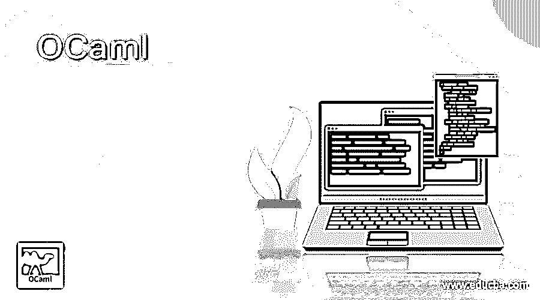

# OCaml

> 原文：<https://www.educba.com/ocaml/>

## OCaml 的定义

OCaml 是一种通用编程语言，为我们提供了面向对象的特性，OCaml 是开源和免费的。它提供了更多的特性，比如模式匹配、异常处理、自动垃圾收集等等，我们将在本教程的下一节中详细介绍这些特性。Ocaml 使用的应用程序主要集中于程序员分析器、解释器、编译器，以及涉及自动定理证明器和符号表示的应用程序。在教程的下一节，我们将看到它的不同用法以及使用的好处。

### 我们为什么需要 OCaml？

OCaml 代表 objective Caml，它还提供了许多有助于开发的优点。在这一节中，我们将看到它提供了哪些关键的东西和好处，使它最适合使用。让我们仔细看看使它成为必要的一些要点，如下:

<small>网页开发、编程语言、软件测试&其他</small>

**1。抽象类型:**我们已经在许多编程语言中看到了抽象的概念，它对用户隐藏了技术细节，所以在这方面，我们有更多的优势，通过使用抽象类型，我们可以在模块中隐藏或覆盖我们的类型。在 OCaml 中，我们有参数化模块，一般来说，当我们在编程中对任何表达式或任何值进行抽象时，我们会尝试定义一个参数化函数。所以在 OCaml 中，我们可以定义一个模块，它代表一组整数，所以在 OCaml 中，我们可以将这组整数定义为参数，这样我们就可以有一组任意的参数。

**2。名称空间:**在大型应用程序或大型程序中，我们有很多同名的情况，为了避免这种情况，我们可以为其定义名称空间。我们可以通过在模块中使用或定义函数、类型、值或异常来忽略或避免这种名称冲突问题，之后，我们强制他们使用这些名称定义来引用它。

**3。信息隐藏:在 OCaml 中，我们可以给模块一个签名，通过这个我们可以防止或避免一些名字被任何外部模块引用。为此，我们可以在 OCaml 中定义 helper 函数。简而言之，在 OCaml 中，我们可以限制我们的模块签名从外部模块开始引用，并在 OCaml 中为它们提供越来越多的限制签名。**

**4。多范例编程语言:**也就是多范例编程，这意味着通过使用它，我们可以根据程序的特性对其进行分类或划分。

**5。可移植性:** OCaml 语言是一种可移植语言，它提供了 but 代码解释器，可以使用 ANSI C 编译器在任何地方运行。它将为我们生成一个字节码，我们在其他语言中有，这些文件可以很容易地在任何地方运行，非常便于跨系统移植。

**6。开发工具:**在使用 OCaml 进行开发的同时，他们也为我们提供了很好的开发工具支持。通过 OCaml 发行版，我们可以得到基本的东西，比如字节码解释器、本机码编译器、字节码编译器和顶级交互。OCaml 发行版也为我们提供了很好的分析器和调试器。

### OCaml 是如何工作的？

到目前为止，我们已经知道 OCaml 是一种强类型语言，这意味着所有的错误只能在编译时发现。此外，它不为我们执行任何隐式类型转换。如果我们想要，我们必须为我们手动制作它。简而言之，这种语言不做任何类型的自动转换。此外，在使用这种语言时，如果我们想从它返回一些东西，那么我们必须在语句的末尾写下表达式，在 OCaml 中，我们没有任何返回语句，最后一个语句将自动成为我们的结果。如果我们讨论 OCaml 中的数据类型，那么下面你可以看到 OCaml 中的基本数据类型列表，开发者也可以很容易地使用这些数据类型，如下所示；OCaml 还为我们提供了各种内置数据类型，这些数据类型进一步分为两类

1)基本数据类型:包括常见的数据类型，如字符串、字符、整数、布尔等。

2)复杂的数据类型:这包括桩、队列、元组、数据流等等

### 优点和缺点

首先，我们可以看看使用这种语言的优势，如下所述；Ocaml 编程语言，它是一种通用编程语言，为我们提供了面向对象的特性，也为异常处理提供了很好的支持。现在，为了更好地理解，我们将详细地看它的特征；

1) Ocaml 为我们提供了本机代码编译器，除了它现有的编译器之外，它还为我们提供了一个额外的编译器，帮助我们获得各种架构的机器代码。

2)通过使用垃圾收集器，Ocaml 还为我们提供了自动内存管理，这是非常快速且不引人注目的。

3)它为我们提供了可移植的字节码编译器，帮助我们创建独立的应用程序。

使用 Ocaml 或学习的一些缺点如下；

1)它不像任何其他编程语言那样受欢迎，所以可能会发生这样的情况:你学习了它，但可能没有得到适当的使用。到目前为止，这方面文章和支持非常少。

2)我们缺少的另一点是这种语言中的并行性和并发性。

### OCaml 的用法

我们可以在很多地方使用这种语言，我们会看到一些领域，我们可以有效地使用它，以获得更好的结果。具体如下:

1)编译器
2)解释器
3)计算或符号计算
4)分析器
6)定理证明器等。

### 结论

正如我们在本教程中所讨论的，我们为什么要使用它，在哪里可以使用它，这让我们很容易理解它。这种语言有很多我们已经讨论过的优点，但是有一点很重要，那就是它不是很受欢迎，这在这里增加了一个负分。

### 推荐文章

这是 OCaml 的指南。这里我们讨论一下简介，为什么我们需要 OCaml，OCaml 是如何工作的？.您也可以看看以下文章，了解更多信息–

1.  [OCaml vs F#](https://www.educba.com/ocaml-vs-f-sharp/)
2.  [Lua 编程](https://www.educba.com/lua-programming/)
3.  [PHP 时区](https://www.educba.com/php-timezone/)
4.  [什么是 Matlab？](https://www.educba.com/what-is-matlab/)

