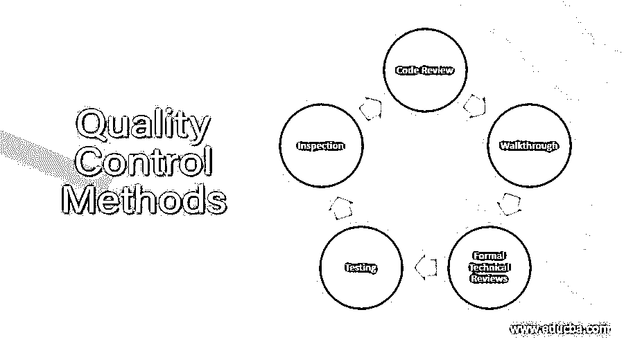

# 质量控制方法

> 原文：<https://www.educba.com/quality-control-methods/>

## 质量控制方法介绍

开发软件的主要任务是控制软件产品的质量。质量控制涉及纠正、产品、对生产商的信心、生产线功能和发现缺陷。过程监控确保决定执行软件开发过程的适当步骤被遵循或不被遵循。这是通过将实际执行的步骤与记录程序中的步骤进行比较来完成的。软件工程师使用各种方法监控质量控制，如走查、正式的技术评审、测试、检查和代码评审。

### 质量控制方法

下面详细讨论一下质量控制方法。

<small>网页开发、编程语言、软件测试&其他</small>

#### 1.游戏攻略

该演练是分析技术的非正式代码。在这种技术中，一个模块被编码后，它被成功地编译，所有的语法错误都被消除。在演练中，一组人查看程序代码并回答问题。如果作者不能回答一些问题，他或她就提出这些问题并找到它们的答案。一些开发团队的成员在预排会议前几天收到了代码，以便阅读和理解案例。每个成员选择一些测试用例，手工模拟代码的执行。演练的主要目标是从多个角度发现代码演练带来的算法和逻辑错误。讨论的重点应该是发现错误，而不是如何修复发现的错误。

#### 2.正式的技术审查

正式技术评审的主要目标是发现功能、逻辑或实现中的错误，验证被评审的软件是否满足其要求，以统一的方式开发软件，确保软件已根据预定义的标准被表示，使项目更易于管理。参与评审会议的人员包括制作人、评审负责人和 2 到 3 名评审人员。

正式的技术评审会议

*   审查会议的准备:在这种情况下，会议的议程和日程由审查负责人决定。生产商对材料和分发进行审核。审阅者提前执行审阅。
*   评审会议的结果:评审问题列表。将创建一个简单的审查摘要报告。会议决定得到执行。
*   接受没有进一步修改的工作产品。
*   由于错误而拒绝工作产品。

#### 3.测试

执行测试是为了尽早发现系统中存在的错误，并确保它们得到修复。测试是一个验证和确认的过程。缺陷测试旨在发现系统缺陷。一个成功的缺陷测试能够揭示系统中缺陷的存在。验证测试用于表明软件满足其需求。一个成功的测试表明需求已经被正确地实现了。验收测试使用户能够评估软件在执行日常工作功能时的适用性和可用性。这测试了用户认为软件应该执行什么，而不是文档化的需求陈述软件应该执行什么。测试改进可以通过在每个软件测试任务结束时评估测试的有效性来实现。虽然这种评估主要是由测试人员执行的，但是它也应该包括开发人员、软件用户和质量保证专家(如果 it 组织中存在这种功能的话)。

#### 4.检查

检查包括人们检查源的表现，目的是发现异常和缺陷。检查不需要执行系统，因此可以在实施之前使用。它们可以应用于系统的任何表示。它们已经被证明是发现程序错误的有效技术。只有当作者确保代码准备好接受检查时，才进行检查。他通过对代码执行一些主要的案头检查和演练来做出决定。通过这些审查方法后，代码将被发送给团队检查。

#### 5.代码审查

在成功编译模块并消除所有语法错误后，对模块进行代码审查。为了产生高质量的代码，代码评审是减少编码错误的一个非常划算的策略。代码审查清单如下

**数据故障:**所有的程序变量在它们的值被使用之前都被初始化了吗？有缓冲区溢出的可能吗？如果使用字符串，是否明确指定了分隔符？

**控制故障:**对于每个条件语句，条件是否正确？在陈述的情况下，所有可能的情况都考虑到了吗？复合句是否正确括起来？

**输入/输出故障:**是否使用了所有输入变量？所有输出变量在输出前都赋值了吗？

### 结论

在本文中，我们讨论了质量控制和软件工程师用来控制软件质量的各种方法。希望你喜欢这篇文章。

### 推荐文章

这是质量控制方法指南。这里我们讨论一下质量控制方法的介绍和列表。您也可以看看以下文章，了解更多信息–

1.  [软件质量控制](https://www.educba.com/software-quality-control/)
2.  [质量软件](https://www.educba.com/quality-software/)
3.  [质量保证工具](https://www.educba.com/quality-assurance-tools/)
4.  [软件质量保证](https://www.educba.com/software-quality-assurance/)

