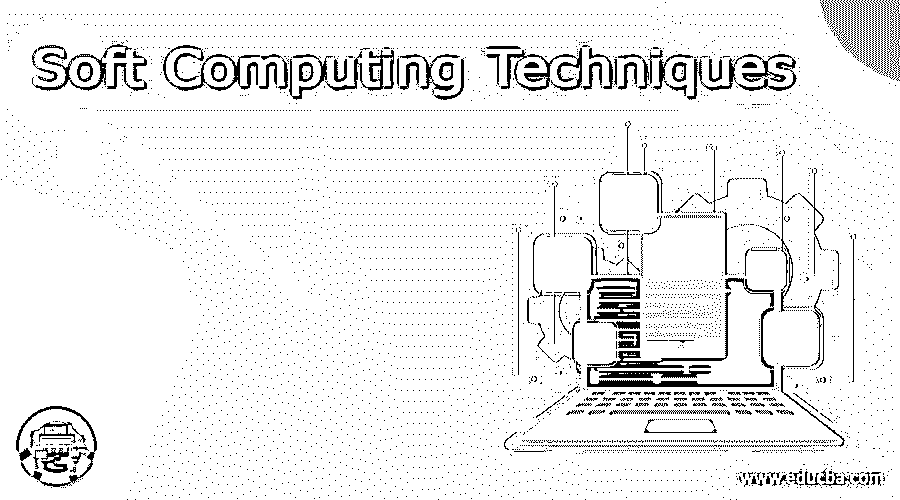
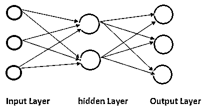

# 软计算技术

> 原文：<https://www.educba.com/soft-computing-techniques/>

## 软计算技术的定义

我们用软计算技术来解决复杂的计算问题，因为软计算技术为我们提供了处理复杂计算问题和复杂系统的计算技术和有用的算法。它所做的是给我们一个给定的特定系统或问题的部分事实，不确定性，和不精确的容忍度。这种类型的方法帮助我们给出和解决问题，这些问题要么是硬件非常耗时的，要么是无法解决的，因此，它通常被称为计算智能。在本教程的下一节中，我们将看到它是如何工作的，以及我们可以使用和实现它的不同场景，以便更好地使用和性能我们的系统，并详细解决复杂的问题。

### 软计算技术

正如我们所讨论的，通过使用软计算技术，我们能够解决一个复杂的问题，或者换句话说，它更倾向于智能系统的设计和分析。诸如模糊逻辑、神经网络等软计算技术帮助我们获得复杂问题的解决方案。在本节中，我们将讨论可用于解决复杂系统问题的不同软计算技术，如下:

<small>网页开发、编程语言、软件测试&其他</small>

*   模糊逻辑
*   机器学习
*   人工神经网络

#### 1)模糊逻辑:

这是软计算的技术之一，它帮助我们从不明确的值中得到结果。“模糊”这个词的意思是不太清楚或不确定的事情。在实践场景中，我们有太多的情况无法确定一个状态的值，比如基于某种逻辑它是真还是假。因此，这种模糊逻辑为我们提供了灵活性，我们可以通过它来克服这种情况，并能够以更好的方式传递不确定性和不准确性的情况。如果我们谈论系统值，那么我们有 1 负责真值，另一方面，我们有 0 代表绝对假值。但是在模糊逻辑的情况下，我们没有绝对真或假的值，它为我们提供了一个值可以部分真或部分假的灵活性。简而言之，它为我们提供了表示这种场景的中间值。

这包含四个部分，作为下面提到的组成部分；

a)规则库:通过使用该系统，我们为系统定义规则，它还包含系统的 if-then 条件。

b)模糊化:借助于此，我们可以很容易地将输入转换成模糊集。

c)推理引擎:这个组件帮助我们找到我们传递的当前输入的匹配值，并根据我们传递的输入决定需要执行哪个规则。

d)反模糊化:它再次将获得的结果转换成作为输入值的 crips 值。

#### 2)概率推理:

在这项技术中，我们使用了概率或概率的概念，这将有助于我们表明和确定值的不确定性。在这种方法中，我们将概率论或概念与逻辑相结合，来处理值的不确定性。就像我们在现实世界中有如此多的例子，就像事情会不会发生，我们也不确定。

我们可以在下面提供的三种情况下使用概率推理；

a)当我们试图做实验时，发生了未知的错误。b)当我们对不确定的结果不确定时。当我们的谓词太大而无法处理时。

下面我们有计算它的公式，

我们可以使用下面的公式来计算事件的概率，
发生概率=期望结果的数量/结果的总数

#### 3)人工神经网络:

人工网络帮助我们解决需要一些预先指导的问题，它们被设计来解决各种类型的问题，如非线性复杂问题，它主要是受启发的或者我们可以说是理想的生物神经网络，其性能可以与大多数人脑功能相比较。下面我们详细解释神经网络的工作原理；

1.输入层

2.隐蔽层

3.输出层

4.它们可以有多个隐藏层。

5.这些层是互连的 vis 节点或神经元，每一层都使用前一层的输出作为其输入。

6.它的主要功能是获取一组输入，执行计算，然后使用输出来解决问题。

*   术语“深度”通常指神经网络中隐藏层的数量。传统的神经网络包含 2-3 个隐藏层，但深度神经网络可以有多达 150 层。
*   前向传播:在这种情况下，我们将几个输入传递给输入层，它将这些输入处理给多个神经元，这些神经元再次通过隐藏层并产生输出层。
*   反向传播:现在我们将结果与实际输出进行比较。但是，在进行前向传播时，我们可能会有一些误差，因此我们试图最小化对误差贡献更大的那个神经元的值/权重。为此，我们需要回溯这个过程。以匹配期望的输出。

下图显示了它是如何工作的。输入可以是任何东西，比如图像，以提取特征并与其他图像进行比较，等等。

**流程图:**

输入层隐藏层输出层

### 结论

到目前为止，我们已经看到了一些软计算技术，这些技术解释了我们如何能够提供输入，并且基于这些输入我们能够得到结果，我们可以使用这些技术来为似乎难以解决的复杂问题获得期望的结果和值。

### 推荐文章

这是软计算技术指南。在这里，我们讨论定义，它是如何工作的，不同的软计算技术。您也可以看看以下文章，了解更多信息–

1.  [切换技术](https://www.educba.com/switching-techniques/)
2.  [虚拟化技术](https://www.educba.com/virtualization-techniques/)
3.  [预测分析技术](https://www.educba.com/predictive-analytics-techniques/)
4.  [复用技术](https://www.educba.com/multiplexing-techniques/)

