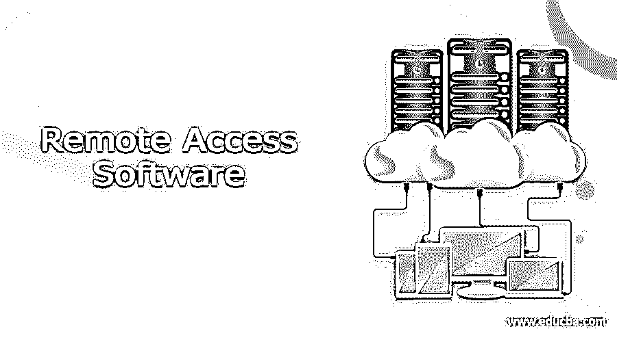

# 远程访问软件

> 原文：<https://www.educba.com/remote-access-software/>

## 远程访问软件简介

远程访问软件是使授权用户能够通过互联网从一个地理距离访问计算机或网络的软件。它将键盘和鼠标事件从一台计算机传输到另一台计算机，通过网络以另一个方向回放图形屏幕更新。此功能由主机的服务器组件和访问远程计算机的计算机上的客户端组件组成。
远程访问软件

### 远程访问软件列表

下面是远程访问软件的列表

<small>网页开发、编程语言、软件测试&其他</small>

#### 1.Zoho 辅助:

Zoho assist 是一个远程访问软件，它使用无人值守远程访问来访问、管理和控制远程设备。它用于传输文件、共享屏幕和同步剪贴板。支持 windows，linux，mac，ios，android，raspberry pi 等各种平台。Zoho assist 可以发起和安排远程支持会话。它很容易设置，并提供 15 天的免费试用。

#### 2.ManageEngine 远程访问增强版:

另一个远程访问工具是 ManageEngine remote access plus。这是一款安全、全面的企业远程访问软件，可帮助桌面技术人员从中心位置对 windows、mac 和 Linux 计算机进行故障排除。它可以从任何地方访问端点。它能够处理多台计算机，并且可以在连接到客户计算机的多台显示器之间切换。

#### 3.团队查看器:

TeamViewer 是另一个最好的远程访问软件，它允许用户连接到多个工作站。其图形用户界面有助于用户提高远程控制性能。它允许用户将控制权从一个用户传递给另一个用户。为了将文件从一台计算机传输到另一台计算机，TeamViewer 提供了拖放选项。为了安全传输，每次建立新连接时，TeamViewer 都会自动生成唯一的 ID 和密码。在建立连接之前，它检查 ID 和密码的有效性。如果正确，则只允许连接。

#### 4.RealVNC 连接:

另一个远程访问软件是 RealVNC connect。它用于共享、培训、协作和支持团队成员。为了提高用户满意度，RealVNC connect 按需提供卓越的帮助台服务。它帮助生态系统以安全的方式访问资源和信息。

#### 5.AnyDesk:

AnyDesk 是一个最好的远程访问软件，帮助用户确保安全的 IT 专业人士的远程桌面连接。它允许用户传输音频和视频文件，并提供 VPN 功能。AnyDesk 支持各种操作系统，如 Windows、Linux 和 macOS。它还允许用户记录远程会话。这样做的好处是它会自动更新它的最新版本。为了保护客户端之间的连接，anyDesk 提供了 AES 256。当建立直接网络连接时，会话是端点加密的，其数据不通过 AnyDeSk 服务器路由。

#### 6\. UltraVNC:

UltraVNC 是一个远程访问软件，用于以安全的方式访问其他计算机。它允许用户从计算机程序、浏览器和移动应用程序连接到远程计算机。它允许双重安装，即您的计算机可以远程访问两台计算机，并被远程查看。它的聊天功能允许与其他远程计算机交谈。它支持像 windows 和 Linux 这样的操作系统。除了远程控制，它还提供各种功能，如加密插件，以安全的方式传输数据。该软件是免费的，并根据 GNU 通用公共许可证的条款分发。

#### 7.GoToMyPC:

另一个远程访问软件是 GoToMyPC，它允许用户使用网络浏览器远程访问计算机。它允许您访问文件、网络和应用程序。它可以从 android、kindle、iPad 和 iPhone 远程访问。为了以安全的方式传输文件并为用户提供安全性，GoToMyPc 使用 256 位 AES 加密。这个软件支持多显示器。用户可以在连接建立期间复制粘贴文件。

#### 8.81 号边界:

Perimeter 81 软件允许用户轻松访问网络。它允许用户从不同的位置连接到多个设备。这个软件也可以加密数据。Perimeter 81 自动与主要云提供商集成，提供无限带宽和数据。它还提供活动和审计报告。这种软件的一个优点是它阻止威胁，并授权访问授权的来源。

#### 9.远程实用程序:

它是一个开源的远程访问软件。它支持各种操作系统，如 Windows、Linux、macOS、iOS 和 Android。它由两部分组成，一部分是安装在远程计算机上的主机，另一部分是安装在本地计算机上的浏览器。它提供对远程系统的完全控制，并允许在不打扰用户的情况下查看远程计算机。使用 IP 地址或互联网 ID，建立连接。远程工具有 IP 过滤系统，允许限制访问只有某些 IP 地址。

### 结论

在本文中，我们已经讨论了各种远程访问软件，您可以使用它们来访问其他人的计算机。各有特色。根据要求，你可以选择其中之一。希望你喜欢这篇文章。

### 推荐文章

这是远程访问软件指南。在这里，我们讨论介绍，各种远程访问软件，及其功能。您也可以看看以下文章，了解更多信息–

1.  [软件分类](https://www.educba.com/software-classification/)
2.  [软件维护](https://www.educba.com/software-maintenance/)
3.  [软件测试服务](https://www.educba.com/software-testing-services/)
4.  [什么是软件工程？](https://www.educba.com/what-is-software-engineering/)

