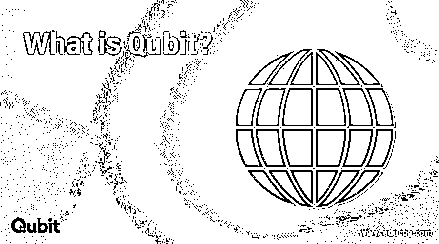

# 什么是量子比特？

> 原文：<https://www.educba.com/what-is-qubit/>

## 量子位的定义

量子比特也称为量子比特，是量子力学中比特表示的同义词。在计算中，位是计算环境中任何字符或信息的大小，在量子计算中，位代表加载的信息的大小。所以，为了在量子力学中充当计算机处理器，量子位代表原子或任何离子在各自的设备中进行存储和处理。量子比特是量子计算中计算信息的基本单位。当任何量子系统中有两个能级时，比如上或下，大小就用量子位来表示。

### 什么是量子比特？

*   它用量子力学来表示，它用复数来表示一个量子态的叠加。简单来说，我们可以说一个单元的两种状态，如是/否或真/假，是用量子比特来表示的。由于量子力学的状态被表示，每个原子或离子的路径也由量子位表示。因此，如果路径是循环的，量子位可以在球体的任何部分。这与计算中的普通比特不同。
*   这个位置给出了量子力学中路径的信息，因而量子位和比特给出的信息是不一样的。信息会非常复杂，只能用量子力学相关知识去探索。因为它只需要两种状态，所有关于量子力学位置的信息都应该分解成两种状态，这样量子位才能表现良好。
*   此外，量子位用于逻辑电路，因为它测量两种状态的信息。量子位必须首先准备好作为相位门，然后必须进行量子逻辑运算。必须确保逻辑量子门的数量相等。因此，正常的“与”和“或”逻辑门应该被重新构造以管理量子位信息。
*   在某些情况下，量子逻辑门增加了更多的复杂性，这是为了使结果在电路中的任何地方都相同。这导致较少的信息耗散和适当的转换。

### 量子位的重要性

*   将量子力学与计算机系统相结合是当前各方面技术发展和进步的需要。它有助于在 bits 的帮助下共同监管无法监控的信息，并以更安全的方式传递信息。这有助于避免创建任何其他通道并传递信息。将会有大量的数据，如果使用传统的计算，将需要更多的时间和空间。这也有助于加快进程和减少存储内存。
*   除了量子计算，量子位在传感器领域也很有用。这提高了量子领域中存储的数据的安全性并保护了这些数据，并有助于网络和通信渠道，从而有助于更快地传递消息和安全相关信息的加密网络。优化是另一个重要的层面，有助于在线交易和防御。优化应用于多个领域，量子位在其中扮演着重要的角色。
*   它可以被修改成一个寄存器，通过它可以进行计算和存储。还有，我们有量子比特，它由八个量子比特组成。并行处理可以在量子位的帮助下完成，从而明确了量子力学中隐形传态和密集编码是一次完成的。这有助于节省专家的时间和流程。此外，加密算法是量子位的另一个应用，因为纠缠只能在量子力学中完成。缠绕作为一种资源，使过程更加有效。
*   量子位的一个应用是处于混合状态，这使得量子位的叠加在概率上以同样的方式被测量和应用。当一个纠缠的量子比特态与一个纯量子比特态混合时，就变成了混合态，可以应用于各种技术。量子位的重要性不能用整体概括来简化。

### 优势

一些优点是:

<small>网页开发、编程语言、软件测试&其他</small>

1.  双态系统有助于计算进行得更快，并使其在所有应用中更有用。此外，超导量子位的存在有助于提高系统内存的处理速度。当普通计算机处理 1 和 0 的二进制数时，叠加有助于量子位处理 1、0 以及 1 和 0 的组合。
2.  纠缠有助于与远距离的物体进行协作，而无需与它们进行物理接触。可以覆盖巨大的距离，以便更多的原子可以纠缠在一起处理更多的信息。量子位的速度可以与每秒万亿次运算相比，这对研究想法和新技术有很大帮助。量子计算的基础可以很容易地用量子位来分析，这有助于物理学家更快地改进他们的研究。
3.  模拟器可以和量子位元一起使用，因此模型量子系统可以被程式化，并且可以在系统中用原子或离子做许多实验。测量可以用量子位来加快速度。超导、化学反应和设计可以很容易地在系统中模拟完成。
4.  虽然通常使用双态系统，但在量子计算中可以使用三态或多级态，并且可以去耦以进行量子位操作。存储总是一致的，这有助于为高级系统的开发存储信息。

在量子位的帮助下，经典问题可以被修改成现代过程，并且通过并行处理可以轻松完成无错误的计算。可以用新的眼光看待问题，可以对结果进行优化，得到最终的输出。

### 推荐文章

这是一本关于什么是量子比特的指南？.这里我们也讨论量子位的介绍和重要性以及它的优点。您也可以看看以下文章，了解更多信息–

1.  [什么是网格计算？](https://www.educba.com/what-is-grid-computing/)
2.  [统一方案](https://www.educba.com/unity-alternatives/)
3.  [雾计算](https://www.educba.com/fog-computing/)
4.  [颤 Matlab](https://www.educba.com/quiver-matlab/)

