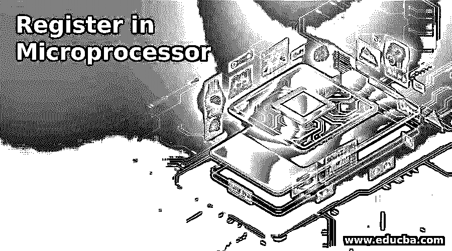

# 微处理器中的寄存器

> 原文：<https://www.educba.com/register-in-microprocessor/>

## 微处理器中的寄存器介绍

计算机 CPU 内部用来存储数据和地址的临时存储位置称为寄存器。寄存器文件包含微处理器的所有寄存器。在某些 CPU 中，有一些特殊的寄存器来完成系统中分配给它们的特定任务。设计系统时，要特别注意架构细节，以便在系统中考虑寄存器。系统中有许多寄存器用来执行操作而没有任何中断，并节省操作时间。此外，寄存器中还包括一个解码器，用于加密保存的数据和文件。

### 说明

*   任何类型的数据、指令或地址都存储在系统用户可以访问的寄存器中。较小的寄存器称为半寄存器，存储在这些寄存器中的数据会非常少。注册号和设计取决于处理器的需求。变址寄存器用于修改，只要寄存器中有修改，这些寄存器就用于改变数据。
*   一个寄存器位于计算机的中央处理器中，这样程序员就可以很容易地访问它。他们可以很容易地对寄存器进行操作，并根据系统的需要对它们进行修改。存储是有限的，但它保证是快速的，因为它是系统中处理的数据的临时存储。有些寄存器只对硬件起作用，在系统中可以是只读或只写的。
*   数据从主存储器加载，算术运算的指令在寄存器中执行。数据在寄存器中存储一段特定的时间，并在需要时传送到主存储器。这有助于在系统中创建临时存储和永久存储，从而在处理器中维护系统的正常工作。
*   这些寄存器总是保存在计算机内存系统的顶部，以便在系统中更快地访问数据。这些寄存器通常是处理器的指令寄存器，根据系统给出的指令工作。在某些情况下，CPU 有这些寄存器的副本，它们在系统中被重命名。这些寄存器有助于提高性能。这使得寄存器与复制寄存器并行工作。
*   系统可能会重复要求相同的数据，这些数据可能会存储在寄存器中。这些寄存器称为引用局部性，由于从寄存器中提取数据的速度，这些寄存器有助于系统良好地运行。程序员将数据和工作分配给寄存器，或者在编码时，编译器将数据分配给寄存器。
*   寄存器可以保存的数据位各不相同。它可以是 8 位、32 位或 64 位寄存器。它以不同的模式工作，因此较大的任务被分解成较小的任务，不同种类的数据可以被加载并在系统中工作。数据可以是任何类型，存储器也可以变化。当处理器对不同种类的数据执行一条指令时，它被称为向量处理器。
*   在许多处理器中，系统中添加了一个伪寄存器，当提取数据时，该寄存器总是返回零。它有助于简化系统中的索引节点，并且在需要数据时不会覆盖。因此，大多数情况下，我们无法确定一个处理器中有多少寄存器可用。当有 16 个寄存器时，我们可以说处理器中只有 15 个可用。
*   寄存器接收二进制数据作为输入，检查可用数据，处理输入，并将输出作为二进制输出传递给系统。现在，输出的副本存储在寄存器中。这有助于系统获取数据以进行更快的处理。
*   寄存器根据其功能和行为进行分类。它可以是只读或只写，一次写入并复位以清除数据，多次写入，读取以清除，写入以清除，并在系统中受到保护。基于这些功能，在系统中选择寄存器以在处理器中为特定目的工作。

### 微处理器中寄存器的组成部分

*   由机器指令写入的用户可访问的寄存器，分为数据寄存器和地址寄存器。数据寄存器保存系统中的数字、字符和数组。地址寄存器保存地址，可以访问系统的主存储器。
*   通用寄存器既可以作为数据寄存器，也可以作为地址寄存器。在某些情况下，它们也存储浮点数。
*   状态寄存器存储系统中是否要执行指令的逻辑值。
*   浮点数存储在浮点寄存器中，零、一或圆周率存储在常数寄存器中。
*   向量指令存储在向量寄存器中，专用寄存器具有系统的程序状态。它包括一个程序计数器和状态寄存器。
*   型号专用寄存器或机器专用寄存器包含系统中处理器的数据和设置。它们是特定的，不能作为处理器的标准。
*   指令寄存器有每次要执行的指令，也有一些寄存器从 RAM 中获取信息，将数据存储在系统中。它们被称为内存缓冲寄存器和内存地址寄存器。
*   体系结构寄存器对于体系结构的软件是可见的，并且仅对应于该软件工作。
*   此外，还有硬件寄存器，但它们在 CPU 之外工作，执行系统的硬件相关操作。

可以通过增加寄存器的数量来提高系统的效率，以便在系统中执行不同的目的。编译器通过改进代码优化来提高效率。可以对专用寄存器进行编码，以完成系统中的一些特殊任务。

<small>网页开发、编程语言、软件测试&其他</small>

### 推荐文章

这是一个在微处理器中注册的指南。在这里，我们还讨论了微处理器中寄存器的介绍和组成，并给出了解释。您也可以看看以下文章，了解更多信息–

1.  [微处理器 vs 微控制器](https://www.educba.com/microprocessor-vs-microcontroller/)
2.  [CPU 的类型](https://www.educba.com/types-of-cpu/)
3.  [嵌入式系统的类型](https://www.educba.com/types-of-embedded-systems/)

