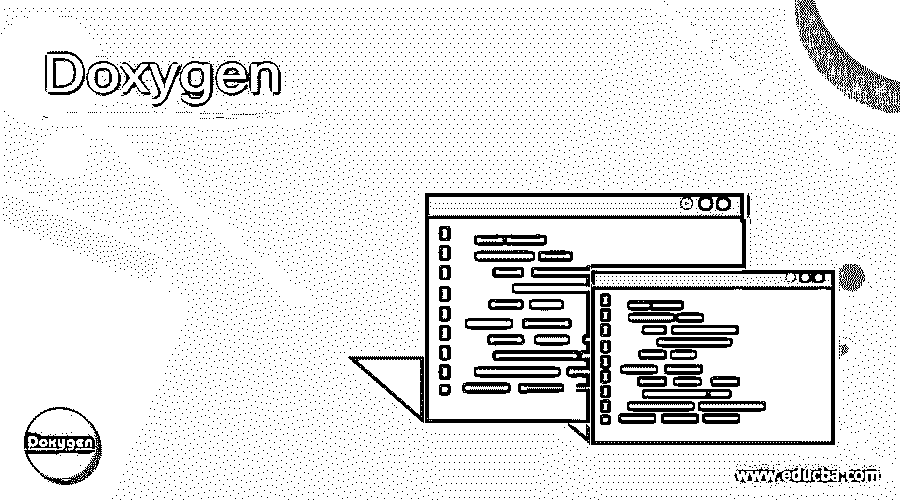

# 脱氧核糖核酸

> 原文：<https://www.educba.com/doxygen/>

## Doxygen 简介

Doxygen 是一个基于工具或命令行的文档生成器，帮助编写软件参考文档。因为它写在代码中，所以很容易保持更新。此外，它可以交叉引用代码和文档，这有助于引用实际的代码。由于这些优势，开发人员现在使用 Doxygen 编写文档。除此之外，它支持不同的编程语言。在本文中，我们将看到关于 Doxygen 的更多细节。

### 我们为什么需要 Doxygen？

如前所述，Doxygen 是一个帮助编写不同编程语言参考文档的工具，如 Java、C、C++、C#、IDL、D 等。

<small>网页开发、编程语言、软件测试&其他</small>

除此之外，Doxygen 还可用于

*   创建模板配置文件，
*   使用已经可用的 conf 文件生成文档
*   旧配置文件的更新等。

关于这些的更多细节将在 Doxygen 的用途标题下解释。

### Doxygen 是如何工作的？

现在，我们来看看下面的工作:

#### 1.选择编程语言

对于在 Doxygen 中工作，首先，应该保证您将要选择的编程语言能够被这个工具识别。如果不是，那么选择另一种方法。正常情况下，Doxygen 支持 C、C++、IDL、C#、Java、Objective C、VHDL、Python、D、PHP、Fortran 等不同的编程语言。

一旦选择了要在 Doxygen 中使用的编程语言，就创建一个 conf 文件。这是配置文件。这个文件决定了所有的设置，Doxygen 中的每个项目都有自己的配置文件。众所周知，一个项目要么包含一个单独的源文件，要么包含一棵需要递归扫描的完整的源代码树。为了以一种简单的方式制作配置文件，Doxygen 可以使用命令 doxygen -g <conf-file>创建一个模板。这里，<conf-file>是配置文件的名称。假设您没有使用文件的名称；在这种情况下，将创建一个名为 Doxyfile 的文件。在已经有一个同名文件的情况下，doxygen 将其重命名为<conf-file>。在创建配置模板之前进行 bak。如果在创建的文件名中使用减号，它将能够从标准输入(stdin)中读取，这有助于编写脚本。</conf-file></conf-file></conf-file>

#### 2.运行 Doxygen

为了制作文档，运行命令 doxygen <conf-file>。</conf-file>

一旦执行了这个命令，就会在输出目录中创建一个 html、latex、rtf、xml、docbook 或 man 目录。文档的类型取决于您在 doxygen 中提供的设置。从文件本身的类型，我们可以理解这些目录由 RTF、HTML、Unix 手册页、LATEX、DocBook 和 XML 格式的文档组成。

在这种情况下，默认输出目录是它开始的目录。此外，在 OUTPUT_DIRECTORY 的帮助下，可以更改输出将被写入的根目录。在这个 OUTPUT_DIRECTORY 中，可以使用 conf 文件的 DOCBOOK_OUTPUT、HTML_OUTPUT、MAN_OUTPUT、RTF_OUTPUT、XML_OUTPUT 和 LATEX_OUTPUT.tags 来选择特定于格式的目录。类似于 conf 文件的创建，如果输出目录也不存在，doxygen 将创建一个。

#### 3.来源文件

尽管源文档被解释为第三步，但在新项目的情况下，它应该被解释为第一步。假设选项 EXTRACT_ALL 在 conf 文件中标记为 No；doxygen 将仅为记录的实体生成文件。为了记录这些，有两种方法，特别是对于类、成员和名称空间。第一种是在文件、类和命名空间成员的成员/类/命名空间声明或定义之前设置特定的文档块；也允许将文档直接放在成员之后。

第二种方法是将特定的文档块放在其他任何地方。这是另一个位置或文件。放置后，在块中放置一个结构命令。结构化命令的任务是将文档块连接到特定的实体，如成员、名称空间、类或文件，这些实体可能会被文档化。第一种方法的主要优点是实体名称不需要重复。

### 优点和缺点

优点是:

*   编写文档的人只需要更少的开销。
*   支持联合、文件、模板、命名空间、枚举、类、函数、结构、typedefs、变量和定义的文档。
*   兼容 JavaDoc (1.1)、KDOC 和 Qt-Doc
*   类图是在 HTML 中自动生成的
*   依赖图、图形类层次结构图等。可以使用称为点的工具来创建，该工具在称为 Graphviz 的工具包中可用。
*   文档可以保存在头文件、源文件或其他文件中。
*   可以生成一个带有保护级别的类成员列表。
*   可以自动检测所有公共、私有以及受保护的部分。
*   对于文档和搜索引擎来说，转移到其他机器或位置是可能的。
*   即使在大型项目中也易于工作。

尽管它有几种方法来搜索 HTML 输出，但是它有一些缺点。

*   客户端搜索仅限于符号，而不是完整的文本搜索。
*   在本地工作时，服务器端搜索无法正常运行。
*   CHM 文件的编译只能在 Windows 上运行
*   Mac OSX 和 Xcode 只能结合使用。

### 强力霉素的用法

如前所述。它可以用来创建模板配置文件，使用 conf 文件生成文档，等等。现在，我们将看到如何。

*   **模板配置文件的生成:** doxygen [-s] -g [confName]
*   **旧配置文件**的更新:doxygen [-s] -u [confName]
*   **使用已经可用的配置文件生成文档:** doxygen [confName]
*   **RTF/HTML/Latex 模板样式表文件的生成:** doxygen -w rtf 样式表文件
*   **RTF 扩展文件的生成:** doxygen -e rtf 扩展文件

### 结论

这是一个帮助编写不同编程语言的参考文档的工具。在这篇文章中，不同的方面，如使用，工作，利弊，详细解释。

### 推荐文章

这是一份 Doxygen 指南。在这里，我们讨论为什么我们需要 Doxygen 和它如何使用，优点和缺点。您也可以看看以下文章，了解更多信息–

1.  [强力霉素替代品](https://www.educba.com/doxygen-alternatives/)
2.  [软件测试方法论](https://www.educba.com/software-testing-methodologies/)
3.  [质量软件](https://www.educba.com/quality-software/)
4.  [数据库管理软件](https://www.educba.com/database-management-software/)

