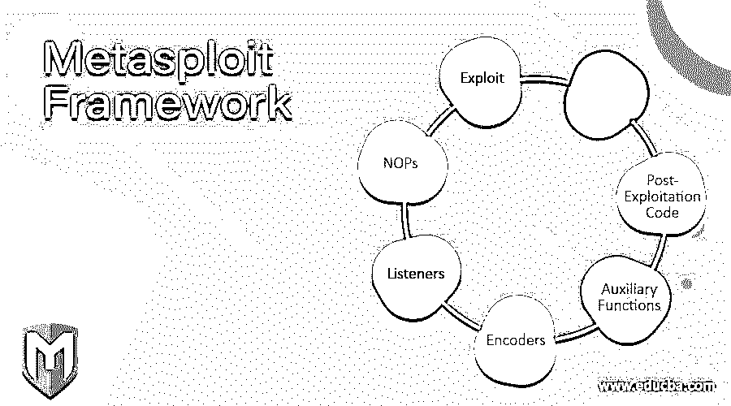

# Metasploit 框架

> 原文：<https://www.educba.com/metasploit-framework/>

## Metasploit 框架简介

Metasploit 框架是网络罪犯和道德黑客用来识别服务器和网络上的系统漏洞的工具。Metasploit 框架非常灵活，可以兼容不同的操作系统，并且是开源的，因此很容易定制。在使用 Metasploit 时，处理 pen 测试的团队可以很容易地使用现成的系统或定制的系统将其部署到网络或服务器中，以确定网络的弱点。确定威胁和弱点后，可以记录下来，解决网络或服务器的弱点，并提供解决方案。

### 为什么我们需要 Metasploit 框架？

*   如今，网络犯罪和网络攻击非常普遍。黑客总是在寻找机会破坏网络或进行其他非法活动。一旦他们发现网络或服务器中的任何漏洞，他们就会攻击并获取敏感信息，给组织、政府或国家带来问题。为了解决这些问题，使用了 Metasploit 框架。Metasploit 框架可以很容易地识别网络或服务器的弱点。识别后，可以很容易地记录下来。一旦记录完成，组织或政府就可以对薄弱环节采取行动，并在攻击发生之前纠正薄弱环节。这是公司、组织或政府保存敏感信息的一个非常有用的框架。
*   由于其广泛的应用和作为开放源码的可用性，现在 days Metasploit 正被开发人员领域的大多数专业人员甚至黑客所使用。Metasploit 之所以被广泛使用，是因为它非常容易安装，并且非常可靠，可以在任何系统上工作，不管平台或语言如何。这个软件在道德黑客和黑客中非常受欢迎。专业人员越来越需要理解并在他们的系统中实现它。

### Metasploit 框架是如何工作的？

*   默认情况下，Metasploit 使用端口 3790 来运行其功能。安装 Metasploit 后。可以使用端口扫描、操作系统指纹识别、操作系统指纹识别以及通过使用漏洞扫描器来识别网络的弱点来访问关于目标的信息。Metasploit 是一个基于 Ruby 的开源模块化渗透测试程序。Metasploit 包含一套工具，允许我们测试我们网络的网络安全漏洞，并进行攻击模拟和检测逃逸。
*   为了执行诸如扫描或利用之类的精确动作，使用了称为 Metasploit 模块的软件。Metasploit 可以执行的每个任务都包含在该模块中。我们也可以说模块是 Metasploit 框架的核心。模块有多种类型，每个模块都取决于模块的用途及其动作。模块可以在运行时加载，或者甚至可以在启动 msfconsole 后加载。

以下模块可以在 Metasploit 中使用。

<small>网页开发、编程语言、软件测试&其他</small>

#### 1.剥削

Exploit 是 Metasploit 的一个模块，用于利用目标系统的弱点来创建和访问。该模块执行一系列命令，以系统或应用程序中检测到的特定弱点为目标。利用模块示例可以是缓冲区溢出、web 应用程序利用或代码注入。

#### 2.有效载荷

有效载荷是一个包含一组恶意代码的模块，这些代码在有效利用目标系统渗透后运行。该模块中包含一组指令，目标系统在受到攻击后可以执行这些指令。有效载荷模块还允许控制连接到外壳的方式，并设计系统的动机，这是获得系统控制权后的目标。

有效载荷模块中有不同的可用功能，包括小代码甚至小应用程序。有效载荷模块可以打开命令外壳或仪表解释器。meterpreter 是一个高度创新的有效负载，它允许我们编写 DLL 文件，这些文件根据需要有策略地生成一些新的结构。

#### 3.剥削后代码

后开发代码是一个模块，有助于测试深度渗透。它允许我们获得更多的访问权限，并收集关于目标系统的更多信息。应用程序、哈希转储和服务枚举器就是其中的一些例子。

#### 4.辅助功能

辅助功能是一组辅助工具和命令，运行时不需要有效负载。该模块可用于执行不需要与开发链接的随机功能。拒绝服务攻击(DoS)、扫描仪、嗅探器。SQL 注入工具和模糊器是辅助函数的一些例子。

#### 5.编码器

编码器是一套用于转换信息或代码的工具。对于攻击来说，外壳代码的编码非常重要。编码器是一种传感设备，提供用于确定数字信号的反馈。

#### 6.听众

监听器是一种恶意软件，它隐藏自己以访问目标系统。metasploit 框架具有与有效负载产生的会话相关的特定处理程序。监听器也可以主动坐下来监听传入的连接，甚至可以植入一个绑定外壳，等待测试系统的连接。Bind shell 总是不活动地监听正在建立连接或发送指令的攻击者。

#### 7.NOPs

No operation 缩写为 NOP，是一种防止有效负载崩溃的指令。NOP 生成一组任意字节，用于绕过标准 IPS/IDS NOP sled 签名。

### Metasploit 框架的优点和缺点

下面给出了提到的优点和缺点:

#### 优势:

*   Metasploit 框架的主要优势之一是它是开源的，并且是积极开发的。
*   在 Metasploit 中，在负载之间切换非常容易。Metasploit 中提供了快速访问，用于更改使用命令的有效负载。在 Metasploit 框架中，添加用户或远程访问桌面变得更加容易。
*   像 Armitage 这样的 Metasploit 提供了用户友好的 GUI 和第三方接口。渗透测试项目变得更加容易，因为这些接口提供了不同的服务，包括单击功能、轻松切换工作空间和漏洞管理。

#### 缺点:

*   Metasploit 框架非常难学。
*   如果框架使用不当，它会使您的系统崩溃。
*   需要对利用环境有更深入的了解。

### 结论

在上述文章的基础上，我们了解了 Metasploit 框架及其工作原理。我们看到了 Metasploit 框架的用法及其优缺点。

### 推荐文章

这是一个 Metasploit 框架的指南。这里我们讨论一下入门，为什么我们需要 Metasploit 框架？工作，优缺点。您也可以看看以下文章，了解更多信息–

1.  [网络安全工具](https://www.educba.com/cyber-security-tools/)
2.  [Kali Linux Metasploit](https://www.educba.com/kali-linux-metasploit/)
3.  [安全测试](https://www.educba.com/security-testing/)
4.  [暴力巨蟒之书](https://www.educba.com/violent-python-book/)

