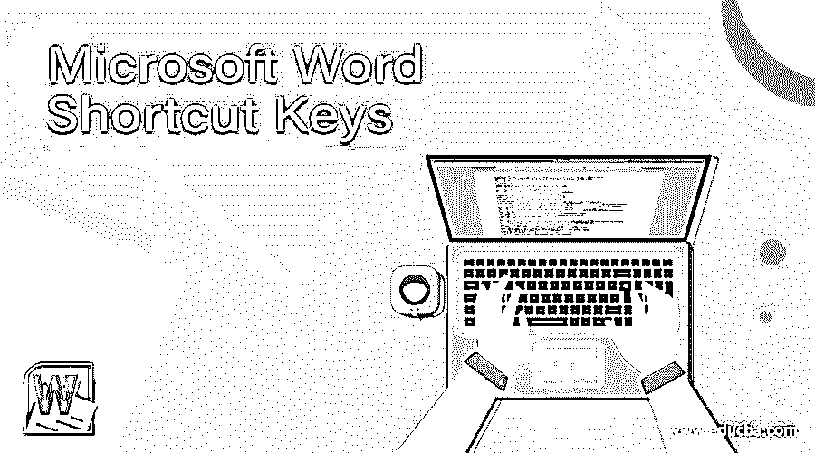

# Microsoft Word 快捷键

> 原文：<https://www.educba.com/microsoft-word-shortcut-keys/>

## Microsoft Word 快捷键介绍

以下文章提供了 Microsoft Word 快捷键的概述。微软 word 是微软公司开发的文字处理器。Microsoft word 提供了从基本到高级的各种功能，使工作变得简单，并使文档变得有吸引力和有效。有一些快捷键将帮助您轻松执行相同的功能，并节省您的时间。

例如，如果您想要复制整个文档，您需要用鼠标帮助选择内容，并需要单击“复制”选项，该选项位于“主页”选项卡中。不需要执行所有这些步骤，您只需单击 ctrl + A 来选择整个内容，然后单击 ctrl + C 来复制相同的内容。

<small>网页开发、编程语言、软件测试&其他</small>

### 不同的 Microsoft Word 快捷键

下面给出了不同的 Microsoft word 快捷键:

*   **Ctrl + A:** 该快捷键用于选择 word 文档的所有内容。
*   **Ctrl + C:** 该快捷键用于复制用户选择的文本。
*   **Ctrl + V:** 该快捷键用于粘贴复制的文本。
*   **Ctrl + X:** 用于剪切选中的文字。
*   **Ctrl + Y:** 用于重做上一次执行的任务。
*   **Ctrl + Z:** 用于撤销上一次执行的任务。
*   **Ctrl + B:** 用粗体突出显示选中的文本。
*   **Ctrl + D:** 用于打开字体首选项窗口。
*   **Ctrl + F:** 用于打开查找对话框。
*   **Ctrl + P:** 该快捷键打开打印窗口。
*   **Ctrl + I:** 以斜体突出显示所选文本。
*   **Ctrl + U:** 用来给选中的文字加下划线。
*   **Ctrl + Shift + D:** 用于高亮显示选中文本的双下划线。
*   **Ctrl + E:** 用于设置线条或选中文本向屏幕中央对齐。
*   **Ctrl + L:** 用于设置行或所选文本在屏幕左侧的对齐方式。
*   **Ctrl + J:** 用于设置行或所选文本的对齐方式，以使屏幕对齐。
*   **Ctrl + R:** 用于设置行或所选文本在屏幕右侧的对齐方式。
*   **Ctrl + K:** 用于给文本添加超链接。
*   **Ctrl + N:** 该快捷键用于打开新的空白文档。
*   **Ctrl + W:** 用于关闭当前打开的 word 文档。
*   **Ctrl + M:** 用于段落缩进。
*   **Ctrl + S:** 用于保存单据。
*   **Ctrl + O:** 用于打开对话框，用户可以选择需要打开的文件。
*   **Ctrl + Shift + A:** 用于将所有选中的文字字母设为大写。
*   **Ctrl + Shift + L:** 用来给文本添加一个项目符号点。
*   **Ctrl + Home:** 用于移动光标到文档的开头。
*   **Ctrl + End:** 用于将光标移动到文档的末尾。
*   **Ctrl +空格键:**用于将选中的文字设置为默认字体。
*   **Ctrl + Alt + 1:** 用于将文本改为标题 1。
*   **Ctrl + Alt + 2:** 用于将文本改为标题 2。
*   **Ctrl + Alt + 3:** 用于将文本改为标题 3。
*   **Shift + Alt + T:** 用于添加当前时间。
*   **Shift + Alt + D:** 用于添加当前日期。
*   **F12:** 用于提示另存为窗口。
*   **F1:** 此快捷键将打开帮助窗口。
*   F7: 用于打开拼写检查和语法检查窗口。
*   **F5:** 用于打开查找、替换和转到窗口。
*   **F4:** 用于重复上一次执行的动作。
*   **Ctrl +左箭头键:**用于将一个单词向左移动。
*   **Ctrl +右箭头键:**用于将一个单词向右移动。
*   **Ctrl +向上箭头:**用于移动到一行或一段的开头。
*   **Ctrl +向下箭头:**用于移动到一行或一段的末尾。
*   **Ctrl + Del:** 用于删除光标右侧的单词。
*   **Ctrl + Backspace:** 用于删除光标左侧的单词。
*   **Ctrl + Shift+ < :** 用于将字体大小缩小一点。
*   **Ctrl + Shift+ > :** 用于将字体的大小增加一个点。
*   **Ctrl + Shift+ *:** 用于隐藏或查看非打印字符。
*   **Ctrl + T:** 用于创建悬挂缩进。

### 结论

Microsoft word 快捷键帮助用户通过点击键盘上的两到三个按钮来执行任务，而不是执行许多步骤，从而节省了他们的时间并使任务变得更容易。

### 推荐文章

这是 Microsoft Word 快捷键指南。这里我们分别讨论简介和不同的 Microsoft word 快捷键。您也可以看看以下文章，了解更多信息–

1.  [什么是微软规划器](https://www.educba.com/what-is-microsoft-planner/)
2.  [微软 Word 功能](https://www.educba.com/microsoft-word-features/)
3.  [什么是微服务？](https://www.educba.com/what-is-microservices/)
4.  [什么是微服务架构？](https://www.educba.com/what-is-microservices-architecture/)

