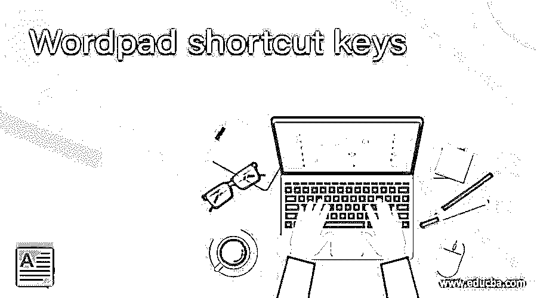

# 写字板快捷键

> 原文：<https://www.educba.com/wordpad-shortcut-keys/>

## 写字板快捷键介绍

写字板是基本的文字处理器，几乎包含在所有版本的 Microsoft windows 中。写字板提供从基本到高级的各种功能，使工作变得容易，使文档更有吸引力和更有效。有一些快捷键将帮助您轻松执行相同的功能，并节省您的时间。例如，如果您想要复制整个文档，您需要用鼠标帮助选择内容，并需要单击“复制”选项，该选项位于“主页”选项卡中。不需要执行所有这些步骤，您只需单击 ctrl + A 来选择整个内容，然后单击 ctrl + C 来复制相同的内容。在本主题中，我们将学习写字板快捷键。

### 写字板快捷键

写字板中使用的快捷键列表如下

<small>网页开发、编程语言、软件测试&其他</small>

*   **Ctrl + A:** 该快捷键用于选择 word 文档的所有内容。
*   **Ctrl + C:** 该快捷键用于复制用户选择的文本。
*   **Ctrl + V:** 该快捷键用于粘贴复制的文本。
*   **Ctrl + X:** 用于剪切选中的文字。
*   **Ctrl + Y:** 用于重做上一次执行的任务。
*   **Ctrl + Z:** 用于撤销上一次执行的任务。
*   **Ctrl + P:** 该快捷键打开打印窗口。
*   **Ctrl + B:** 用粗体突出显示选中的文本。
*   **Ctrl + N:** 该快捷键用于打开新的空白文档。
*   **Ctrl + O:** 用于打开对话框，用户可以选择需要打开的文件。
*   **Ctrl + I:** 以斜体突出显示所选文本。
*   **Ctrl + U:** 用来给选中的文字加下划线。
*   **Ctrl + F:** 用于打开查找对话框。
*   **Ctrl + H:** 用于将特定单词替换为已定义的单词
*   **Ctrl + S:** 用于保存单据。
*   **Ctrl + E:** 用于设置线条或选中文本向屏幕中央对齐。
*   **Ctrl + L:** 用于设置行或所选文本在屏幕左侧的对齐方式。
*   **Ctrl + J:** 用于设置行或所选文本的对齐方式，以使屏幕对齐。
*   **Ctrl + R:** 用于设置行或所选文本在屏幕右侧的对齐方式。
*   **Ctrl + Shift + A:** 用于将所有选中的文字字母设为大写。
*   **Ctrl + Shift + L:** 用于给文本添加要点。
*   **Ctrl + Del:** 用于删除光标右侧的单词。
*   **Ctrl + Backspace:** 用于删除光标左侧的单词。
*   **Ctrl +左箭头键:**用于将一个单词向左移动。
*   **Ctrl +右箭头键:**用于将一个单词向右移动。
*   **Ctrl +向上箭头:**用于移动到一行或一段的开头。
*   **Ctrl +向下箭头:**用于移动到一行或一段的末尾。
*   **Ctrl + Home:** 用于将光标移动到文档的开头
*   **Ctrl + End:** 用于将光标移动到文档的末尾。
*   **F1:** 此快捷键将打开帮助窗口。
*   **F12:** 用于提示另存为窗口。
*   **Ctrl + Shift+ < :** 用于将字体大小缩小一点。
*   **Ctrl + Shift+ > :** 用于将字体的大小增加一个点。
*   **Ctrl + D:** 用于插入油漆图。
*   **Ctrl + 5:** 用于将行距设置为 1.5
*   **Ctrl + 2:** 用于设置双倍行距。
*   **Ctrl + 1:** 用于设置角度线间距。
*   **Ctrl + Shift+ =:** 用于创建选中文本的上标。
*   **Ctrl + =:** 用于创建选中文本的下标。
*   **Shift +F10:** 用于显示当前快捷菜单。

### 结论

写字板快捷键不是执行许多步骤，而是帮助用户通过点击键盘上的两三个按钮来执行任务，从而节省时间并使任务变得容易。我希望你喜欢这篇文章。

### 推荐文章

这是写字板快捷键指南。这里我们讨论写字板中使用的快捷键列表，这些快捷键帮助用户轻松执行任务。您也可以看看以下文章，了解更多信息–

1.  [微软 Word 功能](https://www.educba.com/microsoft-word-features/)
2.  [面向学生的微软项目](https://www.educba.com/microsoft-project-for-students/)
3.  在 WordPress 的职业生涯
4.  [CSS 自动换行](https://www.educba.com/css-word-wrap/)

