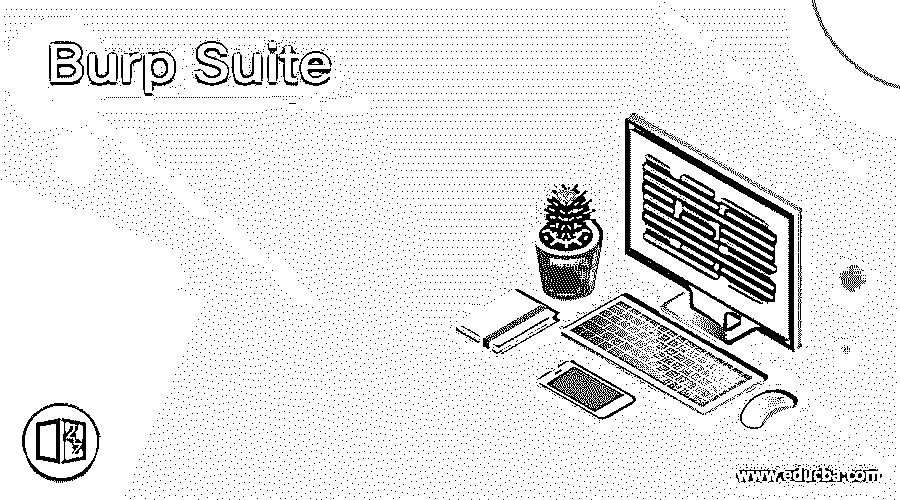

# 打嗝组曲

> 原文：<https://www.educba.com/burp-suite/>

## 打嗝套件简介

Burp，也称为 Burp Suite，是一个用于 web 应用程序渗透测试的工具集。Portswigger 公司创造了它。Burp Suite 的目标是成为一个一体化的工具包，它的功能可以通过安装 BApps，即它的附加组件来增加。专业的 web 应用安全研究人员和 bug 赏金猎人用的最多。这是一个比 OWASP ZAP 等免费替代品更好的选择，因为它易于使用。

### Burp 套件的工具

Burp Suite 提供各种工具，如下所示:

<small>网页开发、编程语言、软件测试&其他</small>

#### 1.蜘蛛

它是映射目标 web 应用程序的网络爬虫或蜘蛛。该映射旨在创建一个端点列表，可以对其功能和潜在漏洞进行检查。蜘蛛搜索非常有用，因为在侦察阶段收集的端点越多，在实际研究中就有越多的攻击面。

#### 2.代理人

Burp Suite 具有一个拦截代理，可以帮助用户在传输过程中访问和更改请求和响应内容。它还允许用户将受监控的请求/响应提交给另一个适当的 Burp 套件工具，从而消除了复制粘贴的需要。代理服务器可以被编程为使用特定的环回地址和端口。可以使用代理过滤掉请求-响应对的唯一形式。

#### 3.干扰者

这用于通过单个输入点传递一系列值。运行这些值，并评估内容的成功/失败和大小。异常通常会导致响应代码或响应内容长度的差异。对于有效载荷位置，Burp 套件支持蛮力，单值和字典文件。入侵者用于以下目的:
i. Pin 表单、密码表单以及其他表单容易受到强力攻击。
二。对密码类型的字典攻击，被认为易受 SQL 注入或 XSS 的攻击。
三世。在 web app 上，限速正在受到考验和攻击。

#### 4.中继器

Repeater 允许用户在进行手动更改时不断提交请求。它用于以下目的:

I .检查用户提供的值是如何被验证的。

二。用户提供的属性得到验证的情况如何？

三。在输入参数/请求头中，服务器期望什么值？

四。如果服务器遇到不可预知的值会怎样？

动词 （verb 的缩写）服务器在做输入卫生吗？

六。服务器过滤和检查用户提供的数据的能力如何？

七。服务器使用谁的验证系统？

八。计算机上的哪个 cookie 是会话 cookie？

九。CSRF 安全性是如何应用的，是否有可能绕过它？

#### 5.序列发生器

sequencer 是一个熵检查器，它确保 web 服务器创建的令牌是随机的。反 CSRF 和 Cookies 令牌就是这些令牌的例子，它们通常用于敏感操作的身份验证。这些记号应该优选地以真正随机的方式产生，每个潜在字符出现在每个位置的可能性是均匀共享的。这可以通过比特和字符来实现。熵分析仪验证了这个概念是有效的。它的功能是这样的:令牌最初被认为是随机的。然后将令牌放入一系列检查中，以查看它们是否符合这些要求。显著点是表征对于属性表现出的概率的最小值，使得如果表征的特征概率小于显著性水平，则该表征是随机的论点被驳回。此方法可用于识别和计数易受攻击的令牌。

#### 6.解码器

解码器中列出了 URL、HTML、Base64、Hex 和其他流行的编码方法。此方法对于在参数或头值中搜索数据集非常有用。它还用于为许多漏洞类型构建有效负载。它用于查找最常见的 IDOR 和会话劫持事件。

#### 7.延长器

外部模块可以在 Burp 套件中实现，以扩展工具套件的功能。外部模块被命名为 BApps。该功能与浏览器扩展的功能相同。在扩展器窗格中，可以访问、更新、安装和卸载这些组件。其中一些可用于免费社区版本，而另一些则包括付费技术版本。

#### 8.扫描仪

团体版没有扫描仪。它会自动在网站上搜索几个典型的漏洞，并列出它们，以及关于每个发现的信任级别和利用难度的详细信息。它每天都在更新，包括最近的和鲜为人知的缺陷。

### 结论

在这篇文章中，我们已经看到了什么是 Burp 套件及其各种模块。我希望这篇文章对你有所帮助。

### 推荐文章

这是一个指南打嗝套件。在这里，我们讨论了 Burp 套件及其各种工具，如蜘蛛、代理、介绍者等。，并附有解释。您也可以看看以下文章，了解更多信息–

1.  [模糊测试](https://www.educba.com/fuzz-testing/)
2.  [网络安全的类型](https://www.educba.com/types-of-cyber-security/)
3.  [道德黑客工具](https://www.educba.com/ethical-hacking-tools/)
4.  [安全测试工具](https://www.educba.com/security-testing-tools/)

