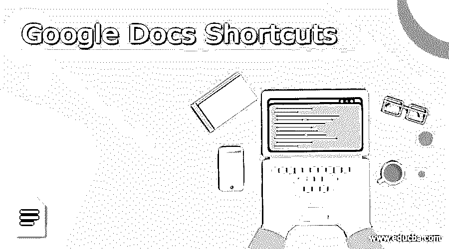

# 谷歌文档快捷方式

> 原文：<https://www.educba.com/google-docs-shortcuts/>

## 谷歌文档快捷方式简介

没有人喜欢做难的事情，所以他们为自己的键盘创造了快捷键！我们将检查快捷方式，以缩短使用谷歌文档的日常操作所需的时间。这不是所有谷歌文档快捷键的完整列表。我们试图维护一个更常用快捷方式的列表。如果你在本指南中找不到你想要的，还有很多可以探索。

### 谷歌文档的快捷键

让我们来看看谷歌文档的快捷方式和快捷键。如果你想在 mac 中访问菜单，那么你必须使用这个快捷键来获取谷歌文档。

<small>网页开发、编程语言、软件测试&其他</small>

*   如果你想打开菜单文件时，你必须点击 CTRL+ OPTION + F
*   如果你想打开编辑菜单时，你必须点击 CTRL + OPTION + E
*   如果你想打开视图菜单时，你必须点击 CTRL + OPTION + V
*   如果你想打开格式菜单时，你必须点击 CTRL + OPTION + O
*   如果你想打开插入菜单时，你必须点击 CTRL + OPTION + I
*   如果你想打开帮助菜单，当你必须点击 CTRL + OPTION + H
*   如果你想打开工具菜单时，你必须点击 CTRL + OPTION + T
*   如果你想显示你的浏览器的上下文菜单，那么你必须点击 SHIFT +右键+点击。
*   如果你想显示你的辅助功能菜单，那么请点击 CTRL + Option + A

### Google 文档上表格的快捷键

让我们来看看在谷歌文档上使用表格时的快捷键。

*   如果你想从表格开始，使用这个关键字，按住 Ctrl+ Alt+ Shift，然后按 P，再按 s。
*   如果你想走到表的末尾，那么使用这个关键字，按住 Ctrl+ Alt+ Shift，然后按 P，再按 d。
*   如果你想从表格的第一列开始，使用这个关键字，按住 Ctrl+ Alt+ Shift，然后按 P，再按 I
*   如果你想走到表格列的末尾，那么使用这个关键字，即按住 Ctrl+ Alt+ Shift，然后按 P，再按 k。
*   如果你想转到表格的前一列，那么使用这个关键字就是按住 Ctrl+ Alt+ Shift，然后按 P，再按 v。
*   如果你想从表格的第一行开始，使用这个关键字，按住 Ctrl+ Alt+ Shift，然后按 P，再按 J
*   如果你想走到表格行的末尾，那么使用这个关键字，即按住 Ctrl+ Alt+ Shift，然后按 P，再按 l。
*   如果你想退出表格，使用这个关键字，按住 Ctrl+ Alt+ Shift，然后按 P，再按 E
*   如果你想去下一个表，然后使用这个关键字是按住 Ctrl+ Alt+ Shift，然后按 N，然后 t。
*   如果你想去上一个表，那么使用这个关键字，按住 Ctrl+ Alt+ Shift，然后按 P，再按 t。

### Google Doc 的其他导航工具

现在让我们看看谷歌文档的其他导航工具。

*   如果你想打开文档修订历史，那么你必须点击 CTRL + ALT + Shift + H(这将只使用 chrome 操作系统和 Windows)，CMD + Option + SHIFT + H(这个关键字用于 mac perpours)
*   如果你想打开谷歌文档探索工具，那么你必须点击 CTRL + ALT + Shift + I(这将使用唯一的 chrome 操作系统和 Windows)，CMD + Option + SHIFT + I(这个关键字用于 mac perpours)
*   如果你想显示谷歌文档字数，那么你必须点击 CTRL + Shift + C(这将只使用 chrome 操作系统和 Windows)，CMD + SHIFT + C(这个关键字用于 mac perpours)
*   如果你想开始语音打字，那么你必须点击 CTRL + Shift + S(这将使用唯一的 chrome 操作系统和 Windows)，CMD + SHIFT + S(这个关键字用于 mac perpours)

### Google Doc 上的额外窗口快捷键

让我们看看谷歌文档上的一些额外的窗口快捷键

*   如果你想复制，请使用快捷键，也就是 CTRL+C
*   如果你想剪切，那么请使用快捷键，也就是 CTRL X
*   如果你想粘贴，那么请使用快捷键，也就是 CTRL+V
*   如果你想粘贴一些没有格式的东西，那么请使用快捷键，也就是 CTRL + shift + v
*   如果你想做重做选项，那么点击 CTRL + shift + Z
*   如果要打开链接并按 ALT + ENTER
*   如果你想对文本进行加粗，那么按 CTRL + B

### 推荐文章

这是谷歌文档快捷方式指南。在这里，我们还将讨论在 google docs 上使用表格时的简介和快捷键，以及额外的窗口快捷键。您也可以看看以下文章，了解更多信息–

1.  [Dropbox vs Google drive](https://www.educba.com/dropbox-vs-google-drive/)
2.  [谷歌地图替代品](https://www.educba.com/google-maps-alternatives/)
3.  [Echo vs Google Home](https://www.educba.com/echo-vs-google-home/)
4.  [谷歌 Chrome 是什么？](https://www.educba.com/what-is-google-chrome/)

