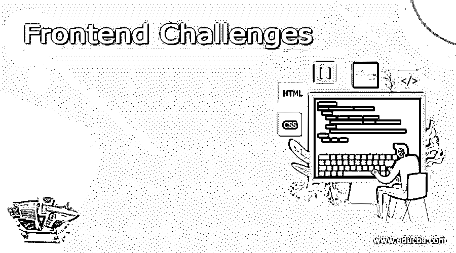

# 前端挑战

> 原文：<https://www.educba.com/frontend-challenges/>

## 前端挑战简介

在应用程序或系统中向用户显示的视觉图像被称为应用程序的前端，用户在该图像中与系统交互并从他们的层次理解应用程序。前端使用的语言不是编码语言，而是用于基本编码的 HTML、CSS 和 JavaScript，以便不熟悉编码的用户可以与网站交互并浏览他们正在寻找的任何内容。开发人员要精通前端开发技能，面临着各种挑战。如果项目做得好，一些网站会给他们提供工作。

### 前端的挑战

前端面临的挑战如下:

<small>网页开发、编程语言、软件测试&其他</small>

*   **HackerRank:** 这为 ace 开发者开发前端网页的技能提供了所有类型的测试、测验和挑战。这也有助于根据你在特定领域的技能找到工作。有基于 CSS、JavaScript 和 HTML 的测试，用于评估开发人员基于不同需求设计网页的能力。此外，可以下载和脱机工作的项目。这也很考验开发者的效率。
*   **CodePen:** 这是一个在线社区，帮助用户在 HTML、CSS、JavaScript 的帮助下构建自己的项目，为应用的前端创建网页。他们每周发布基于新想法的挑战，任何人都可以参与其中。我们可以看到别人解决挑战，我们也可以用完全不同的方式解决同样的问题。如果需要，我们可以对其他人的提交内容进行修改，并将其应用到我们的项目中，而无需编辑他们的姓名。
*   **CodeCombat:** 一种用点数和不同阶段开发的视频游戏，学习者可以获得每项技能并进入下一个级别，这种游戏叫做 CodeCombat。任何人都可以安装和学习，无论他们的年龄或技能。这主要是针对 JavaScript 的，我们没有 CSS 或 HTML。这被添加到推荐视频中，如果需要，我们可以重复观看。这是一种更简单的方法来教学生，让他们通过玩游戏和与其他程序员互动来学习 JavaScript。
*   **前端导师:**顾名思义，这是为前端设计开发的，人们可以使用 CSS 和 HTML 设计和构建现实生活中的项目。其他人会看到我们的工作，他们也可以对项目留下反馈。这有助于社区通过服务他人成长，成长为更好的前端开发者。在这里，开发者为初学者开设课程来开发他们自己的网页，每个人都从中受益。开发人员也可以订阅专业订阅，在那里他们可以访问许多特权。
*   这是另一个提供挑战的平台，开发者可以解决同样的问题。开发人员可以通过看到其他人的开发向 Codier 学习，并从中获得动力。Codier 提供社区支持。挑战的类型各不相同，从纯粹的 CSS 挑战或简单的 HTML 模板创建或任何开发人员希望它是什么。开发人员也可以使用外部资源来解决挑战，帮助他们找到解决方案。将创建用户配置文件，开发者创建的帖子可以在这里查看。
*   Ace Front end: 当其他人专注于创造和解决挑战时，这个平台也有助于准备面试。可以用 HTML 和 CSS 创建项目，开发人员可以找到一种独特的方法来解决同样的问题。提供面试问题，开发者自行解决。或者在网页本身提供面试解答。这有助于开发者提高前端开发的技能。学习可以是交互式的，由导师或社区中的其他人提供解决方案。这是帮助开发者理清面试流程的另一种方式。
*   Codewars: 这个平台就像 CodeCombat 一样，可以通过互动和有趣的方式解决挑战。这主要是针对 JavaScript 或其他编程语言，用户可以选择挑战的难度。因此，初学者或熟练用户可以选择这个平台，提高他们的前端开发技能。用户可以解决特定的挑战，然后与其他开发人员进行比较，并找到另一种方法来解决相同的挑战。可以从社区中整理反馈，这总是有建设性的。用户可以不断学习，不断重复挑战，以不同的方式解决问题。有一个排名系统，可以帮助用户提高他们的技能，总是领先一步。
*   这个平台也是为编程语言开发的，我们可以在这里看到 JavaScript 的挑战。这有助于通过提出问题来准备面试或任何其他竞争。提供了视频和文章来帮助开发人员掌握所需的技能。
*   其他可以找到挑战的地方是前端挑战俱乐部和 100 天 CSS 挑战。虽然现在还没有激活，但是用户可以经历其他人已经解决的挑战。此外，日常 UI 挑战帮助人们在登录时解决挑战。这有助于他们创造性地解决问题。Frontloops 是另一个为用户提供挑战页面。
*   现在会有开发者不想成为任何其他网站的用户，而是想创建自己的网页。对于他们来说，利用可用的文档创建自己的项目并通过艰苦的方式学习总是好的。这在没有任何社区帮助的情况下发展了一个人的技能，并使即将到来的项目变得容易。构建项目可以在笔记本电脑上完成，用户不必在单独的网站上创建。这使得开发者能够构建他们自己的项目。

我们可以查看 GitHub 的前端挑战，那里也有可用的解决方案。这些选项中的任何一个都可以帮助想要学习和提高前端开发技能的开发人员。有些网站是免费的，有些是收费的。但值得一试的是调查这些网站，并学习用 HTML、CSS 和 JavaScript 编码。

### 推荐文章

这是一个前端挑战指南。在这里，我们还讨论了前端的介绍和挑战，并给出了解释。您也可以看看以下文章，了解更多信息–

1.  [jQuery 替换 innerhtml](https://www.educba.com/jquery-replace-innerhtml/)
2.  [jquery internhtml](https://www.educba.com/jquery-innerhtml/)
3.  [HTML 中的水平菜单栏](https://www.educba.com/horizontal-menu-bar-in-html/)
4.  [HTML 中的 href 标签](https://www.educba.com/href-tag-in-html/)

