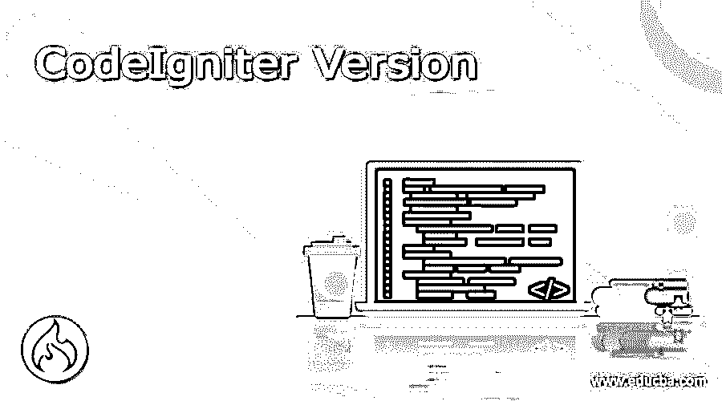

# CodeIgniter 版本

> 原文：<https://www.educba.com/codeigniter-version/>

## CodeIgniter 版本介绍

2006 年 2 月，EllisLab 发布了 CodeIgnitor 第一版，这是他们当时领先的内容管理工具“Expression Engine”在删除了与原始产品相关的特定代码后的一个略微重构的版本；第二个版本被称为遗留版本，于 2011 年 1 月发布，修复了早期版本的错误；随着 CodeIgniter 寻求外部资源/技术支持，不列颠哥伦比亚理工学院参与进来，他们负责在 2015 年 3 月发布版本 3，解决了安全问题并在产品中引入了复杂性，这是当前版本；版本 4 是测试版或未来版本，于 2020 年 2 月发布，目前仍在发展中。

### CodeIgniter 简介

这是一个易于安装和简单使用的 PHP 框架，以更快的方式加速 Web 开发。它包含了解决 PHP 中复杂问题的库、函数、接口、助手和插件，有助于以极快的速度构建 Web 应用程序。它使用模型视图控制器来分离表示、业务逻辑和数据。它占地面积小，易于学习，有足够的文档支持。

<small>网页开发、编程语言、软件测试&其他</small>

### CodeIgniter 的前 4 个版本

codeigniter 的版本如下

#### 版本 1

*   CodeIgnitor 的第一个版本是 EllisLab 旗舰工具的临时版本，尽管市场上充斥着几个 PHP 产品，但在那个时候，这个版本有很多利基用户。
*   第一个测试版 1.0 于 2006 年 2 月发布，随着 1.1 的发布，它通过修复错误和添加日历、链接到下一页和更新文档等新功能得到了改进。
*   在 2006 年 3 月至 6 月期间，版本 1.2、1.3 及其子版本 1.3.1、1.3.2、1.3.3 修复了许多错误，并在数据库连接、会话处理、助手和全局函数中添加了新功能。
*   版本 1.4、1.5、1.6 和 1.7 在 2006 年 9 月至 2009 年 9 月期间发布，每个版本都有许多子修订版。在数据库访问方法、助手、库和接口方面有一些变化。

#### 版本 2

2.0 版本于 2011 年 1 月发布，与平淡无奇的 1.0 版本相比，它有了显著的变化和令人印象深刻的特性。这个版本的主要特点是

*   这个版本填补了支持 PHP 更高版本的空白。
*   应用程序目录结构默认为外部目录，尽管用户可以手动更改
*   插件被完全撤回，助手和钩子将补偿这些功能。用户将不会有太多的选择，这对于他们来说很简单。
*   简单的覆盖规则可在单个安装中管理多个应用程序
*   支持缓存
*   提供两种开发环境。第一个是由 EllisLab 提供的核心，另一个是由社区更新的 Reactor

在 2011 年 8 月之前，基础版本 2.0 有 2.0.1、2.0.2、2.0.3 三个子版本

2.1 版于 2011 年 11 月发布，2.1.1、2.1.2、2.1.3、2.1.4 版的子修订版于 2013 年 7 月发布。

版本 2.2 于 2014 年 6 月发布，2.2.1、2.2.2、2.2.3、2.2.4 的子修订版于 2015 年 7 月发布

#### 版本 3

EllisLab 正在寻求外部资源和技术支持，不列颠哥伦比亚理工学院提供了支持，并于 2015 年 3 月发布了 3.0 版。版本 3 更加关注安全性、第三方集成和性能。

**安全**:黑客可以通过 Xss_clean 例程中的漏洞潜入早期版本的 CodeIgnitor，并注入恶意代码，这是版本 2 中的一个主要问题。新版本堵塞了漏洞，Xss_clean 没有受到损害，并且通过加强 Xss_clean 代码来防止恶意注入。

**第三方集成:**当今的 IT 环境需要将组织的网站与多个第三方应用程序(如邮件、社交媒体、CRM、DMS、ERP)集成，以便向用户提供实时数据。这可能涉及 Web 服务、API、XML、JSON 和 direct SQL。CodeIgnitor 通过其最新的开发支持所有这样的集成，该版本升级了配置，并添加了一组新的库来管理这些集成。

**性能:**任何网站都必须管理用户负载的增加，并以可接受的性能水平对用户的查询做出响应。数据库访问在提高性能水平方面起着重要作用，触发记录提取的查询需要优化。通过使用高速缓存、在查询构建器程序中修复早期版本中的问题以及微调其他数据库查询，此版本的性能得到了提高。

**其他**

*   它支持更高版本的 PHP
*   改进的编码实践

**版本:**基础版本 3.0 于 2015 年 3 月发布，子版本 3.0.1、3.0.2、3.0.3、3.0.4、3.0.5、3.0.6 至 2016 年 3 月。版本 3.1.0 于 2016 年 7 月发布，子版本 3.1.1、3.1.2、3.1.3、3.1.4、3.1.5、3.1、6、3.1.7、3.1.8、3.1.9、3.1.10、3.1.11 至 2019 年 9 月

#### 版本 4

版本 3 和版本 4 的发布间隔了大约 5 年。PHP 中间有 8 个版本，CodeIgnitor 很有可能被淘汰。但是 CodeIgniter 在新版本中带来了剧烈的升级，并保持了在 PHP 框架中的旗舰地位。

**该版本的亮点有**

*   它支持更高的 PHP 版本
*   通过创建五个独立的目录结构，以更好的方式组织目录。
*   它支持名称空间
*   它遵循自动加载方法来加载文件，而在早期版本中，文件将不得不手动装配
*   在这个版本中，实体用于组织信息。这是一个内置的功能，而在早期版本中，它是使用第三方软件完成的。
*   性能水平超群
*   其他亮点包括简单的配置、单体库、对环境文件扩展名的支持以及从早期版本的轻松迁移

**版本:**基础版本 4.0 于 2020 年 2 月发布，到 2021 年 2 月为止，它有 4.0.1、4.0.2、4.0.3、4.0.4 和 4.0.5 个子版本。下一个版本 4.1 于 2021 年 2 月发布，它的子版本为 4.1.1、4.1.2、4.1.3，直到 2021 年 6 月

### 结论–CodeIgniter 版本

尽管 CodeIgniter 花了时间发布新版本以跟上 PHP 的步伐，但它的特性在 web 开发人员中吸引了大量追随者，并且它仍然是比其他工具更受欢迎的 web 开发工具。

### 推荐文章

这是一个 CodeIgniter 版本的指南。在这里，我们还讨论了 CodeIgniter 的定义和前 4 个版本，并给出了解释。您也可以看看以下文章，了解更多信息–

1.  [CodeIgniter 面试问题](https://www.educba.com/codeigniter-interview-questions/)
2.  [Laravel 子查询](https://www.educba.com/laravel-subquery/)
3.  [PHP 框架](https://www.educba.com/php-frameworks/)
4.  [SVG vs EPS](https://www.educba.com/svg-vs-eps/)

