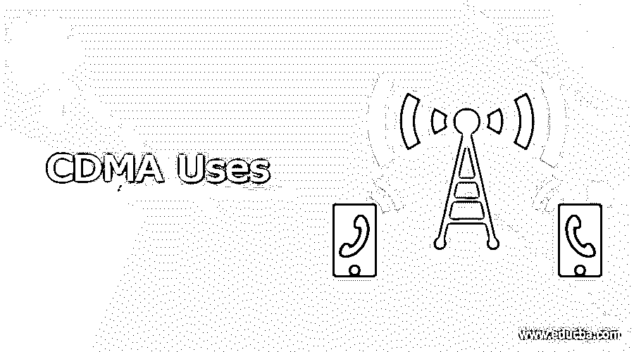

# CDMA 使用

> 原文：<https://www.educba.com/cdma-uses/>

## CDMA 用途介绍

码分多址(CDMA)是一种在无线电通信技术以及一些其他技术中使用的数据传输技术。它是许多多址通信系统中的一种。在其他通信系统中。顾名思义，TDMA 和 FDMA 分别将用户划分为不同的周期或频率范围，因此将他们限制在特定的频率范围或使用周期内。这就是 CDMA 发挥作用的地方。CDMA 给予每个用户通信的时间和频率范围的自由。它将每个用户分成不同的频道，给每个频道一个唯一的代码。

### 码分多址及其应用

由于 CDMA 相对于 TDMA 和 FDMA 的固有优势，包括用户容量、温和切换和安全性。其中，CDMA 在无线技术和服务的竞争中脱颖而出。由于 CDMA 的发展，宽带设备，如无线笔记本电脑调制解调器、GPS 单元和其他尖端技术的开发和使用变得更加容易。

<small>网页开发、编程语言、软件测试&其他</small>

#### 1.军队

CDMA 是一项军事技术，在第二次世界大战期间首次被英国盟友用于挫败德国封锁信号的企图。盟军选择在多个频率而不是一个频率上广播，使得德国人很难接收到整个信号。高通之所以能够接触到这种敏感材料，是因为它开发了 CDMA 技术的通信芯片，并且是第一个将其推向市场的公司。
它也被用于:

–抗干扰(由于信号扩散，很难干扰 CDMA 信号)。
–测距(测量传输的距离，以了解何时接收到传输)。
–安全通信(扩频信号很难检测)。

#### 2 .微小区和室内系统

嵌入式微小区使用与底层宏小区相同的频率，并与之完全连接。在各种业务分布下，计算并模拟了小区的容量。微小区的容量是常规小区的 1.03 到 1.12 倍。组合的微蜂窝和宏蜂窝的容量是传统蜂窝的 2.00 到 2.11 倍。还检查了小区的 RF 可靠性、软切换因素、干扰和功率水平。宏蜂窝的 RF 可靠性将比微蜂窝恶化得更快。微小区的无线电切换因子比宏小区的高大约 11%。微小区平均所需的前向业务信道功率比宏小区低 10%左右。微蜂窝工程指南也适用于商业 CDMA 系统。研究结果表明，在现有的 CDMA 网络中集成微蜂窝可能是提高热点和死角覆盖的有效方法。

#### 3.GPS 卫星信号

主要频率 L1 和次要频率 L2 由 GPS 卫星传送。卫星同时以两种频率发射，然而由于 PRN 码调制，它们的信号不会明显冲突。可以使用 CDMA 方法来隔离和识别卫星信号，因为每个卫星被发给一个唯一的 PRN 码，并且所有的 PRN 码序列基本上彼此不相关。GPS 接收机必须重复所选卫星的 PRN 序列以及复制载波信号，以使用 CDMA 方法监控与多个其他卫星共视的一个卫星。因为电离层延迟通过比例因子与低载波频率的信号到达时间差(TOA)相关，所以给出两个载波频率以允许两个频率用户对其进行监控。单一频率(L1)的用户必须使用导航信息中发送给他们的建模参数来估计电离层延迟。

#### 4.蓝牙

蓝牙采用快速跳频码分多址技术，跳频速率为每秒 1600 跳。每个微微网都有其独特的扩展模式。在蓝牙中，FH/CDMA 允许数十个微微网在同一区域重叠，从而产生超过 1 Mbps 的吞吐量。为了允许许多用户在同一物理信道上复用，CDMA 使用扩频技术和特定的编码系统(其中每个发射机被分配一个代码)。数据和语音包使用代码分离，然后通过 CDMA 技术在较宽的频率范围内发送。

#### 5.移动/无线通信

CDMA 使用扩频无线网络。它可以指这种蜂窝系统使用的特定媒体接入技术，也可以指数字蜂窝电话系统的一种形式。CDMA 将语音和数据以 9.6 Kbps 的速率合并成一个数字传输，然而，错误检测和纠正技术允许每通道高达 19.2 Kbps 的速率。在不知道代码标签的情况下，窃听 CDMA 对话是不可能的，这使得 CDMA 成为比高级移动电话服务更安全的蜂窝电话系统，高级移动电话服务仍然在美国广泛使用。CDMA 还提供比 AMPS 大得多的呼叫容量，并且相当于欧洲蜂窝通信标准，即全球移动通信系统。

#### 6.商业/商业

两个主要的全球蜂窝协议之一是 CDMA。它在北美和亚洲的一些地区最受欢迎，而 GSM 在其他地方最受欢迎。然而，对于 4G 手机，这两种技术之间的区别本质上并不重要，因为两种技术都可以用于两种主要的 4G 标准。CDMA 蜂窝模型集包括为提供或转售 CDMA 无线产品和服务的组织定制的企业、商业区域和数据仓库的逻辑数据模型。CDMA 无线行业数据模型提供了完整的数据和报告架构，以满足整个组织的需求。CDMA 还为商业用途提供高速一键通和一键通电子邮件功能。利用移动电话作为对讲机设备的能力是通过一键通提供的。这些服务被排除在运营商的服务成本之外，使得 CDMA 具有成本效益。

### 结论

总之，可以说 CDMA 是无线通信领域中最有效的方法之一。在一种或另一种形式中，CDMA 技术已经被用于通信网络中。CDMA 在各个方面都取得了巨大的成功，并且相对于现有的通信系统有了显著的进步。CDMA 无线模型集可以毫不费力地与多个通信部门链接，扩展了它们的可能性。

### 推荐文章

这是 CDMA 使用指南。这里我们详细讨论一下 CDMA 的简介、用途列表。您也可以看看以下文章，了解更多信息–

1.  [工作站使用](https://www.educba.com/workstation-uses/)
2.  [哈斯克尔使用](https://www.educba.com/haskell-uses/)
3.  [GIS 使用](https://www.educba.com/gis-uses/)
4.  [人工智能的用途](https://www.educba.com/uses-of-artificial-intelligence/)

