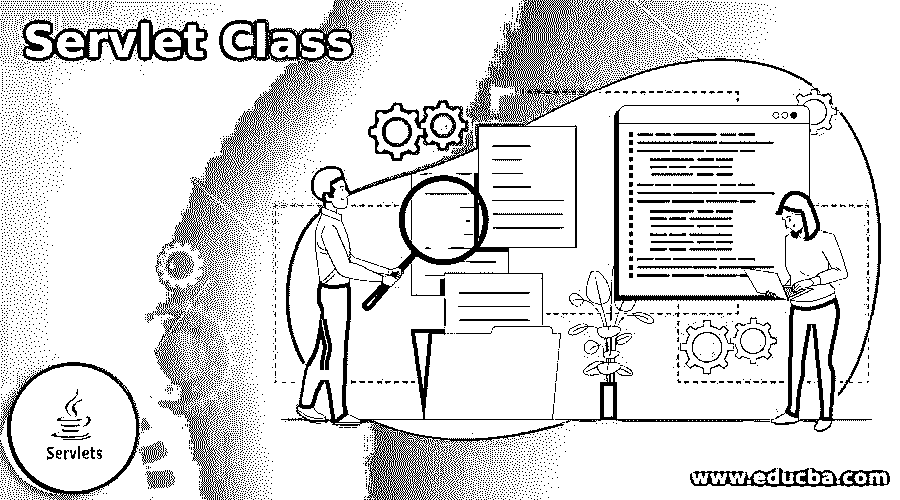
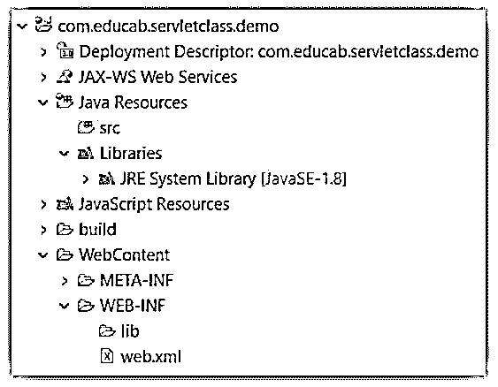
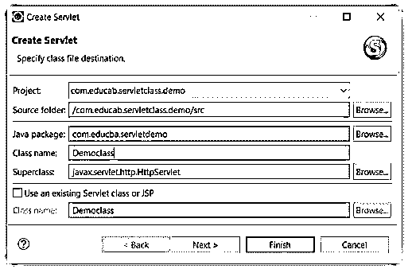
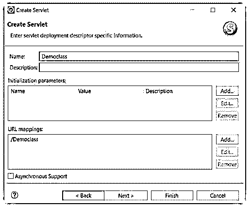

# Servlet 类

> 原文：<https://www.educba.com/servlet-class/>




## Servlet 类简介

被称为“servlet”的 Java 类执行 javax.servlet 规范并处理 HTTP 请求。servlets 的接口。servlet 类扩展 javax.servlet.http.HttpServlet 接口是一个实现 Servlet 接口的抽象类，专门为处理 http 请求而构建，通常由 web 应用程序开发人员编写。servlet-class 元素指示容器如何创建类实例。一个称为 servlet 的 java 编程类用于增加服务器的功能，这些服务器承载通过请求-响应编程模型访问的应用程序。

### 关键要点

*   包含对象、方法和数据库驱动。
*   它扩展并实现了接口。
*   连接页面和 web.xml 文件，用于应用程序操作。
*   使从另一个页面请求和回复变得容易。
*   在类内部使用 servlet 生命周期，由开发者高效操作。
*   它是任何 servlet 页面的关键点。

### 什么是 Servlet 类？

基本层次的主界面是界面。所有 Servlets 都必须直接或间接地实现该接口。接口是由 Servlet API 的 GenericServlet 类实现的。GenericSC 执行接口、Servlet API 的 ServletConfig 接口和标准 java.io. package 的 Serializable 接口。当 servlet 被初始化时，Web 容器使用 Config 接口对象给出配置信息。要创建通过 HTTP 通信的 servlet，我们必须扩展 HttpServlet 类。HttpSC 扩展了 GenericSC，并且默认包含 HTTP 功能。

<small>网页开发、编程语言、软件测试&其他</small>

### 创建步骤

它使用了两个主要的包:javax.servlet 和 javax.servlet.http。下面的类将我们放在 servlet 中进行操作。

**类:**

*   **GenericServlet:**javax . servlet 包中包含与 web 服务器交互的 generic servlet 类。这是一个通用的实现。如果想为 HTTP 以外的协议开发，应该扩展 GenericServlet，而不是显式实现 Servlet 接口。
*   **http servlet:**javax . servlet . HTTP 包包含管理 HTTP 请求的类。它包括 HttpSC，它实现 javax.servlet 所需的接口

遵循以下步骤。

1.  创建动态文件夹。




2.在“src”文件夹中创建一个包和页面。




3.为部署编写 URL 映射并使用适当的方法。




页面和类名相似。下面的语法显示了页面上的基本类。

```
package com.educba.servletdemo;
import java.io.IOException;
import javax.servlet.ServletException;
import javax.servlet.annotation.WebServlet;
@WebServlet("/Democlass")
public class Democlass extends HttpServlet {
private static final long serialVersionUID = 1L;
public Democlass() {
}
//Write servlet methods and operations.
}
```

4.使用映射或部署创建 web.xml 文件。

**代码:**

```
<web-app>
<servlet>
<servlet-name> Democlass </servlet-name>
<servlet-class> Democlass </servlet-class>
</servlet>
</web-app>
```

5.在 web.xml 文件中创建“url”映射。

**代码:**

```
<web-app>
<servlet-mapping>
<servlet-name> Democlass </servlet-name>
<url-pattern> /Democlass </url-pattern>
</servlet-mapping>
<web-app>
```

### HttpServlet 类

提供 HTTP 请求实现功能的抽象类。值得注意的是，service()函数是在接口中定义的。它现在将调用 doGet()和 doPost()，这两个函数可以单独执行，以便为 Servlet 提供行为。

下面的文件示例向我们展示了它在页面中是如何工作的。

**文件名:Democlass.java**

**代码:**

```
package com.educba.servletdemo;
import java.io.IOException;
import javax.servlet.ServletException;
import javax.servlet.annotation.WebServlet;
import javax.servlet.http.HttpServlet;
import javax.servlet.http.HttpServletRequest;
import javax.servlet.http.HttpServletResponse;
@WebServlet("/Democlass")
public class Democlass extends HttpServlet {
private static final long serialVersionUID = 1L;
public Democlass() {
}
protected void doGet(HttpServletRequest reqst, HttpServletResponse respnse) throws
ServletException, IOException {
respnse.getWriter().append("Served at: ").append(reqst.getContextPath());
}
protected void doPost(HttpServletRequest reqst, HttpServletResponse respnse) throws
ServletException, IOException {
doGet(reqst, respnse);
}
}
```

**说明:**

*   HttpServlet。
*   类别会以类别名称扩充介面。
*   “doGet”和“doPost”方法用于请求和响应对象。

### Servlet 类的示例

以下示例显示了 generic 和 HTTP SC 及其输出。

#### 示例#1

遵循下面的例子和输出。

**文件名:DemoServletExample.java**

**代码:**

```
import java.io.*;
import javax.servlet.*;
public class DemoServletExample extends GenericServlet
{
  public void service(ServletRequest reqes, ServletResponse respes)
  throws ServletException, IOException
{
  respes.setContentType("text/html");
  PrintWriter printout = respes.getWriter();
  printout.println("<html>");
  printout.println("<head><title> My GenericServlet Class </title> </head>");
  printout.println("<body>");
  printout.println("<h2> Welcome To Servlet Class Data! </h2>");
  printout.println("</body>");
  printout.println("</html>");
  printout.close();
 }
}
```

**文件名:web.xml**

**代码:**

```
<web-app>
<servlet>
<servlet-name> DemoServletExample </servlet-name>
<servlet-class> DemoServletExample </servlet-class>
</servlet>
<servlet-mapping>
<servlet-name> DemoServletExample </servlet-name>
<url-pattern> / DemoServletExample </url-pattern>
</servlet-mapping>
</web-app>
```

**输出:**


#### 实施例 2

httpservlet 类的例子和输出。

**文件名:DemoServletExample.java**

**代码:**

```
package com.educba.servletdemo;
import java.io.IOException;
import javax.servlet.ServletException;
import javax.servlet.annotation.WebServlet;
import javax.servlet.http.HttpServlet;
import javax.servlet.http.HttpServletRequest;
import javax.servlet.http.HttpServletResponse;
@WebServlet("/Democlass")
public class DemoServletExample extends HttpServlet {
private static final long serialVersionUID = 1L;
private string messages;
public void init() throws ServletException{
messages = "The HttpServlet Class Demo";
}
protected void doGet(HttpServletRequest reqst, HttpServletResponse respnse) throws
ServletException, IOException {
respnse.getWriter().append("Served at: ").append(reqst.getContextPath());
respnse.setContentType("text/html");
PrintWriter printout = respnse.getWriter();
printout.println("<h2>" + messages + "</h2>");
printout.println("<p>" + "Welcome To Servlet Class Data!"+ "</p>");
}
public void destroy(){}
}
```

**文件名:web.xml**

**代码:**

```
<web-app>
<servlet>
<servlet-name> DemoServletExample </servlet-name>
<servlet-class> DemoServletExample </servlet-class>
</servlet>
<servlet-mapping>
<servlet-name> DemoServletExample </servlet-name>
<url-pattern> / DemoServletExample </url-pattern>
</servlet-mapping>
</web-app>
```

**输出:**


### 常见问题解答

下面是提到的常见问题:

#### Q1。是类还是接口？

**答案:**

http 包为编写 servlets 提供了接口或类。所有 Servlet 都必须符合 Servlet 接口，该接口指定了生命周期方法。创建通用服务时，可以利用或扩展 Java Servlet API 的 GenericSC。

#### Q2。servlet 的名称和类是什么？

**答案:**

上下文中的每个实例都必须有一个特定的名称。另一方面，名称只是用来将 URL 映射与这个实例相关联，而不必与标题或 servlet 的 URL 相对应。servlet-class 元素指示容器如何创建 servlet 实例。

#### Q3。servlet 和 Java 类有什么区别？

**答案:**

它的功能和其他 Java 类完全一样。这种语言没有任何不同。把他们分开的是对他们做了什么。servlet 容器(Tomcat)被设计用来识别类。

### 结论

它有助于用数据来包含和操作方法、变量和对象。它处理 web.xml 文件和注释的使用。对于每个 servlet 页面来说，处理 servlet 生命周期是一个基本的操作功能。

### 推荐文章

这是一个 Servlet 类的指南。在这里，我们分别讨论介绍、创建步骤、示例和常见问题。您也可以看看以下文章，了解更多信息–

1.  [Servlet 方法](https://www.educba.com/servlet-methods/)
2.  [Java servlet](https://www.educba.com/popular/java-servlets/)
3.  [Servlet 监听器](https://www.educba.com/servlet-listener/)
4.  [Servlet 架构](https://www.educba.com/servlet-architecture/)


