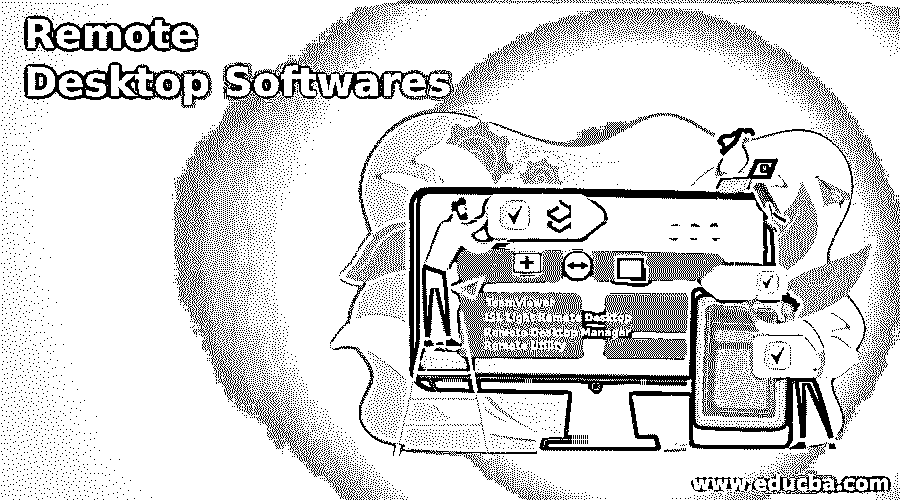

# 远程桌面软件

> 原文：<https://www.educba.com/remote-desktop-softwares/>

## 远程桌面软件介绍

远程桌面软件是一个允许 IT 人员、专业人员和管理员远程访问客户端设备以解决或调试技术问题并提供维护支持的平台。它具有各种无干扰的远程访问和控制功能、多显示器导航、聊天或消息传递、屏幕共享、文件共享等。

### 远程桌面软件的特点

以下是远程桌面软件的功能:

<small>网页开发、编程语言、软件测试&其他</small>

*   **无人值守访问:**有了这项功能，无论何时客户需要帮助，您都不必中断客户来授予访问权限。相反，在一天中的任何时候，您都可以通过单击鼠标远程访问客户的计算机。
*   **多会话处理:**高效的多任务对于提供高质量的远程支持至关重要。在这种情况下，可以同时运行支持会话。
*   **多窗口控制:**当您需要同时为许多用户提供支持时，设置多个远程桌面控制窗口的能力非常有用。
*   自动重启&重新连接:远程桌面工具的一个重要方面是重启远程计算机并自动重新连接。通过清除缓存，刷新内存，从而给你重新开始的机会，使计算机处于一个相对干净的状态。
*   **远程屏幕缩放:**远程屏幕缩放功能使您可以更轻松地在屏幕分辨率大于或小于您的设备上操作。使用远程桌面软件，可以根据远程用户的屏幕分辨率设置或客户端的偏好，在多个缩放选项之间轻松更改远程控制窗口。

### 远程桌面软件列表

以下是远程桌面软件列表:

#### 1.团队查看器

这是一个广泛用于在线协作和远程管理的远程桌面应用程序。它使您能够远程连接到几个工作站。这使您能够提高硬件加速图像处理的 GPU 远程控制效率。

**特性:**

*   它能让你把权力从一个人转移到另一个人身上。
*   快速安全地访问远程桌面。
*   它支持人工智能、增强现实(AR)以及[物联网(IoT)](https://www.educba.com/what-is-iot/) 实现。
*   允许您将文件从一个系统拖放到另一个系统。

#### 2.ISL 轻型远程桌面

ISL Light 让您安全方便地访问远程计算机和移动设备。

**特性:**

*   它通过双因素身份验证和 AES 256 位加密提供最大程度的保护。
*   它易于使用，并提供了几种不同的通信方式。
*   自动记录会议，文件传输。
*   通过 RDP 连接到无人值守机器的可能性。
*   易于使用的定制协作选项。

#### 3.远程桌面管理器

这个工具使您能够在一个平台上安全地远程控制您的所有连接。

**特性:**

*   它为所有远程连接的启动和管理提供了单一平台。
*   允许您所有的密码和凭证存储在一个安全，统一的核桃。
*   借助精细的访问控制保护，保护连接免受多重安全攻击。
*   允许创建有效策略的模板。
*   根据特定标准生成定制报告。

#### 4.远程实用程序

远程工具是一个免费的开源远程访问工具。对于自动和无人值守的远程访问，您可以使用该工具。

**特性:**

*   它为远程访问提供了几个工具。
*   它提供了活动目录的集成。
*   它支持笔记本电脑模式。
*   它允许建立多达 10 台计算机的连接。

#### 5.ManageEngine 远程访问增强版

Remote Access Plus 是一款面向组织的安全可靠的远程支持解决方案，可帮助系统管理员和 IT 服务台技术人员从一个中心位置对 Windows、Linux 和 Mac 计算机进行故障排除。

**特性:**

*   它允许随时随地进行终端访问。
*   在连接到客户端计算机的多台显示器之间轻松切换。
*   使用快速启动工具，它允许执行管理任务。

#### 6\. LogMeIn

对于那些已经创办了一家需要来自世界各地的持续援助的公司的人来说，LogMeIn 是一个理想的工具。对于随时可能出现问题的地点特别有用。

**特性:**

*   它允许您轻松访问您的作品，并在您的所有设备上存储、共享和协作。
*   只需一次点击，即可存储、传输和协作文件。
*   为了自由交流，您可以与任何人共享屏幕。

#### 7\. RealVNC

RealVNC 为互联世界提供安全的远程桌面访问和支持。

**特性:**

*   简单可靠的远程支持和访问。
*   分享、合作、培训团队成员并鼓励他们。
*   提供卓越的按需服务台服务，提高客户忠诚度。
*   帮助您的生态系统安全地访问资源和数据。

### 结论

在本文中，我们看到了各种远程桌面软件及其特性。我们可以根据自己的需求选择任何一种。

### 推荐文章

这是一个远程桌面软件指南。这里我们讨论远程桌面软件的介绍、特点和列表。您也可以看看以下文章，了解更多信息–

1.  [远程支持软件](https://www.educba.com/remote-support-softwares/)
2.  [什么是远程桌面？](https://www.educba.com/what-is-remote-desktop/)
3.  [远程桌面替代方案](https://www.educba.com/remote-desktop-alternatives/)
4.  [服务台工具](https://www.educba.com/helpdesk-tool/)

