# Soapui 负载测试

> 原文：<https://www.educba.com/soapui-load-test/>

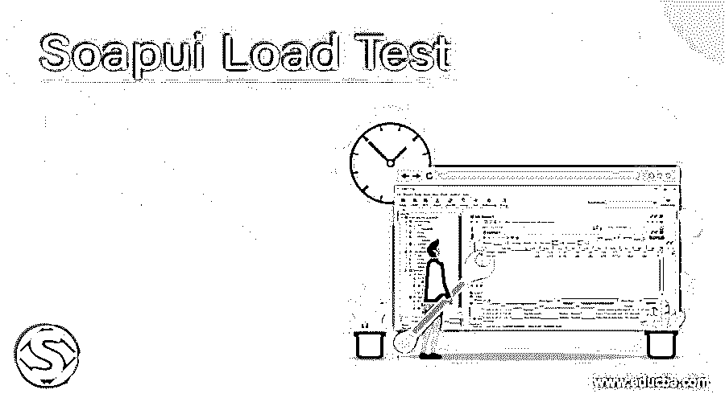

## Soapui 负载测试简介

SoapUI 是一个测试 Web 服务的开源工具；它可能是 SOAP web 服务或 REST web 服务或基于 HTTP 的 web 服务。SOAP 中的负载测试是性能测试的一种形式，用于检查应用程序在特定负载下的行为。在这个主题中，我们将学习 Soapui 负载测试。

负载测试属于性能测试，包括增加负载和检查应用程序或系统在高负载下的行为。在负载测试时，我们还可以在不破坏目标环境的情况下监控响应时间、吞吐量和服务器状况。我们还有各种性能测试类型，如基线跟踪、压力测试、浸泡测试和可伸缩性测试。

<small>网页开发、编程语言、软件测试&其他</small>

与其他类型的测试相比，负载测试是独特的，

*   一个允许快速创建和修改性能的功能测试用例。
*   SOAP 中的性能测试是从现有的功能测试中创建的。
*   可以在不同的负载下验证 web 服务的性能。
*   将它的负载分布在多个负载代理上；许多加载代理可能会根据一组输入条件而变化。
*   允许高级报告捕获其性能参数。
*   允许对系统性能进行端到端监控。
*   模拟大容量和真实负载测试。

### 如何在 SoapUI 中创建负载测试？

我们将创建一个 SoapUI 项目，并用下面的例子运行一个负载测试。

#### 示例#1

*   在 SoapUI 中创建新项目；这里，我们使用的是 SoapUI 5.3.0 版本

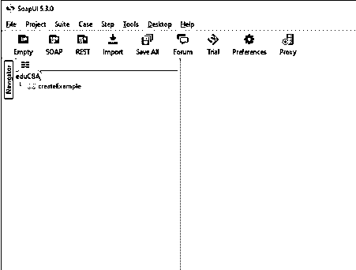

*   单击 new Soap project 后，会出现一个弹出窗口，

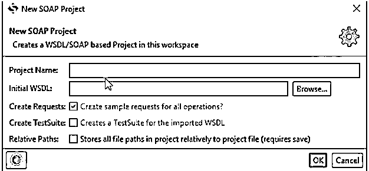

给出你选择的项目名称和 WSDL 网址，然后点击确定。

*   提供如下所述的细节，

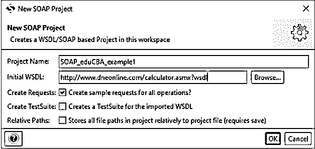

当点击 OK 时，这是 wsdl 设置的样子，

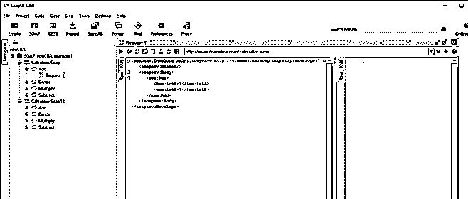

*   要为 wsdl 文件创建测试，右键单击任何可以找到“添加到测试用例”的请求，或者在一些 SOAP 版本中，可以按 CTRL+N 来创建负载测试用例。给出 TestSuite 名称和 TestCase 名称，点击 Ok。

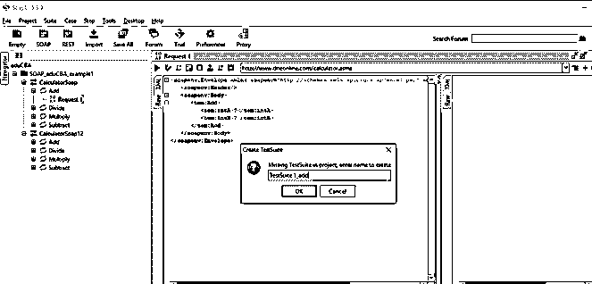

*   点击 Ok，这就是 SoapUI 的外观，

*   我们在下面创建了一个测试用例，

*   创建负载测试用例。

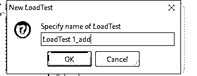

*   这是实际负载测试控制台的样子，

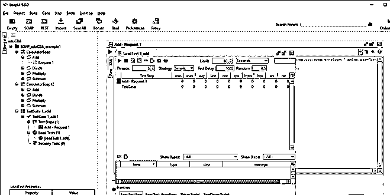

默认情况下，负载测试窗口被配置为运行 60 秒，这被标记为 Limit，但也可以相应地进行调整。此外，它使用简单的加载策略，以默认的 5 个线程运行。

*   单击左上角的绿色箭头选项，测试用例“Add-Request1”将运行，下面是负载测试运行后它如何显示的控制台。

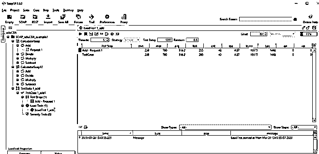

它显示负载测试的开始时间和结束时间；按钮“LoadTestLog”显示测试日志，即开始时间和结束时间，如果有故障。

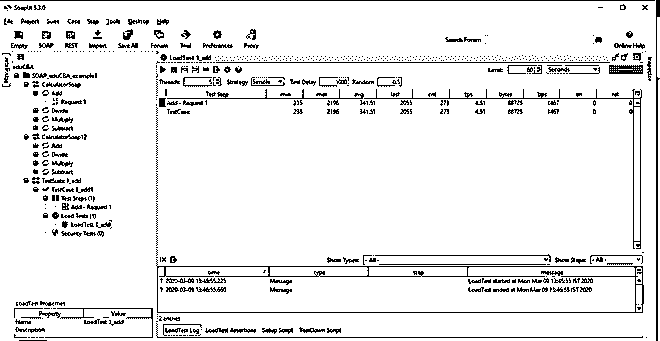

*   然后我们添加断言来加载测试用例，单击弹出窗口中的加号选项，选择任意选项。这里，我们选择“最大步长”。

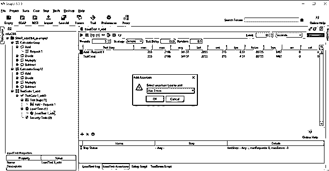

*   然后点击 Ok，打开一个弹出窗口，从下拉列表中选择测试用例，并将最大时间设置为 1000 毫秒，这是从 web 服务发出服务请求的时间。

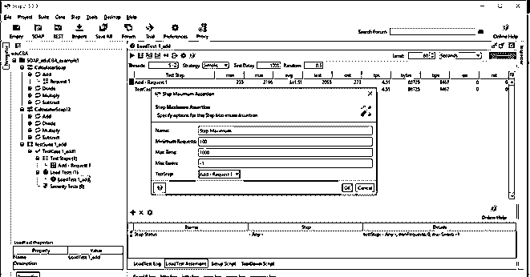

这里，最大时间被假设为 1000 毫秒；因此，如果 web 服务的响应时间超过 1000 毫秒，将会记录一个错误，进一步断言失败。如果负载测试花费的时间少于 1000 毫秒，断言通过。

*   现在我们需要再次运行负载测试，

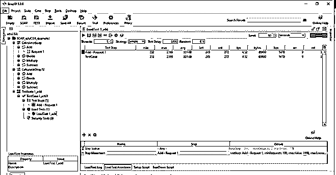

这就是我们如何添加断言来加载测试 web 服务请求。其他断言，如“最大误差”、“步长平均值”、“步长状态”、“步长 TPS”。

**最大误差**:用于验证测试的总误差不应超过规定值。

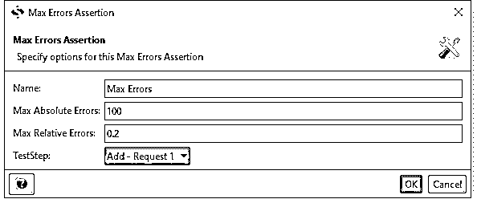

**最大绝对误差:**测试步骤允许的绝对最大误差数。

**最大相对误差:**可以取 0 到 1 之间的值。如果该值如上所述设置为 0.2，则最多 20%的指定测试步骤运行会导致错误。

**步长平均值**:用于验证测试步长的平均值不超过规定值。

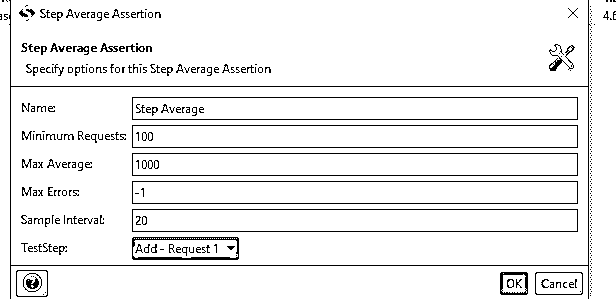

**最大平均值:**检查测试步骤平均值是否大于定义值，并记录一个断言错误。

**采样间隔:**用于计算平均值的步数。

**步骤状态**:用于验证测试步骤没有因错误而失败。

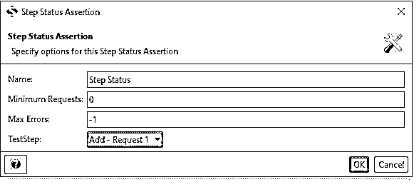

**步骤 TPS** :用于验证测试步骤的每秒交易量。

**名称:**断言名称。

**最小请求数**:应用断言前要执行的最小请求数。

**最小 TPS:**TPS 的期望值

**最大误差:**应取消测试的值

**测试步骤**:显示测试用例下定义的整个测试设置，并让用户选择用户想要应用断言的设置。

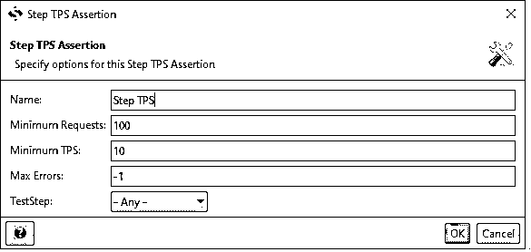

#### 实施例 2

乘法负载测试

在应用上述步骤直到步骤 9 之后，

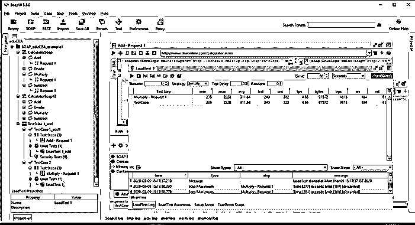

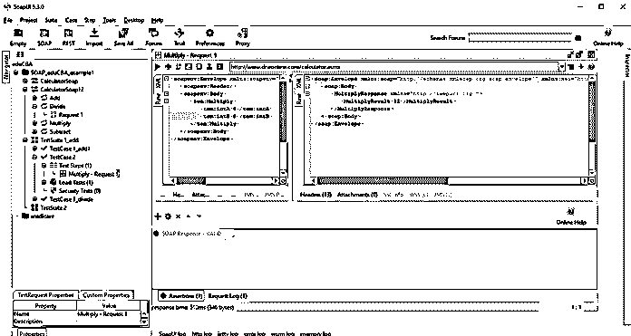

我们将“最大步长”的断言应用于 Multiply_request1，并给定最大时间延迟为 100 毫秒，因此断言失败，显示 LoadTestLog 为“time[277]excess limit[100]discarded ”,并且 err rate 为 184，如上所示。根据我们的断言，Soap 响应是有效的。

#### 实施例 3

分部负荷试验

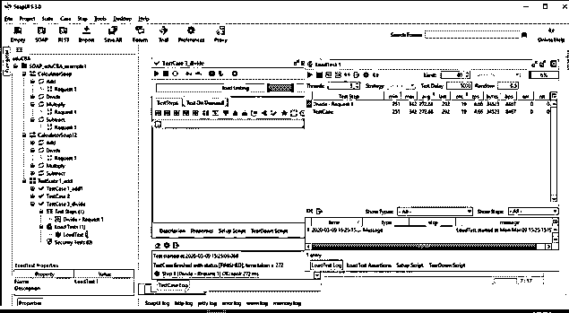

负载测试用例通过，带有“最大步进”断言和 err 0。

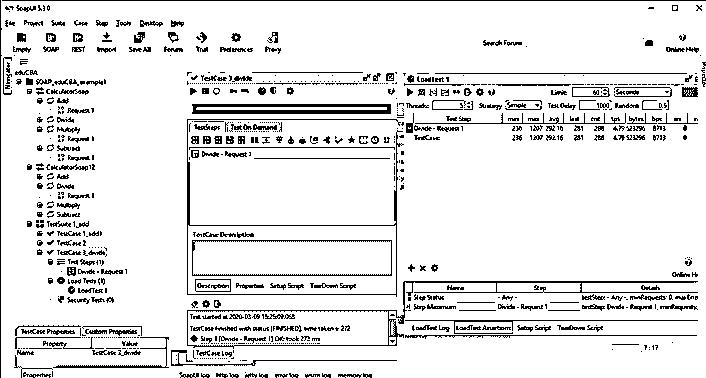

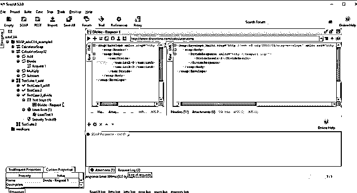

下面的屏幕截图显示了 divide 上负载测试的统计数据。

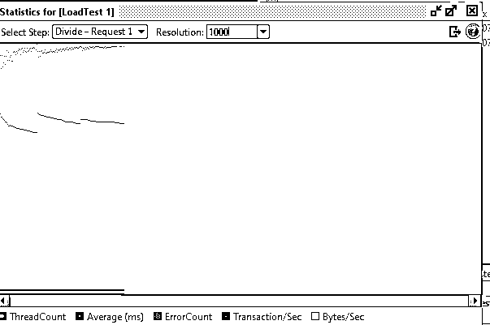

断言验证测试的条件并决定测试是失败还是通过，并且只有在没有抛出任何异常的情况下才被认为是完成的。

到此，我们将结束这篇文章。让我们简单回顾一下“SoapUI 负载测试”。我们学习了什么是 SoapUI 以及它的用途；在许多类型的测试中，我们经历了负载测试，这是性能测试的一部分。说明了 SoapUI 中的一些例子，了解了断言以及在 web 服务调用的负载测试期间可以应用什么类型的断言。

### 推荐文章

这是一个 Soapui 负载测试指南。这里我们讨论什么是 SoapUI，如何在 SoapUI 中创建一个负载测试，以及一些例子。您也可以看看以下文章，了解更多信息–

1.  [什么是 SoapUI？](https://www.educba.com/what-is-soapui/)
2.  [SoapUI 替代品](https://www.educba.com/soapui-alternatives/)
3.  [SoapUI 面试问题](https://www.educba.com/soapui-interview-questions/)
4.  [SOAP Web 服务面试问题](https://www.educba.com/soap-web-services-interview-questions/)

