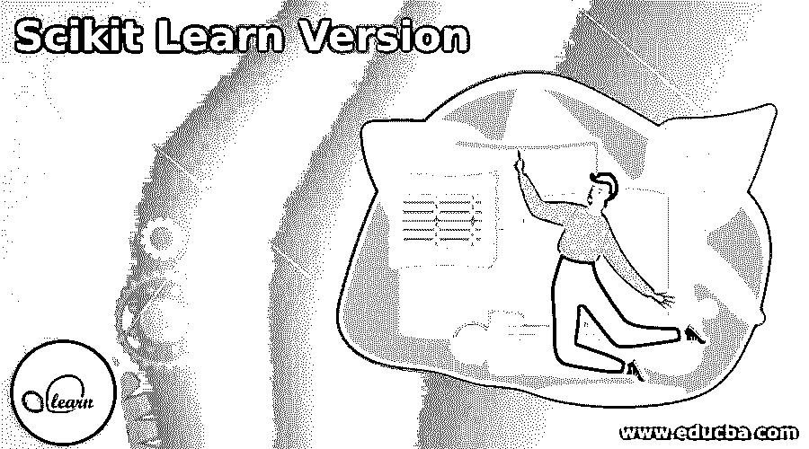

# Scikit 学习版

> 原文：<https://www.educba.com/scikit-learn-version/>

## Scikit 学习版简介

Scikit learn v0.1 beta 版于 2010 年 2 月由来自法国 INRIA(法国计算机科学研究所)的一组开发人员向公众发布，它建立在 David Cournapeau 早些时候完成的初始项目工作的基础上，作为他的 Google summer project 2007 的一部分。从初始版本开始，Scikit 一直是一个受欢迎的开源机器学习库，并在多个真实世界的人工智能(AI)项目中广泛使用。Scikit 经历了从 v 0.1 到 v0.24 的多次版本更改，v 0.24 于 2007 年 4 月发布

### 什么是 Scikit Learn？

*   很容易为机器学习场景开发端到端的逻辑和编程步骤。但是对于复杂的场景，不可能每次都从头开始开发 ML 算法。Scikit learn 在一个库中提供了预先开发的 Python 代码，供 Python 开发人员在他们的程序中使用，以高效地构建 ML 场景。
*   这些库提供了基于 NumPy、Matplotlib、Plotly、Scipy 和 Pandas 等技术的监督和非监督 ML 算法，并涵盖了包括回归、分类、聚类等若干统计模型在内的功能。其特征包括降维、数据集、参数调整、集成方法、监督/非监督模型、交叉验证等。

### 各种 Scikit 学习版本

以下是各种 Scikit 学习版本:

<small>Hadoop、数据科学、统计学&其他</small>

#### 1.版本 0.1

2010 年 2 月，一群来自 INRIA 的开发人员发布了一个测试版，它是 2007 年谷歌项目的改进版。这个版本得到了 INRIA、谷歌、Python 软件基金会、Tinyclues 和 30 个社区贡献者的赞助。它有几个特点，如欠采样，过采样，欠采样和过采样的组合，以及整体采样。

#### 2.版本 0.2

Scikit Learn 于 2010 年 4 月发布的 0.2 版解决了欠采样和集成算法中的问题。在欠采样逻辑中增加了新技术 AIIKNN。医生被添加到文档中。

#### 3.版本 0.3

Scikit 的第三个版本于 2010 年 6 月发布，修复了上一个版本中检查率功能的缺陷。数据集和字典的早期版本中的某些功能已被弃用。

#### 4.版本 0.4

该版本于 2010 年 8 月发布，其亮点是:

*   度量模块，介绍了 GMM 模块。
*   介绍了 LARS 算法。
*   Attrselect 模块已过时。
*   遗留代码已被删除。
*   引入了新的示例，并修复了许多错误。

#### 5.版本 0.5

在 2010 年 10 月推出，这个版本有几个新的类，如稀疏矩阵，交叉验证，有效的 LARS 实现，和提取。文档得到了改进，网页上引入了新的 sphinx 主题，并修复了错误。

#### 6.版本 0.6

该版本于 2010 年 12 月发布，新增了随机梯度下降、改进的 sym 模块、文本特征提取和真实世界数据集等模块。

#### 7.版本 0.7

该版本于 2011 年 3 月发布，在高斯模型采样、高维空间和许多其他模块中有许多性能改进特性。它优化了共线性函数并重构了几个算法以获得更好的稳定性。

#### 8.版本 0.8

该版本于 2011 年 5 月发布，其亮点包括:

*   介绍了层次聚类、核主成分分析、交叉分解、非负矩阵分解等新模型。
*   许多其他模块进行了微调，以获得更好的性能。
*   内存泄漏问题和其他错误被修复。

#### 9.版本 0.9

它于 2011 年 9 月推出，引入了许多新模块，如流形学习、Dirichlet 过程、性能微调和文档改进。

#### 10.版本 0.10

Scikit 的第 10 个版本发布于 2012 年 1 月，受 Python 2.6 支持，对早期版本的支持已被放弃。在系综方法等中引入了新的模块。为了更好的性能，重构了几个模块。支持向量方法中的内存泄漏被阻止。

#### 11.版本 0.11

该版本于 2012 年 5 月推出，改进了回归和分类功能。它在 API 模块中带来了一些性能改进。

#### 12.版本 0.12

该版本于 2012 年 9 月发布。它在回归模块中增加了 Huber 和分位数功能。决策树的性能得到了增强。它在 2012 年 10 月发布了子版本 0.12.1。

#### 13.版本 0.13

该版本于 2013 年 1 月发布，在 Estimator 类和 API 领域实现了几项更改。为了修复这些错误，2013 年 2 月发布了子版本 0.13.1。

#### 14.版本 0.14

7 个月后于 2013 年 8 月推出，这个新版本增加了双聚类逻辑和集成采样的新功能。它还重构了决策树以获得更好的性能。

#### 15.版本 0.15

该版本于 2014 年 7 月发布，通过在几个函数中微调内存使用，在性能上有了几处改进。添加了速记构造函数。2014 年 8 月/2014 年 9 月推出了两个子版本 0.15.1 和 0.15.2，仅用于修复错误。

#### 16.版本 0.16

Scikit 于 2015 年 3 月发布了第十六版。与熊猫框架的集成是这个版本的新特性。通过在几个模块中更好地管理内存和重新使用默认设置，实现了性能的提高。2015 年 4 月发布了一个用于逮捕 bug 的 subversion 0.16.1。

#### 17.版本 0.17

该版本于 2015 年 11 月发布，主要关注新模块和增强功能。在集合抽样中引入了一个新的类。2016 年 2 月发布了 subversion 0.17.1 来修复这些错误。

#### 18.版本 0.18

Scikit 于 2016 年 9 月发布了第 18 版。这是 Python 2.6 的最后一个版本。精选模块得到了增强。2016 年 11 月和 2017 年 6 月发布了两个版本 0.18.1 和 0.18.2。

#### 19.版本 0.19

该版本于 2017 年 8 月推出，在分类器、回归器和估计器方面具有重要特性。2017 年 10 月的两个子版本 0.19.1 和 2018 年 7 月的 0.19.2 解决了错误。

#### 20.版本 0.20

该版本于 2018 年 9 月发布，主要关注库、文档和示例方面的改进。发布了 2018 年 11 月的 0.20.1、2018 年 12 月的 0.20.2、2019 年 3 月的 0.20.3 和 2019 年 7 月的 0.20.4 中的颠覆版本，以修复问题。

#### 21.版本 0.21

0.21 版本于 2019 年 5 月发布，各种型号和子版本 0.21.1、0.21.2、0.21.3 的总变化发生在 2019 年 5 月至 2019 年 7 月期间。

#### 22.版本 0.22

该版本于 2019 年 12 月发布，展示了其网站。两个子版本 0.21.1 和 0.21.2 分别于 2020 年 1 月和 2 月发布

#### 23.版本 0.23

于 2020 年 5 月发布，进行了多项改进以提高性能。子版本 0.23.1、0.23.2 于 2020 年 5 月发布。

#### 24.版本 0.24

Scikit 的最新版本于 2020 年 12 月发布，修复了许多错误。子版本 0.24.1 于 2021 年 1 月发布，0.24.2 于 2021 年 4 月发布。

### 结论

由于未来将由人工智能特性驱动，Scikit Learn 库将在机器学习应用程序的软件开发中发挥重要作用。

### 推荐文章

这是 Scikit 学习版指南。这里我们讨论一下入门，什么是 scikit learn？和各种版本。您也可以看看以下文章，了解更多信息–

1.  [可翻译版本](https://www.educba.com/ansible-versions/)
2.  [OpenSSL 版本](https://www.educba.com/openssl-version/)
3.  [OpenCV 版本](https://www.educba.com/opencv-version/)
4.  [春云版](https://www.educba.com/spring-cloud-version/)