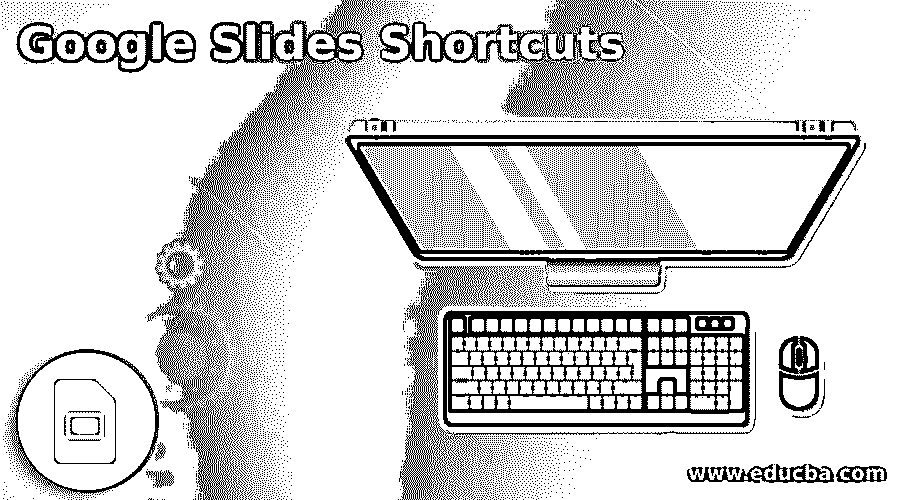

# 谷歌幻灯片快捷方式

> 原文：<https://www.educba.com/google-slides-shortcuts/>

## 谷歌幻灯片简介

Google slide 是一个演示程序，是由 Google 提供的基于网络的 google docs 编辑器套件。谷歌幻灯片可作为一个网络应用程序，android，windows，黑莓手机应用程序。它与 Microsoft PowerPoint 文件格式兼容。它允许用户在线创建和编辑文件，同时与其他用户实时协作。它提供了创建有吸引力的演示文稿的功能。要在 google slides 中执行各种任务，有许多快捷方式可以轻松快速地执行这些任务。

### 各种谷歌幻灯片快捷方式

以下是各种谷歌幻灯片快捷方式:

<small>网页开发、编程语言、软件测试&其他</small>

*   **Ctrl + M:** 该键用于创建新的幻灯片。
*   **Ctrl + C:** 用于将选中的内容复制到剪贴板。
*   **Ctrl + V:** 用于将剪贴板中复制的内容粘贴到幻灯片中。
*   **Ctrl + X:** 用于剪切选中的内容。
*   **Ctrl + D:** 该键用于复制幻灯片。
*   **Ctrl + Z:** 撤销之前执行的动作。
*   **Ctrl + Y:** 重做之前执行的动作。
*   **Ctrl + S:** 保存内容。
*   **Ctrl + K:** 用于插入或编辑外部链接。
*   **Ctrl + P:** 用于打印演示文稿。
*   **Ctrl + o:** 该快捷键打开一个弹出窗口，用户可以通过该窗口打开文件。
*   **Ctrl + H:** 用于查找或替换幻灯片中的特定文本。
*   **Ctrl + F:** 用于查找文件中的文本。
*   **Ctrl + F5:** 该快捷键用于显示当前选中的幻灯片。
*   **Ctrl + Shift + F5:** 用于从第一张幻灯片开始呈现幻灯片，而不是当前选中的那张。
*   **左右箭头:**用于移动到下一张幻灯片。
*   **一个数字，后跟 enter:** 它将控制转移到特定的幻灯片编号。例如，如果你按 2 然后回车，那么它将移动到第 2 张幻灯片；如果是 5，那么移动到 5。
*   **答:**用于打开观众工具。
*   **S:** 用于打开演讲者注释。
*   **B:** 用于显示空白的黑色载玻片。
*   **W:** 用于显示空白的白色载玻片。
*   **L:** 用于切换激光笔。
*   **F11:** 用于切换全屏。
*   **选项卡:**用于选择下一个对象或形状。
*   **Shift + Tab:** 用于选择上一个对象或形状。
*   **Ctrl +D:** 用于创建所选对象的副本。
*   **Ctrl + Alt + B:** 用于横向放大对象。
*   **Ctrl + Alt + W:** 用于横向缩小对象。
*   **Ctrl + Alt + I:** 用于垂直放大对象。
*   **Ctrl + Alt + Q:** 用来让物体垂直变小。
*   **Ctrl + Alt + J:** 用来让对象变小。
*   **Ctrl + Alt + K:** 用于将对象放大。
*   **Ctrl + Alt + G:** 用于创建一组选中的对象或形状。
*   **Ctrl + Alt + Shift + G:** 用于对已创建的组进行解组。
*   **Ctrl + Alt + Shift + F:** 用于将焦点移动到幻灯片上。
*   **Ctrl + Alt + Shift + C:** 用于将焦点移动到画布上。
*   **向上箭头:**将焦点移到上一张幻灯片。
*   **向下箭头:**将焦点移到下一张幻灯片。
*   **首页:**将焦点移到第一张幻灯片。
*   **结束:**将焦点移到最后一张幻灯片。
*   **Ctrl + B:** 用来加粗文本。
*   **Ctrl + I:** 用于文本的斜体。
*   **Ctrl + U:** 用于添加或删除文本的下划线。
*   **Ctrl + Shift + 8:** 用于添加项目符号列表。
*   **Ctrl + Shift + 7:** 用于增加编号列表。
*   **Ctrl + Shift + R:** 用于文本右对齐。
*   **Ctrl + Shift + L:** 用来将文字靠左对齐。
*   **Ctrl + Shift + E:** 用于文本居中对齐。
*   **Ctrl + Shift + J:** 用于文本两端对齐。
*   **Ctrl + [:** 用于减少段落缩进。
*   **Ctrl+】:**用于增加段落的缩进量。
*   **Ctrl + Shift + > :** 用来增加字体的大小。
*   **Ctrl + Shift + < :** 用于缩小字体大小。
*   **Ctrl + Alt + C:** 用于复制选中文本的格式。
*   **Ctrl + Alt + V:** 用于粘贴复制文本的格式。
*   **Ctrl + \:** 用于清除应用于文本的格式。

### 结论–谷歌幻灯片快捷方式

在这篇文章中，我们试图列出谷歌幻灯片所有可能的快捷键，以使这项任务更容易和更快。

### 推荐文章

这是谷歌幻灯片快捷方式指南。这里我们分别讨论简介和各种 google 幻灯片快捷方式。您也可以看看以下文章，了解更多信息–

1.  [OneNote 快捷方式](https://www.educba.com/onenote-shortcuts/)
2.  [Linux 键盘快捷键](https://www.educba.com/linux-keyboard-shortcuts/)
3.  [什么是微软规划器](https://www.educba.com/what-is-microsoft-planner/)
4.  [计算机端口](https://www.educba.com/computer-ports/)

