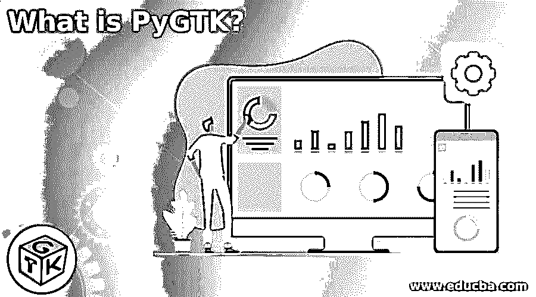

# PyGTK 是什么？

> 原文：<https://www.educba.com/what-is-pygtk/>

## PyGTK 简介

PyGTK 是一个模块，用于在 python 编程语言中创建高级图形布局，以便用户可以快速与应用程序交互。它是 python 和 GTK 的结合，缩写 GTK 代表 GIMP ToolKit，因此，PyGTK 是 GTK+图形用户界面库的 Python 包装器的集合。它带有大量的图形元素以及其他用于构建桌面应用程序的编程工具。这是 GNOME 项目的扩展。

它是在 LGPL 许可下发布的开源软件，是一个跨平台的库。詹姆斯·亨斯特里奇是 PyGTK 的创造者。PyGTK 非常用户友好，非常适合快速原型开发。PyGTK 可以安装在 Unix 和 Win32 上，使用安装程序版本很容易设置，Mac OS X 版本正在开发中。该图书馆的资料来源于 http://pygtk.org/和 http://www.gtk.org/.

<small>网页开发、编程语言、软件测试&其他</small>

### 对 PyGTK 的需求

*   PyGTK 用于在 python 编程语言中创建 GUI。
*   图形用户界面(GUI)包括一个窗口及其小部件的集合，这些小部件包括输入框、复选框、单选按钮、选项卡、按钮、文本以及窗口中显示的其他对象。
*   当用户对窗口或某个小部件做任何事情时，即使只是移动鼠标光标，GUI 也会向程序发送一个信号，通知它可能需要响应。
*   Python 编程语言包括一个 PyGTK 模块，该模块带有用于构建基本 GUI 的标准库集合。

### PyGTK 的优缺点

下面给出了提到的优点和缺点:

#### 优势:

*   **性能:** PyGTK 0。x(GTK 1.2 版)表现出色。2.0 版(针对 gtk 2。x)不具备与之前版本相同的性能，但仍可接受。
*   PyGTK 有一个基于信号和回调传播的高效 API。任何组件都可以发出信号，信号会“向上”传输，直到被捕获并生成回调调用。
*   IDE: PyGTK 有一个创建接口的工具，叫做 Glade，它允许你生成一个接口的 XML 引用，库可以直接使用它。
*   **可移植性:**将 PyGTK 应用移植到 Windows 很简单。通常，这是在不修改代码的情况下完成的。
*   **文档:**大量的文档。两个版本都有优秀的教程。虽然 PyGTK 0 没有完整的参考资料。x，版本 2 有一个。那太好了。

#### 缺点:

*   **代码大小:**虽然 PyGTK 中的大部分代码看起来是多余的，但却是必要的。例如，要使用任何元素，我们必须首先构建它，然后调用该类，使用它的配置方法配置它，定位它，然后使用 show()方法显示它。对于每个对象，至少有三个方法调用。因此，我们有大量的源代码。

### PyGTK 的模块

下面是提到的模块:

*   **Pango:** 是一个专注于国际化的文字排版和绘图库。
*   这是一个 2D 图形库，支持不同的输出设备。
*   **ATK:** 用户界面、放大镜和替代输入设备只是这个库中可用的辅助工具的一部分。
*   **GTK:**GTK 用户界面模块负责用户界面。
*   这个工具用于从 XML 文件中创建图形用户界面。
*   **GObject:** GObject 是 PyGTK 类的基础类，提供公共属性和函数。

### PyGTK 的类别

下面是提到的类别:

*   **gtk。小部件:**对于所有 PyGTK 小部件，都有一个 gtk.base 类。gtk。对于小部件，小部件提供了一套标准化的方法和信号。
*   **gtk。窗口:**这是一个单个子窗口的顶层窗口。gtk。窗口是一个显示区域，包含一个标题栏和用于关闭、调整大小和移动窗口的按钮。
*   **gtk。对话框:**用于创建一个弹出窗口，提供信息和选项供用户选择。
*   **gtk。按钮:**这是一个按钮小部件，点击时会发出信号。gtk。按钮通常显示为带有文本标签的按钮，通常用于附加回调函数。
*   **gtk。标签:**这个小部件显示只读文本。
*   **gtk。布局:**这创建了一个可滚动区域，其中包含子部件和自定义图形，可以无限滚动。
*   **gtk。Toolbar:** 这个容器存储并维护一个水平或垂直的按钮和小部件栏。
*   **gtk。ComboBox** :这个小部件用于从列表中选择项目。
*   **gtk。滚动条:**允许显示水平或垂直滚动条。
*   **gtk。ProgressBar:** 这用于显示一个长时间运行的流程已经进展到什么程度。
*   **gtk。菜单:**这是一个下拉菜单，包含一组菜单项对象，用户可以访问并激活这些对象来执行应用程序功能。

### PyGTK 的应用

下面是一些 PyGTK 应用程序的例子:

*   Anaconda 安装程式
*   比特流
*   泛滥
*   催吐剂
*   流体运动
*   流放
*   gDesklets
*   Gajim
*   GIMP(用于可选的 Python 脚本)
*   Gedit(用于可选的 Python 子系统和插件)
*   Gramps GNOME Sudoku
*   犹太教规
*   Gwibber(微博客户端)
*   毕希音乐
*   普德塔格
*   特里顿
*   ROX 桌面(包括 ROX 文件管理器)
*   Pybliographer
*   普遍性(Ubuntu 安装程序)
*   声音转换器
*   机翼 IDE
*   Ubuntu 软件中心
*   连环漫画

### 结论

PyGTK 是 python 和 GTK 的结合，首字母缩写 GTK 代表 GIMP ToolKit。这是一个 Python 模块，允许您开发高级图形布局，以便用户可以快速与应用程序交互。它是在 LGPL 许可下发布的开源软件，是一个跨平台的库。

### 推荐文章

这是一本关于什么是 PyGTK 的指南？这里我们讨论 PyGTK 的介绍、需求、优缺点、模块、分类和应用。您也可以看看以下文章，了解更多信息–

1.  [XAMPP 另类](https://www.educba.com/xampp-alternative/)
2.  [jQuery ajax 上传文件](https://www.educba.com/jquery-ajax-upload-file/)
3.  [旅游路线](https://www.educba.com/laravel-route/)
4.  [PHP 压缩文件](https://www.educba.com/php-zip-files/)

