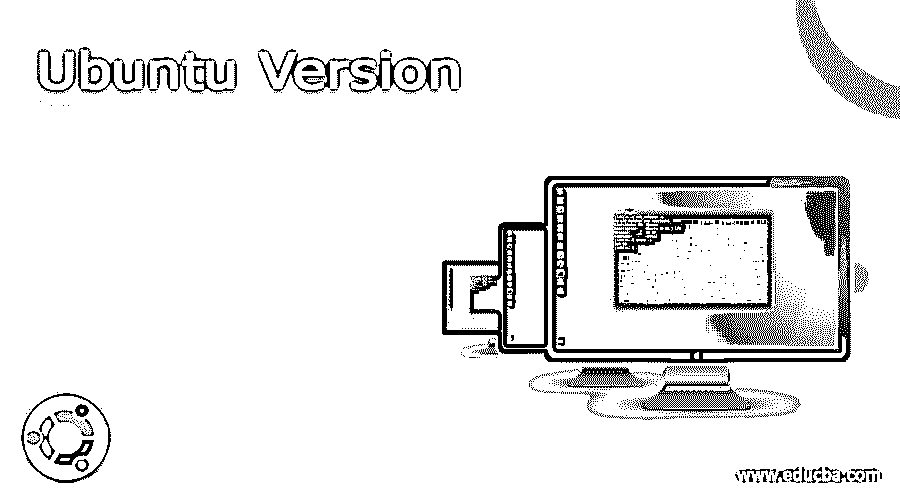

# Ubuntu 版本

> 原文：<https://www.educba.com/ubuntu-version/>

## Ubuntu 版本的定义

Ubuntu 版本对用户完全免费，相关的应用程序也免费提供；买不起昂贵操作系统的人可以免费使用 Ubuntu 操作系统，享受其应用程序的功能和威力；它们不缺乏任何其他公认的操作系统(如 Windows)的生产力特性、美观性和安全性；版本可由 Ubuntu 用户定制，以适应他们的操作要求；这个操作系统是由开发者社区维护的，任何人都可以成为社区的一部分并做出贡献；它甚至可以在较旧的硬件上运行，拥有旧笔记本电脑或台式机的用户仍然可以运行该节目。

### Ubuntu 的解释

Ubuntu OS 属于 Linux 家族，它建立在 Debian 自由软件原则和开源软件开发者社区的鼓励之上。它有桌面版本，俗称 Gnome，服务器和核心，涵盖物联网设备和机器人。它可以在成熟的系统或单片微型计算机上运行。它支持所有处理器，如 AMD，ARM，Intel，IBM power，IBM Z 系列和 IBM 皇帝。

<small>网页开发、编程语言、软件测试&其他</small>

它的软件库包括 Gnome、内核、Web 服务器、word、电子表格和互联网应用程序。

### Ubuntu 的 17 大版本

**版本和支持窗口:** Ubuntu 按照计划每六个月发布一次新版本，准确的说是在四月和十月，版本的发布代码中会有月份号 04，10 和年份。每个版本都有一个带有形容词的代号和一个首字母相同的动物名。

该版本可能是运行版本的升级或修订，主要包含错误修复和较小的更改，也可能是有重大更改的新版本。这些版本的支持期为 18 个月，单个软件包的支持期为 5 年。

Ubuntu 的版本如下:

#### 1.版本 4.10

Ubuntu 的第一次发布是在 2004 年 10 月，发布代码是 Ubuntu 4.10，名字是 Warty Warthog。这个版本是建立在 Debian 操作系统之上的，它的开发者 Canonical Ltd 向用户提供了这个版本的免费下载或者免费光盘。

#### 2.版本 5.04

这是 Canonical 在 2005 年 4 月发布的第二个版本，名为《白头刺猬》。引入了待机/休眠支持、升级通知程序、更新管理器、处理器频率缩放、使用 USB 安装等新功能。

#### 3.版本 5.10

该版本于 2005 年 10 月发布，引入了新的功能，如菜单(点菜)编辑器、应用程序添加/删除工具、语言选择器、打印机支持、报告错误的启动板和软件改进。

#### 4.版本 6.06

推迟了两个月到 2006 年 6 月，这个版本合并了现场 CD 和安装 CD 到一个光盘。网络方面的几项改进、长期支持的引入是此版本中的一些新功能。

#### 5.6.10 版

命名为 Edgy Eft，这个 2006 年 10 月发布的版本包含几个人类主题。它还有初始化守护程序、崩溃报告、照片管理器和与第三方软件的集成。

#### 6.版本 7.04

2007 年 4 月发布的 Ubuntu 第六版提供了迁移助手来支持微软用户进入 Ubuntu。它支持安装软件驱动程序、虚拟机、编解码器和 Wi-Fi 接入。

#### 7.7.10 版

这个版本名为 Gusty Gibbon，于 2007 年 10 月发布，引入了安全框架、搜索工具、NFTS 支持和打印支持。

#### 8.版本 8.04

2008 年 4 月发布的 Ubuntu 第八版引入了一些新功能，比如 Ubuntu 上网本混音、Active Directory 集成、音频改进等等。,

#### 9.8.10 版

它于 2018 年 10 月发布，在桌面可扩展性、灵活的互联网连接和移动计算方面有多项改进。它引入了有限运营的客户账户概念。

#### 10.版本 9.04

这个在 2009 年 4 月发布的版本名为 Jaunty Jackalope，支持 ARM 处理器环境。其他改进包括更快的重启，与 webservices 的集成。

#### 11.版本 9.10

2009 年 10 月，Canonical 公司发布了 ubuntu 的第 11 次版本，主要集中在修复用户报告的可用性缺陷和少量的图形改进上。

#### 12.版本 10.04

Ubuntu 在 2010 年 4 月发布了这个版本，2009 年 9 月宣布的云计算改进在这个版本中得以实现。新的主题，新的标志，新的视觉在这个版本中被介绍。光的概念是 Ubuntu 的新风格。

#### 13.10.10 版本

命名为 Maverick Meerkat，于 2010 年 10 月 10 日发布，10:10.10 完美的 10，主要改进是与上网本版本的接口和新的照片管理器。

#### 14.版本 11.04

该版本于 2011 年 4 月推出，将 Gnome 的默认用户界面改为 Unity。

#### 15.11.10 版

该版本于 2011 年 10 月发布。这个版本的重要变化是，由于用户反馈不佳，piti VI Linux 视频编辑器被从 Ubuntu 中移除。

#### 16.版本 12.04

Canonical 在 2012 年 4 月发布的第 16 版将桌面版和服务器版的长期支持期限定为五年。默认媒体播放器的改变和 Unity 的改进是这个版本的主要变化。

#### 17.其他版本

| **版本** | **时间** | **特性** |
| Twelve point one | 2012 年 10 月 | 启动器中的亚马逊图标。团结 2D 被停止 |
| Thirteen point zero four | 2013 年 4 月 | 吴彼软件安装程序已停止。 |
| Thirteen point one | 2013 年 10 月 | 通用网络搜索。由于缺乏及时更新，切换到 Chrome 面临恶劣天气 |
| Fourteen point zero four | 2014 年 4 月 | 桌面界面和新平板电脑界面的变化 |
| Fourteen point one | 2014 年 10 月 | 错误修复和小改动 |
| Fifteen point zero four | 2015 年 4 月 | 图形方面的改进 |
| Fifteen point one | 2015 年 10 月 | 包含 Mir 显示服务器 |
| Sixteen point zero four | 2016 年 4 月 | 支持 Ceph 和 ZFS 文件系统 |
| Sixteen point one | 2016 年 10 月 | 引入了 Linux 内核 4.8 |
| Seventeen point zero four | 2017 年 4 月 | 访问新应用。 |
| Seventeen point one | 2017 年 10 月 | 使用 Gnome shell 界面。丢弃 32 位桌面图像 |
| Eighteen point zero four | 2018 年 4 月 | 推出彩色表情符号 |
| Eighteen point one | 2018 年 10 月 | 引入了新主题和新图标主题 |
| Nineteen point zero four | 2019 年 4 月 | 支持 LCD 显示器的 Linux 内核 5.0 |
| Nineteen point one | 2019 年 10 月 | 装载速度加快。Nvidia 做出了具体改进 |
| Twenty point zero four | 2020 年 4 月 | 引入了新的安全模块锁定 |
| Twenty point one | 2020 年 10 月 | 引入了 linux 内核 5.8 |
| Twenty-one point zero four | 2021 年 4 月 | 改进了对 AMD，5.11 Linux 内核的支持 |

### 结论

Ubuntu 为 windows 操作系统提供了一个简单、经济的替代品，它是一个健壮、安全、用户友好的操作系统，拥有 Windows 所能提供的所有功能。用户可以探索这些选项，并构建 Ubuntu 作为他们的第二个开发操作系统。

### 推荐文章

这是一个 Ubuntu 版本的指南。在这里，我们也讨论了 ubuntu 的定义和 17 大版本以及详细的解释。您也可以看看以下文章，了解更多信息–

1.  [Xubuntu vs Ubuntu](https://www.educba.com/xubuntu-vs-ubuntu/)
2.  [卢邦图诉徐本图](https://www.educba.com/lubuntu-vs-xubuntu/)
3.  [Ubuntu 替代品](https://www.educba.com/ubuntu-alternatives/)
4.  [如何安装 Ubuntu](https://www.educba.com/install-ubuntu/)

